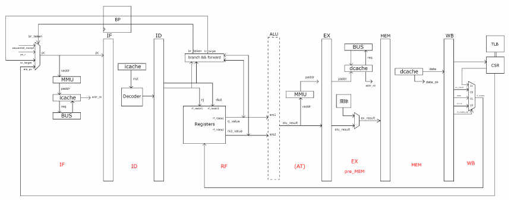

# NSCSCC 2025 西北工业大学二队

## 1. 作者

- **成员：** 杨茂靓、丁开琦、金政轩、吴冰冰
- **指导老师：** 王党辉、王继禾

## 2. 说明

### 框架图

- **TLB：** 32 项
- **Cache：** 两路组相联，256 行
- **分支预测：** 基于两位饱和计数器
- **乘法：** 单周期 Booth 乘法
- **除法：** AI 写的
- **主频：** 性能测试环境下 80 MHz
- **IPC：** openLA500 的 60%
- 可以使用 U-Boot 启动简单的 Linux

## 3. 参考文献

- 《CPU 设计实战》，汪文祥、邢金璋著
- 龙芯架构参考手册
- 使用了 chiplab 中自带的 `bank_ram.v` 和 `tagv_ram.v`，并进行了修改。
- 实现的分支预测以及 AXI 转换桥参考了 openLA500 的 `btb.v` 和 `axi_bridge.v`。
- `invtlb` 的实现方式参考了 openLA500 的 `tlb_entry.v`。
- 直接使用了 openLA500 的 `tools.v`。
