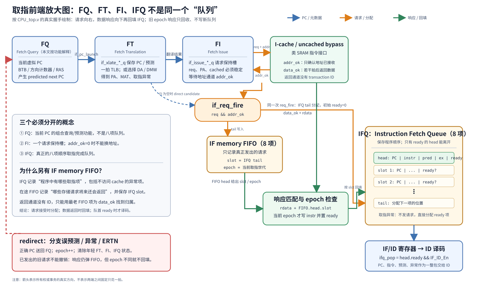
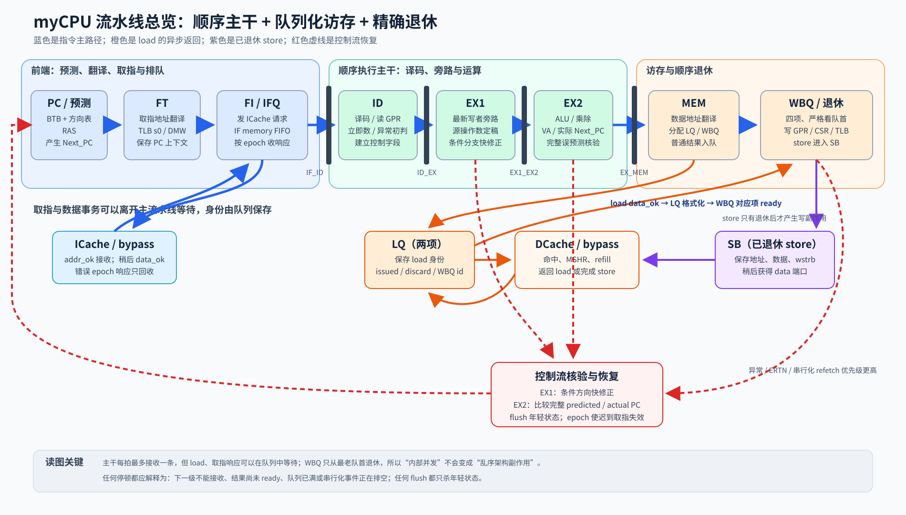
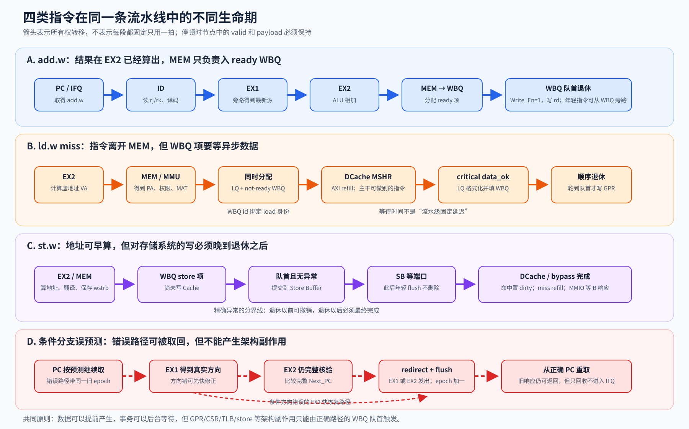
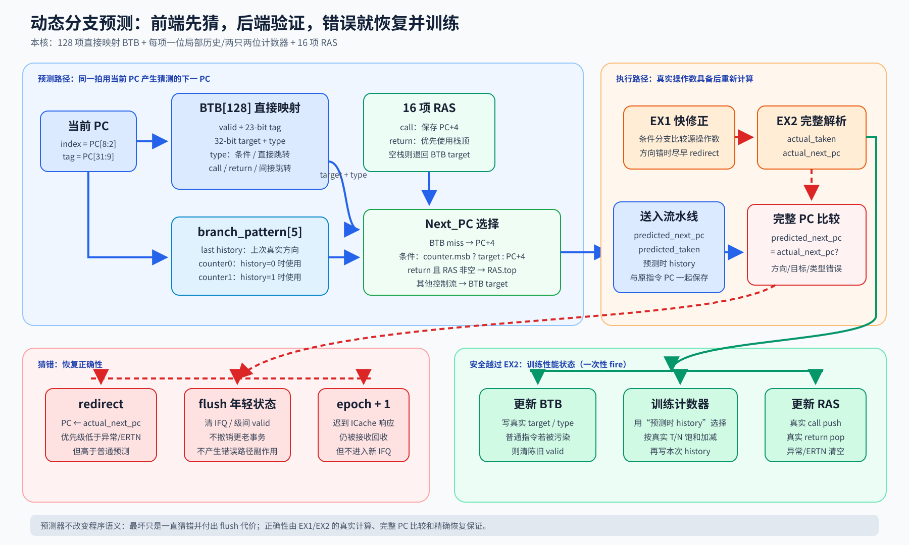
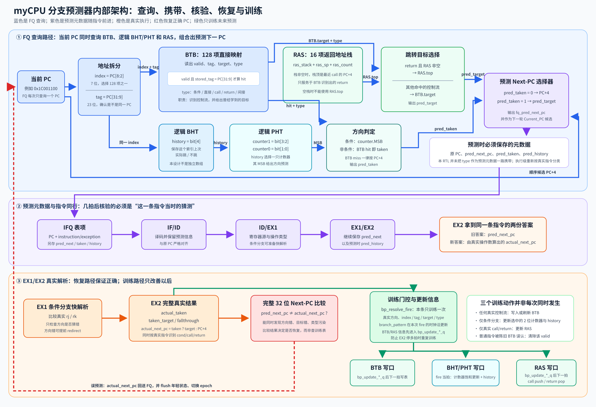
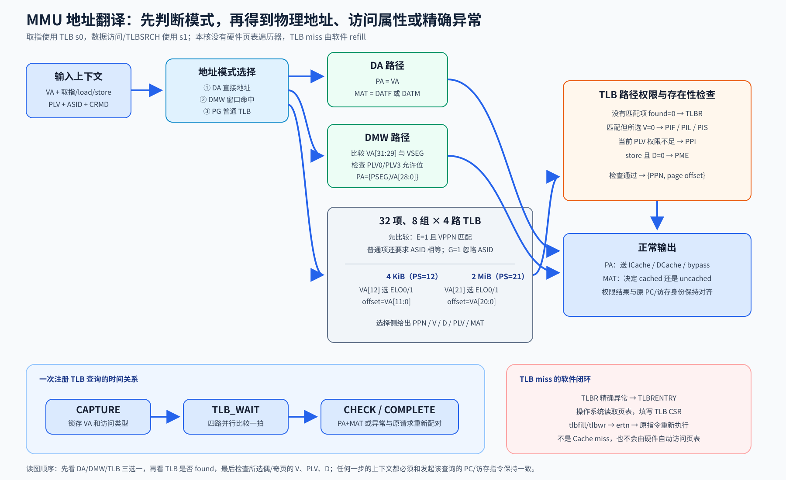
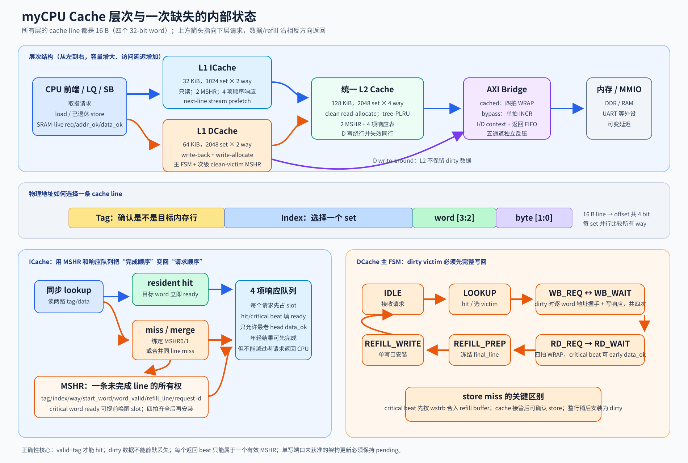
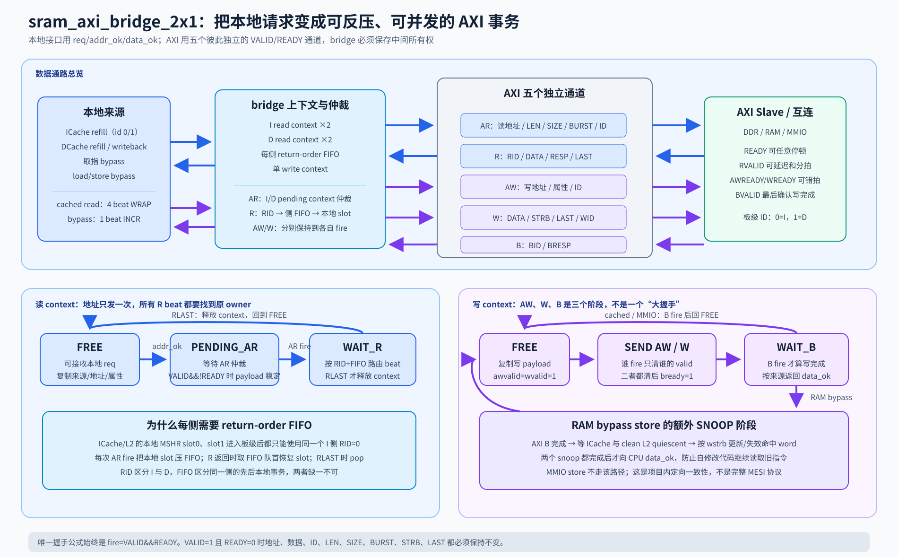
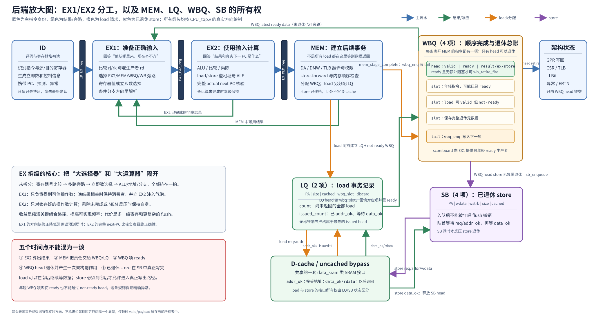
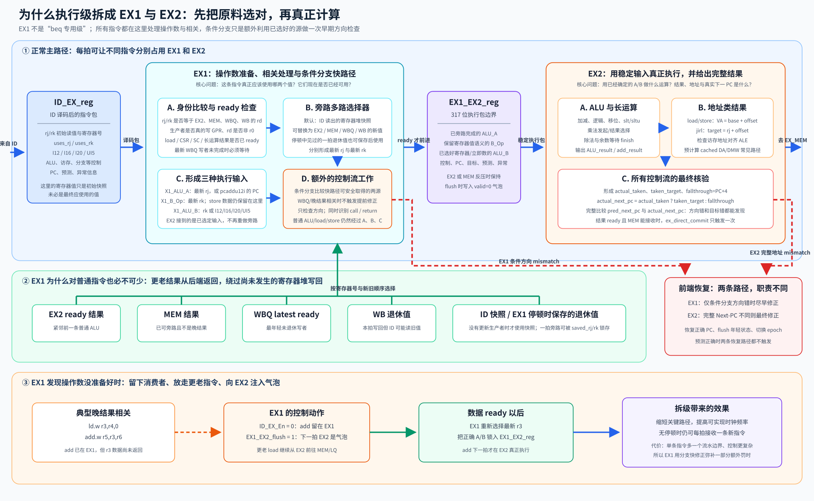

# myCPU 处理器设计详解

> 依据 myCPU 目录现有 RTL 撰写。本文描述的是“代码实际实现的微结构”，不是抽象的 LoongArch 教材模型。阅读时应以信号名和时序关系为准。

# 1. 文档目的、范围与阅读方法

这是一颗能够运行 Linux 的 32 位 LoongArch 处理器核。它在架构层面顺序执行、顺序提交，但为了隐藏取指和访存延迟，在微结构内部加入了取指队列、分支预测、非阻塞缓存、Load Queue、Writeback Queue、Store Buffer 和多项旁路。因此，它已经明显超过最基础的五级流水线。

本文的目标不是只说明“某端口是什么”，而是让读者最终能够回答以下问题：

1. 一条指令从 PC 产生到退休，逐拍经过了哪些状态？
2. 后级为什么能让前级停住，又如何保证停住时数据不丢失、不重复执行？
3. 两条指令读写同一寄存器时，何时旁路，何时必须等待？
4. load 可以先离开 MEM，为什么仍能顺序提交？
5. store 为什么不能在 MEM 阶段立刻写缓存？
6. 分支预测错误、异常、ERTN 和串行化操作分别冲刷哪些内容？
7. 虚地址如何在直接地址、DMW 和 TLB 三条路径间选择？
8. I-cache、D-cache、L2 和 AXI 桥怎样保存请求与响应的对应关系？
9. 如果从零重新实现这颗核，哪些状态和不变量是必不可少的？

说明范围包含以下手写 RTL：

| 文件 | 模块 | 主要职责 |
|---|---|---|
| CPU_top.v | CPU_top、PC | 核心流水线、预测、冒险、访存队列、精确退休 |
| pipeline.v | IF_ID_reg、ID_EX_reg、EX1_EX2_reg、EX_MEM_reg | 流水级边界状态 |
| register.v | Register | 32×32 位通用寄存器堆 |
| alu.v | cpu_top_alu、signed_div、unsigned_div | 算术逻辑、乘法、除法适配 |
| csr.v | CPU_CSR | CSR、中断、异常、定时器和 LLBit |
| tlb.v | tlb | 双查询端口、组相联 TLB |
| icache.v | icache | 32 KiB 两路非阻塞指令缓存 |
| dcache.v | dcache | 64 KiB 两路写回数据缓存 |
| l2_cache.v | l2_cache | 128 KiB 四路统一 clean L2 |
| mycpu_top.v | core_top、mycpu_top、sram_axi_bridge_2x1 | SoC 封装、缓存层次和 AXI 桥 |

xilinx_ip 目录中的有符号和无符号除法器是 Vivado 自动生成 IP。本文解释其契约和 CPU 的适配方式，不逐门分析生成网表。

建议先按顺序阅读第 2～5 章建立整条流水线图景，再阅读第 6～8 章的模块实现，最后用后续复现与验证章节检查理解。第一次阅读可以先忽略所有以 diff 开头的信号；它们只用于差分测试，不参与处理器控制。

# 2. 先建立几个必要概念

## 2.1 组合逻辑与时序状态

组合逻辑的输出只由“当前输入”决定。例如 ALU 加法、寄存器比较和地址多路选择。时序逻辑在时钟上升沿才改变状态，例如 PC、流水寄存器、队列头尾指针和 CSR。

判断一段 RTL 是不是“真正推进了一拍”，不能只看组合结果是否变化，必须看上升沿时某个寄存器是否获得写使能。该设计常见的命名是：

- 名称以 q 结尾：通常是上升沿锁存的状态。
- valid：该位置中是否真的有一条指令或一个事务。
- En：本拍是否允许覆盖某个流水寄存器。
- flush：允许覆盖时，写入气泡而不是正常 payload。
- fire：valid 与 ready 或 req 与 addr_ok 同时成立，本拍握手真正发生。
- ready：结果已经具备，可以被后级消费；它不一定等于流水级的写使能。

## 2.2 气泡、保持和冲刷不是同一件事

气泡可以理解为“一条没有任何副作用的空指令”，通常表现为 valid=0。

- 保持：En=0。寄存器中的旧指令不动，下一拍仍是同一条。
- 正常推进：En=1 且 flush=0。锁存上一级的新指令。
- 冲刷：En=1 且 flush=1。把当前位置清零，杀死原来的年轻指令。

pipeline.v 中所有边界的基本优先级都是：

    reset > 保持判定 > flush 写气泡 > 正常写入

更精确地说，代码结构是“reset 优先；否则只有 En=1 才观察 flush”。所以 En=0 时，即便 flush=1，该边界也保持。这也是顶层在异常时会强制打开相关 En 的原因。

## 2.3 类 SRAM 两阶段握手

CPU 与 cache 之间不是“请求后下一拍必有数据”，而是两阶段协议：

1. req=1 表示上游提出请求。
2. req 与 addr_ok 同拍为 1，表示下游已经复制了地址、读写方向、大小和数据。此后上游可改变输入。
3. 若干拍后 data_ok=1，表示该请求完成；读请求同时给出 rdata。

addr_ok 只接收请求，不代表访问已经完成。data_ok 没有 ready，也没有 CPU 侧事务 ID，因此每个层次必须自己保存请求顺序，绝不能把返回数据配给错误的请求。

## 2.4 精确异常

“精确”意味着异常发生时：

- 异常指令之前的所有指令已经生效；
- 异常指令本身和之后的指令没有产生架构副作用；
- ERA 保存正确的异常 PC；
- BADV、ESTAT 等保存与该指令对应的信息。

本核通过四项 WBQ 顺序退休实现这一点。执行和 load 返回可以在内部重叠，但 GPR、CSR、TLB、LLBit 和 store 的架构副作用只在 WBQ 队首发生。

## 2.5 为什么要有流水线

先假设一颗最简单的单周期 CPU。一条指令要在一个时钟周期中依次完成：读取 PC、读指令存储器、译码、读寄存器、做 ALU、访问数据存储器、选择结果并写回。时钟周期必须长到足以容纳其中最慢的完整路径。即使当前只是 add.w，不访问数据存储器，也只能等待这个很长的周期结束。

流水线的办法是在长组合路径中插入寄存器：

    未分级：取指 → 译码 → ALU → 访存 → 写回

    分级后：取指 |寄存器| 译码 |寄存器| ALU |寄存器| 访存 |寄存器| 写回

插入寄存器后，一条指令从头到尾所需的周期数增加了，但时钟周期可以缩短，而且不同指令能像工厂流水线那样重叠。这里必须区分：

- 延迟 latency：一条指令从进入到退休经过多久；
- 吞吐 throughput：稳定状态下每拍能完成多少条；
- IPC：每个周期退休的指令数；
- 频率：一秒有多少时钟周期。

增加流水级通常降低单级组合延迟、提高频率，却会增加单条指令的拍数和误预测罚时。流水级也不是越多越好：每个级间寄存器有建立时间、时钟到输出延迟和时钟偏差成本，旁路与 flush 还会随级数变复杂。

本设计把传统 EX 分成 EX1 和 EX2：EX1 专门解决源操作数和早期分支，EX2 完成 ALU、乘除和完整跳转核验。这样做的主要目的不是让一条加法“多做一件事”，而是把长旁路选择与 ALU/地址运算分开放置，使 90 MHz 时序更容易收敛。

## 2.6 三类流水线冒险从何而来

### 2.6.1 数据冒险

考虑：

    add.w r3, r1, r2
    sub.w r4, r3, r5

第二条在 ID/EX1 读取 r3 时，第一条可能还没写回寄存器堆。这是 RAW，即 read after write。解决办法有两种：

1. 旁路：第一条结果已经算出，就从 EX/MEM/WBQ 直接送给第二条；
2. 停顿：第一条结果尚未产生，例如 load miss 或除法未完成，只能等待。

旁路不能凭“某级有一个数值”就使用，还必须同时满足生产者 valid、确实写 GPR、rd 非零、rd 与消费者源号相等，以及该结果已经 ready。

WAW 是两条指令先后写同一寄存器；WAR 是老指令尚未读，年轻指令先写。在顺序发射、顺序读、顺序退休的本核中，WAW 由 WBQ 年龄和 latest writer 解决，WAR 不会形成乱序覆盖。但如果将来改成乱序发射，这两类就需要寄存器重命名。

### 2.6.2 控制冒险

遇到分支时，在比较结果出来之前并不知道下一条 PC。若什么都不做，前端每遇分支就停数拍；若猜一个方向继续取指，猜错后必须冲掉错误路径。这就是分支预测要解决的问题，3.4 节会从零解释。

### 2.6.3 结构冒险

两个动作同拍争用一个硬件资源就是结构冒险，例如 LQ load 和 SB store 都想使用唯一 data_sram 请求端口，主 refill 与 store hit 都想写单端口 data RAM。解决方法是复制资源、分时仲裁或让一方停顿。本设计多数采用“明确优先级+保存未获准请求”。

## 2.7 怎样读懂和设计一个状态机

状态机不是一串难记的状态名，而是对“一个多拍事务现在做到哪一步”的记录。设计状态机前先写四张表：

1. 事务输入：开始时必须复制哪些字段；
2. 状态集合：每个状态正在等待什么；
3. 握手事件：什么条件代表本步不可撤销地完成；
4. 退出结果：向谁返回、哪些状态要更新。

以最简单的 SRAM 读为例：

    IDLE
      收到 req 且能保存 → 锁存地址，进入 SEND_ADDR

    SEND_ADDR
      req 保持，地址保持
      addr_ok=1 → req 清零，进入 WAIT_DATA

    WAIT_DATA
      data_ok=1 → 锁存 rdata，向上游完成，回到 IDLE

状态不能因为“下游大概会接受”而前进，只能在真实 fire 事件前进：

    address_fire = req && addr_ok
    data_fire    = data_ok

若下游可能在地址握手同拍返回数据，状态机还要明确是否允许这种零额外延迟；本项目的接口通常把请求和响应视为可分离事件，队列逻辑负责相应同拍边界。

### 2.7.1 Moore 与 Mealy 输出

- Moore 风格：输出只由寄存状态决定，路径短、容易保持；
- Mealy 风格：输出还直接依赖当前输入，能少一拍，但容易形成跨模块长组合路径。

本设计两种都有。例如 cache 的 mem_req 常由状态寄存器保持，是 Moore 风格；一些 fast path 的 req 由当前 MEM 条件组合产生，接近 Mealy 风格，但会把资格判断先寄存，避免 ready 从深层组合返回 PC。

### 2.7.2 每个状态必须回答的五个问题

阅读 DCache 的 S_RD_WAIT 时，可以依次问：

1. 本状态拥有哪一个 miss？由哪些寄存器证明？
2. 等待的输入是什么？这里是 mem_data_ok；
3. 输入到来时写哪些数据？这里是 refill line 的某个 word；
4. 是中间 beat 还是最后 beat？由 beat counter 判断；
5. 能否同时向 CPU 提前响应？critical word 到来时可以。

按照这五问读任何 FSM，比从 case 第一行机械追到最后更有效。

## 2.8 队列、环形指针与事务所有权

### 2.8.1 为什么需要队列

流水寄存器适合固定相邻阶段；队列适合生产者和消费者速度不一致。例如取指能连续发出，但 cache 返回时间变化，于是 IFQ 保存多个 PC；load 能离开 MEM，但结果稍后返回，于是 LQ/WBQ 保存身份。

### 2.8.2 环形 FIFO

深度为 4 的 FIFO 通常有 head、tail、count：

- push 写 tail，然后 tail 加一；
- pop 读 head，然后 head 加一；
- empty 为 count=0；
- full 为 count=4；
- 同拍 push+pop 时 count 不变，但两个动作都必须发生。

指针自然按位宽回绕。不能只用 head==tail 判断空和满，除非另有一位回绕标志；本设计显式 count，更容易核对。

### 2.8.3 “谁拥有这个响应”比“数据是多少”更重要

一个多拍单元至少要保存三类信息：

- 身份：它属于哪条指令、哪个 WBQ slot 或哪个 cache MSHR；
- 年龄：它在其他事务之前还是之后；
- 生命状态：未发出、已发出、已完成、应丢弃还是已消费。

分支 flush 能清掉流水寄存器，却不能让已经送进 cache/AXI/除法 IP 的请求凭空消失。因此 IF 使用 epoch，LQ 使用 discard，除法使用 drop，cache 使用 MSHR id。它们名字不同，本质都是在回答：迟到响应现在是否仍有合法所有者？

### 2.8.4 设计队列时先写不变量

例如两项 LQ 的基本不变量：

    0 <= issued_count <= count <= 2

    data_ok 只属于最老已发项

    未发项可在异常时直接删除

    已发项在异常时只能标 discard，不能删除响应顺序

实现完成后，用断言检查不变量往往比只跑程序更早发现环形边界错误。

# 3. 整体架构

## 3.1 从 SoC 到执行核心

模块层次如下：

    core_top
      └─ mycpu_top
          ├─ CPU_top
          │   ├─ PC
          │   ├─ Register
          │   ├─ IF_ID / ID_EX / EX1_EX2 / EX_MEM
          │   ├─ cpu_top_alu
          │   ├─ CPU_CSR
          │   └─ tlb
          └─ sram_axi_bridge_2x1
              ├─ icache
              ├─ dcache
              ├─ l2_cache
              └─ AXI 读写上下文

存储层次是：

    指令：CPU → I-cache ─┐
                         ├→ 统一 L2 → AXI
    数据：CPU → D-cache ─┘

不可缓存的取指、RAM 访问和 MMIO 会绕过 L1/L2，直接由桥转换成 AXI 单拍事务。

## 3.2 这到底是几级流水线

若只数主指令边界，可以把它看成：

| 逻辑阶段 | 主要工作 | 边界状态 |
|---|---|---|
| FQ（PC 查询/预测） | 当前 PC、BTB、方向预测、RAS | PC 和预测表；FQ 本身不是八项队列 |
| FT | 一拍 TLB 查询及地址属性计算 | `fq2ft_*_q` 级间寄存器 |
| FI/请求 | 向 I-cache 或 bypass 发请求 | `ft2fi_*_q` 请求保持槽、IF memory FIFO、IFQ |
| ID | 译码、读寄存器、立即数、异常初判 | IF_ID_reg |
| EX1 | 最新操作数旁路、操作数选择、条件分支早解析 | ID_EX_reg 到 EX1_EX2_reg |
| EX2 | ALU、乘除、地址、完整分支校验 | EX1_EX2_reg 到 EX_MEM_reg |
| MEM | 数据地址翻译、访存排序、分配 LQ/WBQ/SB 信息 | EX_MEM_reg 与 MEM 内部状态 |
| WB/退休 | WBQ 队首顺序提交 | WBQ 本身 |

所以它不是固定延迟的“七级流水”。前端存在队列，MEM 可能停留多拍，load 进入 LQ 后响应异步到达，WB 又是一个有序完成队列。更准确的描述是：

> 单发射、顺序前端与顺序执行主干，配合有限的非阻塞取指/访存和四项顺序退休窗口。

“单发射”指 ID 每拍最多向 EX1 接受一条新指令；“顺序退休”指 WBQ 每拍最多从队首退休一条。内部可能同时有两个 load、两个 I-cache miss 或两个 L2 miss 在途，但不会乱序改变架构状态。

### 3.2.1 先把 FQ、FT、FI 这些名字翻译成人话

这些名字首先是**本项目的微体系结构命名**，不是 LoongArch 指令集规定的术语。指令集只规定每条指令最终应该产生什么结果，并不强迫处理器一定叫 FQ、FT 或 EX1。换一颗同样执行 LoongArch 指令的 CPU，完全可能把相同功能叫作 IF0、IF1、AG、IS，也可能把几个功能合成一级。

本项目最容易造成误会的是 FQ。源码没有给 FQ 写出一个正式的英文全称；结合 `fq_bp_index`、`fq_btb_hit`、`fq_pred_next_pc` 等信号的实际用途，本文把它解释成 **Fetch Query**，即“取指地址查询/预测产生部分”。这样理解最贴近电路行为：它拿当前 PC 查询分支预测器并产生下一 PC。它**不是**真正的八项 Fetch Queue；真正保存多条取指结果的队列叫 **IFQ**。

| 名称 | 可以怎样读 | 最通俗的理解 | 在本设计里究竟做什么 |
|---|---|---|---|
| FQ | Fetch Query（本文按功能采用的解释） | 决定“接下来去哪里拿书” | 用当前 PC 查询 BTB、方向计数器和 RAS，得到预测下一 PC，并发起与该 PC 对齐的取指地址查询 |
| FT | Fetch Translation | 把“虚拟书号”翻译成“真实书架位置” | 保存待翻译 PC 和预测信息，等待一拍 TLB 查询，选择 DA、DMW 或 TLB 结果，形成物理地址、MAT 和取指异常 |
| FI | Fetch Issue | 把取书申请真正递交给仓库 | 向指令类 SRAM 接口送出稳定的 `req/addr/cached`，等待 `addr_ok`；下游不接收时把请求原样保留 |
| IFQ | Instruction Fetch Queue | 按程序顺序排队的“取指完成等候区” | 八项队列；保存 PC、预测、异常和指令字。请求可以尚未返回，但 ID 只能消费已经 ready 的队首 |
| IF | Instruction Fetch | 取指的统称 | 有些资料把从 PC 到得到指令字的全部工作统称 IF；在本核中，这项工作被 FQ、FT、FI、IFQ 进一步拆开 |
| ID | Instruction Decode | 看懂工作单 | 译码指令、读寄存器、生成立即数和控制信息，并做一部分异常/依赖判断 |
| EX1 / X1 | Execute 1 | 先找到最新原料 | 从各级旁路和 WBQ 中选择最新源操作数，处理数据相关，并对条件分支做早期比较 |
| EX2 / EX | Execute 2 | 真正计算 | 执行 ALU、乘除法、地址加法，形成真实下一 PC，并完成完整的分支预测核验 |
| MEM | Memory | 访存调度站 | 对 load/store 做地址翻译、权限检查和顺序判断，分配 LQ/WBQ；非访存指令只是携带结果经过这里 |
| WBQ | Write-Back Queue | 按号码结账 | 四项顺序退休队列。队首 ready 的指令才能真正改 GPR、CSR、TLB、LLBit，store 也只在这里确认后进入 SB |
| LQ | Load Queue | 等待读数据的取货单 | 保存已经离开 MEM、但仍等待 D-cache 返回的 load 事务，并记录它应回填哪个 WBQ 项 |
| SB | Store Buffer | 已获准、等待真正送出的写单 | 只接收已经退休、不可再撤销的 store，稍后向 D-cache 或 uncached bypass 发出写请求 |

还要特别分清三种很像、实质不同的东西：

1. **流水级**描述“一拍中由哪部分逻辑负责什么工作”，例如 EX1 负责旁路，EX2 负责 ALU；
2. **流水寄存器**是两级之间的一格锁存空间，例如 `IF_ID_reg`、`ID_EX_reg`、`EX1_EX2_reg`、`EX_MEM_reg`；
3. **队列**能同时保存多项，例如八项 IFQ 和四项 WBQ。它们不是只有一格的普通级间寄存器。

因此，不能看到字母 Q 就一律理解成 queue。`IFQ`、`WBQ`、`LQ` 中的 Q 确实是 Queue；但 `fq_*` 是这一组前端查询信号的前缀。另一方面，`fq2ft_valid_q` 末尾的小写 `_q` 是 RTL 命名后缀，表示“由触发器保存的当前状态”，并不表示它又属于一个名为 Q 的流水级。源码中的 `_fire` 则表示请求方和接收方本拍同时同意，时钟沿会真正发生一次传递。

### 3.2.2 先建立一个正确的流水线直觉

流水线不是“同一条指令被切成几段同时执行”，而是“许多不同指令同时占据不同工位”。假设有三条指令 A、B、C，在理想情况下可以出现：

    EX2 正在计算 A
    EX1 正在为 B 选择最新操作数
    ID  正在译码 C
    前端同时还在取得 C 后面的指令

每个工位保存的其实是一包信息，通常包括：

    valid       这一格现在是不是真有一条有效指令
    PC          这条指令来自哪里
    instruction 指令字或已经译出的控制信号
    operands    源操作数及其寄存器号
    prediction  当初预测的下一 PC、taken、history
    exception   已经发现的异常及坏地址
    result      后级逐渐算出的 ALU、地址或访存结果

在时钟沿到来前，每一级用组合逻辑处理自己当前拥有的信息；时钟沿到来时，只有级间 `En` 成立，整包信息才交给下一级。如果下一级忙，本级必须保持原值，这叫 **stall（停顿或反压）**。如果后来发现这些是错误分支路径上的年轻指令，就把相应 valid 清零，这叫 **flush（冲刷）**。

两者不能混淆：stall 是“这条正确指令先别动”，flush 是“这条年轻指令已经不该存在”。反压期间重复保持一个加法结果并不等于把指令执行了多次；只有跨边界的握手或最终退休才表示所有权真的前进。

### 3.2.3 FQ、FT、FI、IFQ 的真实连接关系



读这张图时要先看箭头颜色：蓝色表示 PC 和取指元数据向前传递；橙色表示地址请求被接受后建立“在途身份”；绿色表示若干拍后返回的指令数据；红色虚线表示分支、异常或 ERTN 引起的重定向。请求从 FI 指向 I-cache/bypass，响应则从存储侧经匹配逻辑进入 IFQ，**不会返回 FI**。

这条前端路径可以拆成七个事件。

#### 事件 1：FQ 用当前 PC 猜下一 PC

`fq_pc` 是当前准备查询的虚拟地址。FQ 同时做两件事：

- 默认后继地址是 `PC + 4`；
- 用 PC 的一部分索引 BTB 和方向信息，return 还可能使用 RAS，最后在顺序地址和预测目标之间选出 `fq_pred_next_pc`。

预测下一 PC 的意义是：不用等当前指令取回来、更不用等它执行完，前端就能继续准备下一次取指。这里产生的 prediction 不是随手用完就丢，它必须和当前 PC 一起向后携带，之后 EX1/EX2 才能知道“这条指令当初猜了什么”。

#### 事件 2：`fq_launch` 把这一项交给 FT

当前端有能力接收新项时，`fq_launch` 成立。该时钟沿把 PC、预测下一 PC、预测方向、预测 history 和 epoch 锁存到 `fq2ft_*_q`；PC 寄存器则推进到预测下一 PC。

同一个 launch 也驱动 TLB 的同步查询端口。这样，FT 中保存的 PC 与下一拍出现的 TLB 查询结果严格属于同一次取指。若下游反压，PC 和 TLB 查询使能一起保持，避免“保存的是地址 A，翻译结果却属于地址 B”。

#### 事件 3：FT 完成虚拟地址到物理地址的选择

FT 不是简单地“查一下 TLB”。它先判断地址属于哪种模式：

- 直接地址模式 DA：虚拟地址直接作为物理地址；
- 命中 DMW：按直接映射窗口规则替换高位；
- 普通分页模式：使用 TLB 查询结果。

随后形成物理地址 `ft_paddr`、存储属性 `ft_mat`，并检查 ADEF、TLBR、PIF、PPI 等取指异常。这里的 MAT 会决定请求走 cached 路径还是 uncached bypass。若已经发现取指异常，就没有必要真的访问 I-cache，但这个“异常指令位置”仍必须按顺序进入 IFQ。

#### 事件 4：FI 保证请求在 `addr_ok` 前保持稳定

FI 面向的是类 SRAM 握手接口。CPU 拉高 `inst_sram_req` 并给出地址，不代表请求已经被接收；只有：

    fi_req_fire = inst_sram_req && inst_sram_addr_ok

成立，才算地址请求真正进入存储系统。如果 `addr_ok=0`，FI 必须继续保存同一个 PC、物理地址、MAT、预测信息和异常信息，不能第二拍偷偷换成下一条指令。

源码还有一个吞吐优化：当 FI 为空时，FT 的翻译结果可以通过 `ft_bypass_fi_candidate` 直接尝试请求。如果对方本拍接受，它逻辑上完成了 FI 的职责，却不必先在 `ft2fi_*_q` 多停一拍；如果对方拒绝，结果就在时钟沿被 FT→FI 请求保持槽接住，后面继续重试。因此 FI 是一个真实的“请求保持槽”，但不是每条指令都一定肉眼可见地在其中停满一拍。

#### 事件 5：请求被接受时，同时建立两份不同用途的记录

正常取指的 `fi_req_fire` 发生时，硬件同时做两件事：

1. 在 IFQ 的 tail 分配一项，写入 PC、预测信息和异常信息；指令字尚未返回，所以 `ready=0`；
2. 在 IF memory FIFO 的 tail 写入“这个请求对应哪个 IFQ slot”以及它的 epoch。

为什么要两份记录？IFQ 表示**程序顺序中的指令位置**，既包含正常取指也包含根本没有发存储请求的取指异常；IF memory FIFO 只表示**真正发出去、将来还会收到 data_ok 的存储请求**。两者职责不同，不能合并成一个含糊的队列。

#### 事件 6：`data_ok` 回来时，用在途 FIFO 找到正确 IFQ 项

外部类 SRAM 返回通道没有 transaction ID，`inst_sram_data_ok` 只说“最老的一个取指响应回来了”，没有直接告诉 CPU 它属于 IFQ 的第几项。因此 CPU读取 IF memory FIFO 的 head：

    if_mem_slot[if_mem_head]   → 应回填的 IFQ 槽号
    if_mem_epoch[if_mem_head]  → 该请求属于哪一代取指路径

若 epoch 仍是当前路径，就把 `inst_sram_rdata` 写入对应的 `ifq_instr[slot]` 并置 `ifq_ready[slot]=1`。不论是否仍属于当前路径，在途 FIFO 的 head 都必须弹出，否则旧响应会永远堵住后面的正常响应。

#### 事件 7：只有 ready 的 IFQ 队首才能进入 ID

IFQ 是顺序队列。后面的槽即使先 ready，也不能越过尚未 ready 的 head。只有：

    IFQ 非空
    && ifq_ready[ifq_head]
    && IF_ID_En
    && 没有 frontend_redirect

同时满足，`ifq_pop` 才成立，队首 PC、指令字、预测和异常信息一起写入 `IF_ID_reg`，下一阶段 ID 才真正拥有这条指令。

取指异常是一个很好的反例：FT 已经知道该 PC 无法合法取指，所以不发送存储请求，而是直接分配一个 `ready=1` 的 IFQ 项，指令字填 0，同时携带异常原因。它仍要排在先前尚未完成的正常请求之后，保证异常精确地出现在正确程序位置。

### 3.2.4 为什么重定向后旧的 cache 响应不会污染新路径

假设分支预测错误时，错误路径已经发出三个取指请求。CPU 可以清空 FT、FI 和 IFQ 的年轻 valid，却不能命令 AXI 或 Cache 把已经接受的请求“物理撤回”；这些 data_ok 以后仍可能到来。

本核用 `if_epoch_q` 区分取指世代：

1. 正常发请求时，把当前 epoch 一起写入 IF memory FIFO；
2. 分支误预测、异常或 ERTN 重定向时，epoch 递增，并清空当前年轻前端状态；
3. 旧响应回来时，FIFO head 仍被正常回收；
4. 只有保存的 epoch 等于当前 epoch，响应才允许写入新 IFQ。

可以把 epoch 想成“车票批次号”。重定向等于宣布旧批次车票作废；列车仍会到站，但检票口只回收旧票，不让旧乘客进入新队伍。这样既不必等待旧请求全部排空，也不会把错误路径指令装进正确路径 IFQ。

### 3.2.5 ID、EX1、EX2、MEM、WBQ 分别在做什么

前端解决的是“拿到哪条指令”；后端解决的是“理解、执行并按顺序让结果生效”。本设计刻意把后端拆成下面几个责任明确的阶段。

| 阶段 | 进入时拥有什么 | 本级主要工作 | 为什么可能停住 | 离开时新增了什么 |
|---|---|---|---|---|
| ID | IFQ 队首的指令字、PC、预测、取指异常 | 译码 opcode，读取 GPR，生成立即数、寄存器号、控制信号和分支目标基址 | EX1 不能接收、序列化、idle 或后端整体反压 | “这是什么指令、需要哪些源和操作”的控制包 |
| EX1 | 译码结果和寄存器堆初读值 | 从 EX2、MEM、WBQ 和 load 返回旁路中挑选真正最新的源；检查 load-use 等相关；条件分支可在此做早期方向比较 | 源结果尚未 ready，或 EX2/MEM 无法前进 | 已确定的最新操作数，以及可能的早期分支恢复信息 |
| EX2 | 最新操作数和完整控制信息 | ALU、比较、乘除、load/store 有效地址计算、jirl 目标计算；将真实 next PC 与保存预测做完整比较 | 乘除长运算未完成，或 MEM 被更老事务挡住 | ALU 结果、虚拟访存地址、store 数据、真实控制流结果 |
| MEM | EX2 结果和异常信息 | 数据地址按 DA/DMW/TLB 翻译，检查对齐/权限；处理 store-to-load 转发与内存顺序；为指令分配 WBQ，load 还分配 LQ | 翻译尚未完成、所需队列无空位、访存顺序不允许或 WBQ 满 | 一个按程序顺序排列的 WBQ 项；load 另有一个在途 LQ 项 |
| WBQ/退休 | 最多四条已经离开 MEM 的指令 | 只检查最老的 head；ready 且无额外阻塞时产生唯一的架构提交 | 队首 load 数据未回、store 不能进入 SB、CSR 读取等待等 | 写 GPR/CSR/TLB/LLBit，提交异常/ERTN，或把已确认 store 送入 SB |

ID 读出的寄存器值不一定就是最后使用的值。例如前一条 `add.w` 已经在 EX2 算出 r3，但尚未写回寄存器堆；后一条指令在 ID 读到的仍可能是旧 r3。EX1 的旁路网络会按照“离我最近且程序顺序上最年轻的生产者优先”重新选择，所以 EX1 更像是最后一次领取正确原料，EX2 才是使用原料加工。

MEM 这个名字也很容易误导。对 `add.w` 来说，它完全不访问数据 Cache，只是把 ALU 结果和退休信息送进一个立即 ready 的 WBQ 项；对 load/store，它才执行翻译、权限和队列分配。也就是说，MEM 是每条指令都经过的主干工位，但只有访存类指令使用它的全部功能。

WBQ 也不等于传统五级流水中的单个 MEM/WB 寄存器。它有四个槽，允许一个较老 load 等待 Cache 时，若干较年轻的独立指令先完成计算并进入队列。不过退休仍严格看 head，年轻 ready 项不能越过老项修改架构状态。因此这叫“有限解耦和顺序完成窗口”，不是乱序退休。

LQ 和 SB 则位于主干旁边：load 离开 MEM 后由 LQ 等待数据，返回结果再把绑定 WBQ 项置 ready；store 在 WBQ 队首确认无异常后才进入 SB，进入 SB 以后才允许真正改写存储系统。这个顺序是精确异常能够成立的关键。

### 3.2.6 用三条具体指令理解完整流向

#### 例一：`add.w r3, r1, r2`

1. FQ 用该指令 PC 做预测；普通直线代码通常选择 PC+4；
2. FT 把取指虚拟地址翻译为物理地址；
3. FI 的请求被 I-cache 接受，IFQ 分配一项；
4. 指令数据返回后，IFQ 对应项 ready，轮到队首时进入 ID；
5. ID 认出它是 32 位加法，读 r1、r2，并携带目的寄存器 r3；
6. EX1 检查 r1/r2 是否应从后面级的旁路取最新值；
7. EX2 真正相加；
8. MEM 不访问 D-cache，只分配一个已经 ready 的 WBQ 项；
9. 该项成为 WBQ 队首时写 r3，至此才叫这条指令退休。

“EX2 已算出”与“已经写进 r3”不是同一时刻。前者允许结果旁路给年轻指令，后者必须等到顺序退休，二者分开后才能同时兼顾性能与精确异常。

#### 例二：`ld.w r4, r5, 0`

前端和 ID 与普通指令相同。EX1 取得最新 r5，EX2 计算虚拟地址 `r5+0`。MEM 翻译地址并同时分配：

- 一个 `ready=0` 的 WBQ 项，表示程序顺序中确实存在这条 load；
- 一个 LQ 项，保存访问地址、宽度、符号扩展方式和对应 WBQ slot。

若 D-cache miss，load 指令不必一直占着 MEM；LQ 负责等待。后面的独立 `add.w` 可以完成并进入 WBQ，但如果它排在该 load 后面，就算 ready 也不能先退休。数据返回时 LQ 做字节选择、符号扩展以及必要的 store-forward 合并，再把原 WBQ slot 置 ready。最后仍由 WBQ head 把 r4 写入 GPR。

#### 例三：`beq r1, r2, target`

FQ 还没看到指令内容时，只能根据这个 PC 的历史记录预测 next PC，并沿预测路径继续取指。到 ID 后才确认它是 `beq`；EX1 获取最新 r1/r2 并比较：

- 若 taken/not-taken 方向已经与预测不同，EX1 可以尽早准备恢复；
- 即使方向相同，BTB 中 target 也可能陈旧，所以 EX2 仍会比较完整的 `actual_next_pc` 与保存的 `predicted_next_pc`。

一旦不一致，正确 PC 返回前端，年轻的 FT、FI、IFQ 和后端 valid 被清除，epoch 递增。分支本身比这些错误路径指令更老，不会被自己的恢复杀掉，仍继续走到 WBQ 退休。预测错只浪费周期，不能改变最终程序结果。

### 3.2.7 “每级一拍”为什么只能作为入门近似

在完全命中、所有下游都 ready 的理想情形，可以用下面的重叠方式建立直觉：

| 周期 | 指令 A | 指令 B | 指令 C |
|---|---|---|---|
| 1 | FQ |  |  |
| 2 | FT | FQ |  |
| 3 | FI/请求被接收 | FT | FQ |
| 若干拍后 | IFQ ready | 等待或已经发出 | 等待或已经发出 |
| N | ID | IFQ 队首 | 取指前端 |
| N+1 | EX1 | ID | IFQ 队首 |
| N+2 | EX2 | EX1 | ID |
| N+3 | MEM | EX2 | EX1 |
| N+4 起 | WBQ 等待/退休 | MEM | EX2 |

但这不是硬性延迟表。FT 在正常分页模式下要与一拍 TLB 输出对齐；FI 可能因 `addr_ok=0` 停许多拍，也可能走 direct-candidate 路径而不额外占满一拍；I-cache hit/miss 的 data_ok 延迟不同；load 可以在 LQ 等更久；乘除法会让 EX2 停留多拍；WBQ 还可能被更老的未完成 load 挡住。

更准确的读法不是死记“第几拍在哪一级”，而是逐级问三个问题：

1. 本级的 `valid` 是否有真实工作？
2. 下一级是否允许接收，也就是 enable/ready 是否成立？
3. 有没有更老事件要求 flush 这条年轻指令？

典型停顿关系如下：

| 位置 | 常见停顿原因 | 停住时必须保持什么 |
|---|---|---|
| FQ/FT | FT 尚未被消费、串行化进行中、前端重定向 | 当前 PC、TLB 查询与 prediction 必须属于同一项 |
| FI | I-cache/bypass 未给 `addr_ok`、IFQ 或在途 FIFO 已满、cached/uncached 顺序限制 | 请求地址、属性和元数据原样保持 |
| IFQ | 队首数据尚未返回，或 IF/ID 不能接收 | head 不越过；后面 ready 项也不能插队 |
| ID/EX1 | 源操作数生产者尚未 ready，或后端反压 | 指令及其寄存器号、控制信息保持 |
| EX2 | 乘除未完成，或 MEM 仍被更老事务占用 | 运算上下文和结果不能丢失或重复提交 |
| MEM | 翻译/权限尚未完成、LQ/WBQ 等资源不足、存储顺序条件不满足 | 地址、store 数据、异常和退休元数据保持 |
| WBQ | head 是未完成 load，或 store 暂时不能送入 SB | 所有年轻项都可以 ready，但退休指针不能越过 head |

所以这颗核更适合描述为：**单发射、顺序执行主干，前端与存储侧使用队列吸收可变延迟，最后由四项 WBQ 顺序退休。** 这句话比简单说“七级”或“八级”更准确。

### 3.2.8 流水线总览图应该怎样阅读



先只看图最上方的蓝色主路径：PC/预测、FT、FI/IFQ、ID、EX1、EX2、MEM、WBQ/退休。这是“一条普通指令的身份”向前移动的顺序。深色窄条是明确的级间寄存器边界；FT、FI 和 WBQ 附近还存在专用寄存状态或队列，不能只按四个 pipeline.v 寄存器判断整颗核的实际级数。

每个主干框中都可以想象有两部分：

    valid：这里是否真的有一条指令
    payload：PC、指令字、源/目标寄存器号、预测信息、异常信息等

当下一级不能接收时，本级 valid 和 payload 必须原样保持。它不是把同一条指令“重复执行了一次”，而是这条指令仍停在原来的所有者手中。只有对应 stage_en 成立，所有权才跨过右侧边界。

再看图中部。取指、load 和 store 没有被强行塞进固定的一拍 MEM：

- FI 向 ICache 发出请求后，请求身份由 IF memory FIFO、IFQ 和 epoch 保存；蓝色向下箭头是请求，蓝色向上箭头是返回并回填 IFQ。数据响应不会返回 FI，FI 只负责地址请求被 `addr_ok` 接受之前的保持。
- load 在 MEM 同时占用一个 LQ 项和一个尚未 ready 的 WBQ 项。LQ 向 DCache 发请求；橙色返回先回 LQ，经过字节选择、符号扩展或 store-forward 合并后，再把绑定的 WBQ 项置 ready。
- store 在 WBQ 队首退休后才进入 SB。紫色箭头因此从 WBQ 指向 SB，再从 SB 指向 DCache/bypass；它绝不能从 MEM 直接绕到 DCache，否则异常发生时已经无法撤销。

最下方的红色虚线表示“控制流不按普通方向前进”。EX1 可以对条件分支做早期方向修正，EX2 比较完整预测 PC 与真实 PC，WBQ 还可能产生异常、ERTN 或串行化 refetch。它们最终都把正确地址送回 PC，并清除相应的年轻 valid。已经发到 Cache/AXI 的旧取指不能物理消失，所以 epoch 负责让迟到响应只被回收而不进入新路径。

这张图最核心的信息不是“从左到右有八个框”，而是两种不同的秩序同时存在：

1. 主干指令按程序顺序发射，并由 WBQ 按程序顺序产生架构副作用；
2. 取指和访存事务可以离开主干等待，依靠 IF FIFO、LQ、MSHR、SB 和 WBQ id 保存所有权。

因此本核既不是乱序执行器，也不是所有指令固定 N 拍完成的简单流水线，而是一颗“顺序主干、有限异步存储并发、顺序退休”的处理器。

## 3.3 三条最重要的数据流

普通算术指令：

    PC → IFQ → ID 读 GPR → EX1 旁路 → EX2 ALU
       → MEM 分配 ready 的 WBQ 项 → WBQ 队首写 GPR

load：

    PC → ID → EX1 → EX2 算虚地址 → MEM 翻译物理地址
       → 同时分配 WBQ 的 not-ready 项和 LQ 项
       → D-cache/data_ok 回填对应 WBQ 项并置 ready
       → 轮到 WBQ 队首时写 GPR

store：

    PC → ID → EX1 → EX2 算虚地址 → MEM 翻译并保存写数据
       → 分配 WBQ store 项
       → 轮到队首、确认无异常后进入 SB
       → SB 稍后真正写 D-cache 或 bypass

load 与 store 的区别非常关键：load 的数据可以提前回来但只能按序退休；store 在退休前根本不允许对存储系统产生不可撤销写副作用。

### 3.3.1 用四类指令直观看生命期



图中的每个箭头表示“上一框已经完成当前责任，下一框开始拥有该指令或事务”，并不表示箭头两端一定只相隔一个周期。若下游反压，箭头所代表的转移不会发生，上游框中的内容继续保持。

add.w 是最接近传统流水线的例子：ID 读出寄存器编号和初值，EX1 用所有较年轻且更接近的生产者重新选择最新源，EX2 才真正相加。MEM 不再访问数据存储器，只把 ALU 结果放入一个 ready 的 WBQ 项。若前面没有更老未完成指令，它到达队首即可写 GPR；若前面有 load miss，它虽然已经 ready，也必须留在 WBQ 等待。

ld.w miss 展示了“指令主干”和“存储事务”如何分离：

1. EX2 算出 VA；
2. MEM 通过 DA、DMW 或 TLB 得到 PA、权限和 MAT；
3. MEM 同时建立 LQ 项和 not-ready WBQ 项，二者用 WBQ slot id 绑定；
4. 指令本身可以离开 MEM，让后续无关指令继续进入；
5. DCache miss context/MSHR 持有该物理 cache line，并经 L2/AXI refill；
6. critical word 返回后，LQ 完成字节或半字选择、符号/零扩展以及 SB 部分转发合并，填入原 WBQ 项；
7. 结果即使早已 ready，也只有轮到 WBQ 队首才写 rd。

st.w 的流向刻意比 load 多一个“退休到 SB”的转折。MEM 可以提前证明地址和权限，也可以保存写数据和 wstrb，但仍只建立 WBQ store 项。到队首且确认无异常后，store 才成为不可撤销事务进入 SB。进入 SB 后，年轻分支 flush 或异常不能再把它删除；SB 必须等待 DCache/bypass 最终确认完成。

条件分支误预测则说明错误路径为什么不会破坏程序。前端可以按预测地址取回若干年轻指令，但 EX1/EX2 发现真实 Next_PC 不同后，会重定向 PC、清除这些年轻 valid 并改变 epoch。错误路径即使算出了 ALU 数值，也没有机会成为正确 WBQ 队首，因此不能写 GPR、CSR、TLB 或提交 store。

把四条流向放在一起看，可以得到一个通用判断方法：先问“结果算出来了吗”，再问“结果属于哪条仍然有效的指令”，最后问“它是否已经轮到顺序退休”。只有三个问题都满足，才允许修改架构状态。

## 3.4 分支预测原理：为什么要猜下一条 PC

### 3.4.1 控制相关造成的空洞

顺序指令的下一地址是 PC+4，前端无需等待后级。但条件分支必须知道两个寄存器的比较结果，jirl 还必须知道寄存器目标。若分支到 EX2 才解析，而前端每遇分支都停止，那么分支越频繁，流水线空泡越多。

预测器做的是性能上的猜测：

    当前 PC → 猜测下一 PC → 继续取指

猜对时没有架构副作用，只是省掉等待；猜错时 EX1/EX2 给出正确 PC，并把错误路径年轻指令清除。只要恢复完整，预测算法再差也不应算错程序，它只影响速度。

### 3.4.2 一次预测其实包含两个问题

第一个问题是方向：跳还是不跳？第二个问题是目标：如果跳，跳到哪里？

- BHT/PHT 或饱和计数器回答方向；
- BTB 保存“这个 PC 是哪类控制流以及目标地址”；
- RAS 专门预测函数返回目标。

仅有方向表不够，因为预测 taken 后仍不知道目标；仅有 BTB 也不够，因为条件分支不一定每次都跳。

#### 图解：预测、核验、恢复和训练是四条不同路径



按图中的箭头从上半部分阅读。当前 PC 一方面提供 BTB index 和 tag，BTB 命中后给出 target 和 type；另一方面用同一 index 读取独立存放的 `branch_pattern`。条件分支根据预测时的一位 history 选择两只计数器中的一只，其最高位回答 taken/not-taken；return 类型优先从 RAS 取目标；最后统一 Next_PC 选择器在 PC+4、BTB target 和 RAS.top 中选一个地址。

蓝色“送入流水线”框非常重要。预测器不能只改变当前 PC 后就忘记自己猜过什么，而要把 `predicted_next_pc`、`predicted_taken` 和预测时的 `history` 与原指令 PC 一起保存。当前 RTL 没有把 BTB type 一路携带到 EX2，而是在执行级根据真实指令重新分类。若不保存前述三项信息，几拍后 EX2 只有真实结果，却没有同一条指令当初的预测结果可比较，也不知道该训练 counter0 还是 counter1。

右上方是核验路径。EX1 只在条件分支源操作数已经可靠时做方向快修正；EX2 则对所有控制流形成 actual_next_pc，并与保存的 predicted_next_pc 做完整 32 位比较。因此：

- 预测跳、实际不跳会被发现；
- 预测不跳、实际跳会被发现；
- 两边都跳但 target 不同也会被发现；
- 普通指令被陈旧 BTB 项错误识别为控制流同样会被发现。

红色路径只负责恢复正确性：把 actual_next_pc 送回 PC，flush 年轻状态，增加 epoch。注意箭头从“完整 PC 比较”出发，而不是从训练表出发；即使所有表项都坏了，真实执行结果仍能恢复程序。

绿色路径只负责改善下一次性能，而且只有控制流安全越过 EX2 的一次性 fire 才能触发。图中绿色总线表示一次真实解析事件在逻辑上可训练 BTB、计数器和 RAS，不表示三者依次更新，也不表示它们在同一个时钟沿写入：`branch_pattern` 在 fire 当拍更新，BTB/RAS 的信息先进入 `bp_update_*_q`，下一拍再写。BTB 只在相应控制流或陈旧项场景更新，方向计数器只训练条件分支，RAS 只对真实 call/return push/pop。异常、ERTN 或更老 flush 不能让错误路径训练这些状态。

这也是设计预测器时最安全的分层：预测可以大胆且可能错误；解析必须使用真实操作数；恢复保证功能正确；训练只能影响以后快不快。

### 3.4.3 先把 BTB、BHT、PHT、RAS 四个名字分清

在看电路前，先明确“表”和“表项”是什么。硬件中的表通常就是一组小型寄存器数组或 RAM；表项 entry 是其中一行，index 是这一行的编号。当前 PC 的若干位用来选中一行，然后读取这一行里保存的信息。

分支预测器不是一张无所不能的表，而是几种结构合作回答不同问题：

| 结构 | 英文全称 | 它回答的问题 | 典型输入 | 典型输出 | 本设计中的实体 |
|---|---|---|---|---|---|
| BTB | Branch Target Buffer | “这个 PC 曾经是控制流吗？若跳，目标在哪？属于哪一类？” | 当前 PC 的 index 和 tag | hit、target、type | `btb_valid/tag/target/type[0:127]` |
| BHT | Branch History Table | “这个分支最近的方向历史是什么？” | 当前 PC 的 index | history | `branch_pattern[index][4]`，没有单独 BHT 数组 |
| PHT | Pattern History Table | “在这种历史上下文下，下一次更可能跳还是不跳？” | index 和 history | 2 位计数器、taken/not-taken | `branch_pattern[index][3:0]`，没有单独 PHT 数组 |
| RAS | Return Address Stack | “最近尚未返回的 call 应回到哪里？” | call/return 事件、栈指针 | 栈顶返回地址 | `ras_stack[0:15]`、`ras_sp`、`ras_count` |

最容易混淆的地方是：**教材常把 BHT 和 PHT 画成两个独立模块，本 RTL 为了结构小而把它们合存在一项 5 位的 `branch_pattern` 中。** 因此后文说“逻辑 BHT”或“逻辑 PHT”，是在解释这 5 位各自承担的功能，不表示源码里存在名为 `bht` 或 `pht` 的数组。

还要把四个问题分开：

1. BTB hit 只说明“以前在这个 PC 学到过控制流信息”；它不是当前指令的最终真相。
2. BHT 保存过去，不直接决定方向。
3. PHT 根据历史给出方向倾向，但不知道跳转目标。
4. RAS 只擅长返回目标，也不能独立判断当前 PC 是否为 return。

所以一次完整预测需要把它们的结果组合起来。任一结构失准，后端仍会用真实指令和真实操作数纠正。

### 3.4.4 图解：本设计的模块连接和箭头方向



这张图应按编号阅读：

1. 蓝色查询路径从当前 PC 向右流动。PC 同时查询 BTB 和 `branch_pattern`，而不是先查完 BTB 再串行查 BHT/PHT。
2. BTB 的 `hit/type` 参与“是否 taken”的判断，BTB 的 `target/type` 与 RAS 栈顶参与“taken 后去哪里”的判断。
3. `history` 箭头只能用来选择 PHT 中的一只计数器；计数器最高位才是条件分支的方向预测。
4. 紫色路径把原 PC、`pred_next_pc`、`pred_taken`、`pred_history` 与指令一起送往后端。预测 type 没有在本 RTL 中一路携带，EX1/EX2 会重新按真实指令分类。
5. 橙色路径用真实寄存器值形成真实结果。红色恢复箭头从完整 Next-PC 比较返回 FQ，说明正确 PC 来自执行结果，不来自预测表。
6. 绿色训练路径不会决定当前指令是否正确，它只在安全的一次性 fire 后修改表项，让以后更容易猜对。

注意图中逻辑 BHT 和逻辑 PHT 虽画成两个框以便理解，物理存储是同一个 `branch_pattern[0:127]` 数组。图下方又把恢复与训练分开，是为了强调：误预测才需要恢复，但无论预测对错，只要真实控制流安全解析，都可以训练。

### 3.4.5 BTB：先识别控制流，再提供目标和类型

#### 3.4.5.1 为什么需要 BTB

在 FQ 阶段，I-cache 数据还没有回来，译码器也没有看到当前指令位。前端仅凭 PC，无法现场解码出“它是不是 beq、b、bl 或 jirl”。BTB 保存以前执行这条 PC 时学到的信息，使前端在还没拿到指令位时就能猜测。

可以把 BTB 类比成一本“PC 到控制流信息”的速查册：

    PC → 过去是否见过 → 控制流类型 → 曾经的跳转目标

它和指令 Cache 的职责不同。I-cache 保存指令二进制数据；BTB 保存预测所需的控制流摘要。BTB miss 不等于 I-cache miss，也不会要求去内存填充一条 BTB cache line；前端只是暂时按 PC+4 走，真实指令执行后再训练 BTB。

#### 3.4.5.2 本设计一项 BTB 保存什么

本设计有 128 项、直接映射。每个索引对应下列字段：

| 字段 | 位宽 | 含义 |
|---|---:|---|
| `btb_valid[index]` | 1 | 该行是否包含可用信息 |
| `btb_tag[index]` | 23 | 原 PC 的 `PC[31:9]`，用于确认身份 |
| `btb_target[index]` | 32 | 最近一次解析得到的 taken 目标 |
| `btb_type[index]` | 3 | 条件、直接、call、return 或间接跳转 |

类型编码与源码完全对应：

| 编码 | 类型 | 预测含义 |
|---:|---|---|
| 0 | `COND` | BTB hit 后仍需询问方向计数器 |
| 1 | `DIRECT` | 无条件直接跳转，hit 后预测 taken |
| 2 | `CALL` | 调用，hit 后预测 taken；执行后向 RAS 压返回地址 |
| 3 | `RETURN` | 返回，hit 后预测 taken；RAS 非空时优先用栈顶目标 |
| 4 | `INDIRECT` | 普通间接跳转，hit 后预测 taken，目标暂用 BTB 最近值 |

#### 3.4.5.3 index 与 tag 为什么都需要

128 项需要 7 位 index，因为 2^7=128。指令按 4 字节对齐，`PC[1:0]` 恒为 0，没有区分作用，所以源码采用：

    index = PC[8:2]
    tag   = PC[31:9]

以 `PC=0x1C001100` 为例：`PC[8:2]=0x40`，因此读取第 64 项；`PC[31:9]=0x0E0008`，还要与第 64 项保存的 tag 比较。命中条件是：

    hit = btb_valid[index] && (btb_tag[index] == PC[31:9])

只比较 index 会出错，因为相隔 512 字节及其倍数的许多 PC 可能落到同一行。tag 相等是在回答“当前读出的第 64 行真的是 0x1C001100 的记录吗”。

#### 3.4.5.4 直接映射、冲突和覆盖

“直接映射”表示一个 PC 只能放入由 `PC[8:2]` 指定的唯一一行。优点是结构小、读出和比较容易放进 FQ 的组合时序；缺点是两个不同 PC 若 index 相同，就会反复覆盖同一项，这叫冲突或 aliasing。

tag 可以防止“把别人的 target 当成命中结果”，但不能让两个冲突分支同时留在同一行。后训练的控制流会写入自己的 valid/tag/target/type，先前项自然被替换。若程序在两个冲突分支之间频繁切换，BTB 命中率会下降，但程序仍然正确，因为 BTB miss 只会造成晚些时候恢复。

若 BTB 的 tag 恰好匹配，但该地址现在已经变成普通指令，例如自修改代码或旧类型污染，FQ 可能错误地预测 taken。EX2 发现当前指令根本不是控制流且完整 Next-PC 不符后，除恢复 PC 外，还会清除该行 `valid`，避免持续重复误判。

### 3.4.6 BHT：历史是“上下文”，不是最终答案

#### 3.4.6.1 BHT 一般保存什么

BHT 的思想是：分支的未来行为往往与最近行为有关。history 可以是：

- 一位局部历史：只记“这一个分支上一次跳没跳”；
- 多位局部历史：记“这一个分支最近若干次”的 T/N 序列；
- 全局历史：记处理器最近遇到的若干个分支方向，不区分 PC；
- 混合历史：同时利用局部与全局关系。

本设计选择最小的一位局部历史。逻辑上，每个 `branch_pattern[index][4]` 保存这个 index 上一次条件分支的真实结果：

    0：上一次 not-taken
    1：上一次 taken

“局部”表示它按当前分支 PC 的 index 读取，而不是所有分支共用一个全局移位寄存器。“一位”表示只记上一次，无法区分 TTN 与 NTN 这类更长模式。

#### 3.4.6.2 history 为什么不直接等于预测方向

history=1 只表达“上次跳了”，不代表“这次一定跳”。例如交替分支 T、N、T、N 中，上次 T 恰恰意味着这次更可能 N。因此 history 的用途是选择一个上下文，再由 PHT 对这个上下文给出方向倾向。

可以把它类比为查天气：BHT 告诉你“昨天是晴天”，PHT 则保存“昨天晴天时，今天通常是什么天气”的经验。历史是问题条件，计数器才是经验答案。

#### 3.4.6.3 为什么必须携带预测时的 history

FQ 查询时读出的 history 会保存为 `pred_history`，随该指令经过 IFQ、IF/ID、ID/EX1、EX1/EX2 到达 EX2。训练时必须使用这个旧 history 来确定“当初是哪只计数器给出的预测”。

不能在 EX2 直接重新读取当前 history 后随便选一只计数器，因为从预测到解析已经过去若干拍，表中 history 可能被同一索引的另一条较老分支更新。若选错计数器，就会把一次结果训练到错误上下文。

还要注意：`pred_history` 与前端用于丢弃旧响应的 `epoch` 完全不是一回事。history 是分支行为信息；epoch 是控制流世代标签。

### 3.4.7 PHT：用两位饱和计数器形成有惯性的方向判断

#### 3.4.7.1 为什么不是一位“上次结果”

若用一位预测位，任何一次偶发反常都会立即翻转预测。典型循环尾部分支连续多次 taken，只在退出循环时 not-taken；一位预测器会在退出时错一次，又会在下一轮刚进入循环时再错一次。

两位饱和计数器增加了“惯性”。四个状态及转移如下：

| 状态 | 含义 | 当前预测 | 实际 taken 后 | 实际 not-taken 后 |
|---:|---|---|---:|---:|
| 00 | 强不跳 | 不跳 | 01 | 00 |
| 01 | 弱不跳 | 不跳 | 10 | 00 |
| 10 | 弱跳 | 跳 | 11 | 01 |
| 11 | 强跳 | 跳 | 11 | 10 |

硬件只需要看最高位：0 预测 not-taken，1 预测 taken。真实 taken 时加一，真实 not-taken 时减一，但必须在 00 和 11 饱和，不能发生 `11+1=00` 或 `00-1=11` 的二进制回绕。

循环分支若已处于 11，退出时一次 not-taken 只让它降为 10，方向仍预测 taken。下一轮进入循环时通常不会因为上次退出而立即改成不跳。

#### 3.4.7.2 PHT 一般如何使用 history

PHT 可以理解为“用 history 当索引的方向经验表”。若 history 有一位，就有两种上下文：0 和 1，因此至少需要两个计数器；若 history 有 n 位，完整 PHT 理论上可有 2^n 个计数器组合。

本设计对每个 PC index 保存两只计数器：

    counter1 = branch_pattern[index][3:2]  // 上次 taken 时的经验
    counter0 = branch_pattern[index][1:0]  // 上次 not-taken 时的经验

选择规则是：

    history = branch_pattern[index][4]
    counter = history ? counter1 : counter0
    predicted_direction = counter[1]

因此它可以称为“一位局部历史、两模式的自适应方向预测器”。它比单只两位计数器更会学习简单相关性，但远小于现代处理器中的多级全局/局部混合预测器。

### 3.4.8 `branch_pattern[4:0]`：BHT 与 PHT 在本 RTL 中如何合并

一项的真实布局是：

    bit 4      ：last_actual_direction，即逻辑 BHT
    bit 3:2    ：history=1 时选用的 2 位计数器，即 PHT counter1
    bit 1:0    ：history=0 时选用的 2 位计数器，即 PHT counter0

可以把一项画成：

    +-----------+----------------+----------------+
    | history   | counter1       | counter0       |
    | 1 bit     | 2 bits         | 2 bits         |
    +-----------+----------------+----------------+
       选择条件      上次 T 的经验      上次 N 的经验

复位值是 `5'b00101`，拆开就是：

    history  = 0
    counter1 = 01  // 弱不跳
    counter0 = 01  // 弱不跳

BTB valid 在复位时全为 0，所以这些计数器即使已有初值也不会让未知 PC 被预测 taken；只有 BTB 命中后，方向结果才有效。

条件分支在 EX2 真实解析后执行两件事：

1. 根据随指令保存的 `EX_pred_history`，只更新当初被选中的那只计数器；
2. 把本次 `EX_actual_taken` 写入 bit 4，成为下一次 history。

等价伪代码是：

    old_history = EX_pred_history
    old_counter = old_history ? pattern[3:2] : pattern[1:0]
    new_counter = actual_taken ? sat_inc(old_counter) : sat_dec(old_counter)

    if old_history == 1:
        pattern[3:2] = new_counter
    else:
        pattern[1:0] = new_counter

    pattern[4] = actual_taken

这里先使用旧 history 训练对应计数器，再写入新 history；不能先用本次结果改 history，然后用新 history 选择计数器，否则训练对象就错了。

#### 3.4.8.1 严格交替分支如何被学会

假设方向稳定重复 T、N、T、N，初始 `history=0`、两只计数器均为 01：

| 次数 | 预测前 history | 选中计数器 | 预测 | 实际 | 更新后 |
|---:|---:|---:|---|---|---|
| 1 | 0 | counter0=01 | N | T | counter0→10，history→1 |
| 2 | 1 | counter1=01 | N | N | counter1→00，history→0 |
| 3 | 0 | counter0=10 | T | T | counter0→11，history→1 |
| 4 | 1 | counter1=00 | N | N | 保持 00，history→0 |

训练后，“上次 N”会选择强跳的 counter0，“上次 T”会选择强不跳的 counter1，于是交替模式可以稳定命中。单只计数器没有把两种上下文分开，通常会在中间来回摇摆。

#### 3.4.8.2 连续 taken 分支为何开始时可能要学习两种上下文

第一次遇到一个始终 taken 的条件分支时，BTB 尚未命中，前端先走 PC+4。真实解析后，history=0 对应的 counter0 从 01 升到 10，history 变为 1。下一次会选到此前尚未训练的 counter1=01，所以仍可能预测不跳；再次真实 taken 后 counter1 才升到 10。也就是说，两计数器结构需要分别见到它实际使用到的历史上下文，不能把“一次训练后所有情况都预测 taken”当作保证。

### 3.4.9 RAS：用栈结构预测嵌套函数返回

#### 3.4.9.1 为什么 return 不能只依赖 BTB

直接分支的目标通常由当前 PC 与立即数决定，同一 PC 的目标稳定；return 不同。同一个函数末尾的 return 可能由很多调用点到达：

    调用点 A → function → 应返回 A+4
    调用点 B → function → 应返回 B+4

两次执行的是同一个 return PC，但目标不同。BTB 的一个 target 只能记最近一次结果，很容易把 A 的返回地址用于 B。

函数调用天然满足后进先出：A 调用 B，B 又调用 C，那么必须先从 C 返回 B，再从 B 返回 A。因此 RAS 使用栈而不是普通目标表：

    call：push 当前 call 的 PC+4
    return：使用 top 作为预测目标，并在确认后 pop

#### 3.4.9.2 本设计的 RAS 状态

| 状态 | 位宽/深度 | 作用 |
|---|---:|---|
| `ras_stack` | 16×32 bit | 保存最近尚未匹配返回的地址 |
| `ras_sp` | 4 bit | 指向下一次 push 的位置；栈顶索引为 `ras_sp-1` |
| `ras_count` | 5 bit | 记录有效深度，并判断是否为空 |

FQ 组合读取：

    top_index = ras_sp - 1
    ras_target = ras_stack[top_index]

只有 BTB hit、type=RETURN 且 `ras_count!=0` 时，`ras_target` 才会成为预测目标。若 RAS 为空，return 退回使用 BTB 中最近保存的 target。即使空栈时 `ras_sp-1` 在二进制上回绕，选择器也不会使用那个无效读数。

深度超过 16 时，4 位 `ras_sp` 会回绕并覆盖最老的返回地址，`ras_count` 饱和在 16。它保留最近 16 层，过深调用的最老层可能只能靠 BTB 或后端恢复。

#### 3.4.9.3 什么被识别为 call 或 return

执行级按 LoongArch 的 r1 返回地址约定分类：

- `bl` 一定是 call；
- `jirl` 且写 `r1` 视为 call；
- `jirl r0,r1,0` 视为 return；
- 其他 `jirl` 视为普通 indirect。

call 被确认后压入的是 fallthrough，也就是该 call 的 PC+4，而不是 call 的跳转目标。return 被确认后只移动栈指针和计数，不需要把 BTB target 压入或弹出。

#### 3.4.9.4 为什么本设计不在预测时推测 push/pop

高性能处理器常在取指阶段就推测修改 RAS，这样紧邻的 return 可以立刻看见尚未执行的 call；但若前面的分支预测错了，错误路径上的 call/return 已改动 RAS，就必须保存检查点并回滚。

本设计选择保守方案：FQ 只读取 RAS，真实 call/return 到 EX2、安全越过 EX/MEM 后才更新。优点是不需要为每个在途分支保存 RAS 检查点，异常恢复简单可靠；代价是 call 后很快出现 return 时，RAS 更新可能尚未生效，少命中一次。异常或 ERTN 会清空 `ras_sp/ras_count`，避免跨控制流上下文继续使用旧调用栈。

### 3.4.10 FQ 一次组合查询究竟怎样完成

源码中的关键组合关系可按下面顺序理解。书写上是顺序伪代码，硬件中多数读取与比较是并行发生的：

    idx     = PC[8:2]
    hit     = btb_valid[idx] && (btb_tag[idx] == PC[31:9])
    type    = btb_type[idx]
    history = branch_pattern[idx][4]
    counter = history ? branch_pattern[idx][3:2]
                      : branch_pattern[idx][1:0]

    cond_taken = counter[1]
    pred_taken = hit && ((type != COND) || cond_taken)

    if type == RETURN && ras_count != 0:
        pred_target = RAS.top
    else:
        pred_target = btb_target[idx]

    pred_next_pc = pred_taken ? pred_target : PC+4

逐句解释：

1. BTB 与 `branch_pattern` 都用 `idx` 读表；即使 BTB miss，物理电路仍可能读出了某个 pattern，但 `pred_taken` 被 `hit` 门控，所以结果不会被采用。
2. 条件分支必须看计数器最高位；直接、call、return、indirect 在 BTB hit 后都预测 taken。
3. RAS 只替换 return 的目标来源，不替换方向判断；没有 BTB hit 时仍不会仅凭 RAS 非空就跳走。
4. 所有未命中和预测不跳最终都走 PC+4。

FQ 产生后，以下信息必须与这一条指令绑定：

| 信息 | 为什么必须保存 |
|---|---|
| 原始 PC | 确认真实指令位置、重建 index/tag 和 fallthrough |
| `pred_next_pc` | EX2 完整比较方向与目标 |
| `pred_taken` | EX1 快速比较条件分支方向 |
| `pred_history` | 训练当初真正被选择的计数器 |

这些信息先写入 IFQ 对应表项，再依次穿过 IF/ID、ID/EX1、EX1/EX2。它们与指令、异常信息必须保持同一条目关系，不能只放在一个会被后续 PC 覆盖的全局寄存器里。

另一个优化是：`b` 和 `bl` 的方向与 PC 相对目标在 ID 已完全确定。若 FQ 因 BTB miss 走了 PC+4，ID 可更早发出直接跳转修正，并把修正后的 next-PC 当作这条指令的有效预测值继续传给 EX2，避免 EX2 对同一次 miss 再重定向一遍。

### 3.4.11 EX1、EX2、恢复与训练的完整时序

#### 3.4.11.1 EX1 为什么只做条件分支方向快修正

条件分支的真实方向来自 `rj` 与 `rk` 比较。EX1 的旁路网络尽量取得最新源值，然后计算 equal、signed-less-than、unsigned-less-than，覆盖 beq、bne、blt、bge、bltu、bgeu。

EX1 比较的是：

    X1_cond_taken != X1_pred_taken

只比较方向可以避免同一拍再串接完整 32 位 Next-PC 比较的时序代价。若方向错且操作数可靠，EX1 尽早把真实目标或 PC+4 送回前端。若源依赖尚未满足、WBQ 中存在未可靠观察的生产者，或后端阻塞，快解析会等待或保存一次性结果，不会拿旧操作数贸然重定向。

方向相同不代表目标一定正确，因此 EX1 快修正不能取代 EX2。

#### 3.4.11.2 EX2 如何形成不可遗漏的真实答案

EX2 根据真实指令形成：

    actual_taken = jirl_redirect || branch_taken_or_direct_jump
    taken_target = jirl ? (rj + sign_extended_offset) : PC_relative_target
    fallthrough  = PC + 4
    actual_next  = actual_taken ? taken_target : fallthrough

然后比较：

    mispredict = valid && !exception &&
                 (pred_next_pc != actual_next_pc)

比较完整 32 位地址可以同时覆盖：

1. 方向错：预测 PC+4，实际为 target，或相反；
2. 目标错：双方都认为 taken，但 BTB target、RAS top 或 jirl 最近目标不对；
3. 类型污染：当前实际是普通指令，却被陈旧 BTB 项预测成跳转。

错误时，`actual_next_pc` 经已寄存的 redirect 返回前端，清除年轻 IFQ/流水状态并改变 epoch。已经发出的旧取指响应以后仍可回来，但 epoch 不匹配，只会完成协议回收，不会重新进入正确指令流。

#### 3.4.11.3 为什么预测正确也要训练

训练的目标是加强或修正长期经验，不只是处罚错误。一个循环分支连续预测 taken 且实际 taken 时，计数器仍应从弱跳走向强跳；BTB target 也可刷新为最新真实目标。因此“是否训练”和“是否误预测”不是同一个条件。

本设计的一次性解析门控是：

    bp_resolve_fire = ex_direct_commit && !EX_has_exception_in

`ex_direct_commit` 表示 EX2 指令本拍真正越过 EX/MEM 边界。若较老 MEM 事务反压，同一分支可能在 EX2 保持多拍；只有这个 fire 能保证计数器不重复加减、RAS 不重复 push/pop、BTB 不重复写入。

各结构的更新条件和时序如下：

| 真实情况 | 更新内容 | 本 RTL 的时序 |
|---|---|---|
| 条件分支安全解析 | 用保存的 `pred_history` 选择计数器，饱和加减；history 写实际方向 | `bp_resolve_fire` 的时钟沿直接写 `branch_pattern` |
| 任意真实控制流 | 写 valid、当前 PC tag、真实 taken target、真实 type | 解析信息先进入 `bp_update_*_q`，下一拍写 BTB |
| 真实 call | 把本条 PC+4 压入 RAS | 经 `bp_update_*_q` 后更新 |
| 真实 return 且 RAS 非空 | `ras_sp` 与 `ras_count` 减一 | 经 `bp_update_*_q` 后更新 |
| 当前不是控制流，但匹配陈旧 BTB 且发生误预测 | 清除该行 valid | 经 `bp_update_*_q` 后清除 |
| 当前指令有异常或被更老控制流杀死 | 不训练 | valid/fire 门控阻止写入 |

BTB/RAS 多一组训练边界寄存器，是为了避免 EX2 的目标与分类信号同拍扇出到整张表的写网络，也把一次性状态转移与可能多拍保持的 EX2 分开。`branch_pattern` 更新较窄，源码在解析 fire 的当拍直接写入；理解波形时要注意这一个周期的差别。

### 3.4.12 四个具体例子把所有模块串起来

#### 例 1：第一次遇到一个 taken 的 beq

假设 `PC=0x100`、目标 `0x140`：

| 时刻 | 发生什么 |
|---|---|
| FQ | BTB valid=0，预测 `0x104`；pattern 即使被读出也因 miss 被忽略 |
| IFQ→EX1 | 保存的 `pred_next_pc=0x104`、`pred_taken=0`、`pred_history` 随 beq 前进 |
| EX1 | 两源可靠后比较为相等，实际 taken，方向错，尽早 redirect 到 `0x140` |
| EX2 | 完整确认 `actual_next_pc=0x140`，条件分支计数器开始训练 |
| 随后 | BTB 写入该 PC 的 tag、target=0x140、type=COND；以后才能在 FQ 命中 |

错误路径 `0x104` 后的指令可能已进入 IFQ或已发出 I-cache 请求，但 flush 与 epoch 会阻止它们修改架构状态。

#### 例 2：BTB 命中且方向正确，但 target 已陈旧

假设一个 jirl 上次跳到 `0x3000`，BTB 仍保存 `0x3000`，这次寄存器值使真实目标变为 `0x4000`。FQ 预测 taken 的方向没有错，EX1 也不是条件分支方向快解析的对象；EX2 比较完整地址时发现：

    predicted_next_pc = 0x3000
    actual_next_pc    = 0x4000

于是仍会恢复到 `0x4000`，并用真实目标刷新 BTB。这说明只比较 `pred_taken` 无法保证正确。

#### 例 3：嵌套 call/return 如何使用 RAS

假设 A 在 `0x1000` 调用 B，B 在 `0x2000` 调用 C：

1. A 的 call 确认后压入 `0x1004`；
2. B 的 call 确认后压入 `0x2004`；
3. C 的 return 在 BTB 中被识别为 RETURN，RAS.top=`0x2004`，先返回 B；
4. return 确认后 pop，下一栈顶恢复为 `0x1004`；
5. B 的 return 再预测回 A。

若第二个 call 尚未走到 EX2 就紧接着预测 return，保守 RAS 可能还没压入 `0x2004`。预测可以暂时错，EX2 仍根据 `jirl r0,r1,0` 的真实寄存器值恢复。

#### 例 4：两个分支 BTB index 冲突

PC A 与 PC B 若 `PC[8:2]` 相同而 tag 不同，只能共享一行。A 训练后该行属于 A；执行 B 时 tag 不同，所以 B 是 BTB miss，绝不能使用 A 的 target。B 解析后覆盖这行；再回到 A 时又 miss。表现是反复损失预测性能，而不是跳到错误目标后无法恢复。

### 3.4.13 这种预测器能学什么、不能学什么

它擅长：

- 目标稳定的直接跳转；
- 大部分时间 taken 或大部分时间 not-taken 的条件分支；
- T/N 简单交替，因为一位局部历史能把两个上下文分开；
- 深度不超过 16、call/return 已来得及确认的嵌套返回。

它的限制是：

- 只有 128 个直接映射 BTB 项，冲突分支会互相覆盖；
- history 只有一位，不能学习 TTN、TTTN 等更长周期；
- 没有全局历史，无法利用“前一个不同分支的结果决定当前分支”这种相关性；
- 普通 indirect 只记最近一次 target，多目标间接跳转较难预测；
- RAS 不推测更新，减少恢复复杂度但会错过极短 call-return 的时机；
- RAS 深度仅 16，超过后会覆盖最老项。

这些都是容量、时序和复杂度之间的取舍。增大表、改成多路、增加历史位数或加入间接目标预测器可以改善命中率，但会增加 FQ 读表延迟、存储开销和恢复状态。

### 3.4.14 从零实现时的推荐顺序与验证清单

推荐按“先保证可恢复，再提高准确率”的顺序实现：

1. 永远预测 PC+4，先实现 EX2 的 `pred_next_pc != actual_next_pc` 恢复；
2. 加一张直接映射 BTB，只预测无条件直接跳转；
3. 为条件分支加入单只两位计数器；
4. 加一位局部 history 与第二只计数器，并保存预测时 history；
5. 加 BTB type 和 RAS；
6. 最后加 ID 直接跳转修正、EX1 条件方向快修正和训练边界寄存器。

每一步至少验证：

- BTB miss 是否严格走 PC+4；
- index 相同、tag 不同时是否判 miss；
- 两位计数器在 00/11 是否饱和；
- 停顿多拍是否只训练一次；
- 异常和错误路径是否完全不训练；
- 方向相同但 target 不同是否仍恢复；
- 普通指令被陈旧 BTB 误判后是否清 valid；
- RAS 空时是否退回 BTB target，异常/ERTN 是否清空 RAS；
- call 压入的是 PC+4，return 是否后进先出；
- `pred_history` 是否始终与原指令对齐，而没有误用新 history。

几个常见误解也可以据此排除：BHT/PHT 不是取指队列；BTB 不保存完整指令；RAS 不是软件栈或架构寄存器；BTB miss 不等于 cache miss；`pred_history` 不是 epoch；训练表写入也不是当前误预测恢复所需的正确 PC 来源。

## 3.5 MMU 原理：从虚拟地址到物理地址

### 3.5.1 为什么程序不直接使用物理地址

如果所有程序都直接使用物理地址，会出现三个问题：

- 两个程序可能占用同一地址，无法隔离；
- 程序必须知道自己被装到哪块物理内存，装载困难；
- 操作系统难以把不连续物理页组织成连续程序空间，也难以换页和保护内核。

虚拟内存让每个进程看到自己的地址空间。CPU 指令中的地址先是 VA，Memory Management Unit 根据操作系统建立的映射把它翻译为 PA。cache/AXI 最终通常使用 PA，权限检查则在翻译过程中完成。

### 3.5.2 分页的基本拆分

4 KiB 页大小是 2^12，因此 32 位虚拟地址拆成：

    VA[31:12]  虚拟页号 VPN
    VA[11:0]   页内偏移 offset

页表把 VPN 映射到 PPN。翻译只替换页号，页内偏移原样保留：

    PA = {PPN, VA[11:0]}

这样同一页内 4096 个字节只需一条映射。页越大，页表项越少、TLB 覆盖越广，但内部碎片增多，权限粒度也更粗。

### 3.5.3 页表与 TLB 的关系

页表在内存中，是完整但较慢的映射数据库；TLB 是 CPU 内部很小的最近映射缓存。如果每次访存都先访问内存页表，普通 load 可能变成多次内存访问，性能无法接受。

一些 CPU 有硬件 page-table walker，在 TLB miss 时自行读取多级页表。本核没有通用硬件 PTW：TLB miss 产生 TLBR 精确异常，跳到 TLBRENTRY，由操作系统异常处理程序查页表、写 TLB CSR，再执行 tlbfill/tlbwr 和 ertn。这一点决定了 TLBRENTRY、直接地址模式和 TLB 管理指令必须能够在操作系统中可靠工作。

### 3.5.4 为什么一个 TLB 项包含偶页和奇页

LoongArch TLB 项共享 VPPN、ASID、G 和页大小，但为相邻两个子页各保存一套 PPN/PLV/MAT/D/V。4 KiB 模式下：

    VPPN     = VA[31:13]      // 每项对应 8 KiB 双页范围
    odd/even = VA[12]
    offset   = VA[11:0]

VA[12]=0 选 TLBELO0，VA[12]=1 选 TLBELO1。这样两个相邻页只保存一份地址 tag。

PS=21 时单个子页是 2 MiB：

    比较 VA[31:22]
    VA[21] 选择偶/奇 2 MiB 子页
    VA[20:0] 是页内偏移

所以一项覆盖两个 2 MiB 子页，即 4 MiB 连续虚拟范围。这就是源码变量名中 4MB 的来源，但架构 PS 字段仍表示单页大小 21。

### 3.5.5 ASID 和全局项

不同进程完全可能把相同 VA 映射到不同 PA。若 TLB 只比较 VPN，进程切换后会误用上一个进程的翻译。

ASID 是地址空间编号。普通项要求查询 ASID 等于表项 ASID；G=1 的全局项忽略 ASID，适合所有进程共享的内核映射。使用 ASID 可以避免每次进程切换都清空全部 TLB，但操作系统重用 ASID 时仍必须按规则失效旧项。

### 3.5.6 每个权限和属性位的意义

| 字段 | 含义 | 不满足时的典型结果 |
|---|---|---|
| E | 整个 TLB 项存在 | E=0 不参与匹配 |
| V | 所选偶/奇子页有效 | 取指 PIF、load PIL、store PIS |
| D | 页已允许写/脏 | store 时 D=0 产生 PME |
| PLV | 允许访问的特权等级 | 当前 PLV 权限不足产生 PPI |
| MAT | 存储访问类型 | 决定 cached/uncached 等属性 |
| G | 全局项 | 为 1 时不比较 ASID |

found 与 V 必须分开。found=0 表示根本没有映射，应走 TLBR；found=1、V=0 表示映射项存在但该子页无效，应产生 PIL/PIS/PIF。把两者混在一起会让操作系统收到错误异常类型。

### 3.5.7 直接地址和 DMW 为什么存在

分页依赖 TLB，但复位后 TLB 是空的；TLB refill 处理程序本身也必须能取指。于是还有两条不依赖普通页表的路径。

直接地址 DA：VA 直接作为 PA，取指 MAT 来自 CRMD.DATF，数据 MAT 来自 DATM。复位和 TLBR 入口会使用它。

DMW：按虚地址高三位 VSEG 命中，把它替换为 PSEG，低 29 位不变：

    PA = {DMW.PSEG, VA[28:0]}

DMW 还规定 PLV0/PLV3 是否可用和 MAT。它适合建立大范围、无需 TLB 的固定映射，例如内核直接映射窗口。

本核有效选择顺序为 DA、DMW、TLB；异常的 DA=0/PG=0 组合还有 VA=PA、uncached 的保守回退。正常软件应使用架构规定的 DA/PG 组合。

### 3.5.8 一次 TLB 翻译状态机

可以把取指或数据翻译设计为以下步骤：

    CAPTURE
      锁存 VA、访问类型、当前 ASID/PLV 和随指令信息

    CLASSIFY
      DA 命中 → 直接形成 PA
      DMW 命中 → 重映射形成 PA
      否则 PG=1 → 发 TLB 查询

    TLB_WAIT
      等一拍注册查询结果

    CHECK
      !found → TLBR
      !V     → PIF/PIL/PIS
      PLV错  → PPI
      store&&!D → PME
      否则拼 PPN+offset

    COMPLETE
      输出 PA、cached 或异常，并把结果交给下一队列

本设计把 DA/DMW cached 常见路径提前到 EX2，而真正 TLB 路径在 MEM 等 s1；两条最后都汇合成 paddr、cached 和 exception。取指 s0 则由 `fq2ft_*_q` 寄存器把 PC 与一拍后结果对齐。

#### 图解：三条地址路径在哪里分开、在哪里汇合



这张图必须先从左侧的“地址模式选择”阅读，而不是看到 TLB 就认为所有地址都查 TLB。

DA 路径最直接：PA 等于 VA，MAT 来自 CRMD 的 DATF/DATM。它不读取普通 TLB 项，也不做 TLB 的 found/V/D 检查，主要保证复位和异常环境下仍有可用地址空间。

DMW 路径先比较 VA 高三位与 VSEG，并检查当前 PLV 是否获准使用该窗口；命中后用 PSEG 替换高三位。图中 DA 和 DMW 的箭头直接进入“正常输出”，正是为了强调它们绕过普通 TLB 权限框。

只有 PG 普通分页路径进入 32 项、8 组×4 路 TLB。四路首先并行比较 E、VPPN、ASID/G，再根据 PS 和 VA 中的偶奇选择位挑 ELO0 或 ELO1。选中以后才检查 found、V、PLV 和 store 的 D。权限框中的红色异常含义是：

- found=0：硬件里没有该虚拟页映射，产生 TLBR；
- found=1 但 V=0：表项存在，当前偶/奇页无效，产生 PIF/PIL/PIS；
- PLV 不允许：产生 PPI；
- store 且 D=0：产生 PME。

检查通过后，用 PPN 替换虚拟页号，保留相应页内 offset，同时输出 MAT。PA 告诉 Cache/AXI 访问哪里，MAT 告诉后续走 cache 还是 bypass；二者必须与发起查询的同一条指令保持对齐。

图下方的 CAPTURE→TLB_WAIT→CHECK/COMPLETE 是时间维度。TLB 的四路比较结果下一拍才有效，所以请求方必须保存 VA、访问类型、PC、ASID/PLV 快照等上下文。若只把 VA 送入 TLB，却没有保存“这是取指还是 store”，下一拍就无法选择正确异常类型或 D 检查。

右下方软件闭环则说明本核没有硬件 page-table walker。TLBR 不是由硬件悄悄多访问几次内存后自动消失，而是一条精确异常：操作系统在 TLBRENTRY 中查软件页表、填写 TLB CSR、执行 tlbfill/tlbwr，再通过 ertn 让原指令重新开始。

### 3.5.9 一个 4 KiB 翻译例子

假设 VA=0x00403abc：

    VPPN  = VA[31:13] = 0x00201
    VA[12]=1，选择奇页 TLBELO1
    offset=0xabc

TLB 找到 VPPN/ASID 匹配项，假设 PPN1=0x12345、V1=1、权限允许，则：

    PA = {0x12345, 0xabc} = 0x12345abc

若 V1=0，即使偶页 V0=1，也必须对当前奇页产生 PIL/PIS/PIF；若访问是 store 且 D1=0，则产生 PME。

### 3.5.10 取指和数据为何需要两个端口

流水线稳定运行时，同拍可能既要翻译下一条指令，又要翻译一条老 load。若只有一个端口，就必须每拍仲裁并制造结构停顿。本 TLB 提供 s0 给取指、s1 给数据/TLBSRCH，两端可同时比较。

端口是“一拍查询”而非组合直通，原因是全表 CAM 比较和属性选择路径较长。寄存输出提高频率，但要求请求方保存查询上下文；忘记保存 VA 或访问类型会把下一拍权限结果配给错误指令。

### 3.5.11 TLB 管理指令在做什么

- tlbsrch：按当前 TLBEHI.VPPN/ASID 搜索，把 found/index 写 TLBIDX；
- tlbrd：按 TLBIDX 读一个硬件项，拆回 TLB CSR；
- tlbwr：把 TLB CSR 写入 TLBIDX 指定项；
- tlbfill：选择一个替换索引写入，当前用自由计数器低五位；
- invtlb：按全局、ASID、VPPN 等条件清 E。

这些操作会改变后续地址解释，必须串行。tlbwr/fill/invtlb 后前端 refetch，防止已经按旧翻译取得的指令继续执行。

### 3.5.12 MMU 与 cache 不是同一层

MMU 回答“这个虚拟地址对应哪个物理地址、有没有权限、访问属性是什么”；cache 回答“这个物理地址的数据是否已在片上”。典型顺序是：

    VA → MMU/TLB → PA + MAT → cached? → Cache 或 bypass → AXI

TLB hit 不代表 cache hit，TLB miss 也不是数据 cache miss。前者是地址映射缺失并可能进入操作系统，后者只是数据不在某级 cache、由硬件向下层 refill。

### 3.5.13 从零实现 MMU 的顺序

1. 先实现 DA 模式，让无分页程序工作；
2. 加 DMW 的 VSEG/PSEG、PLV、MAT；
3. 做单端口 4 KiB TLB，只实现 read/write；
4. 加 ASID/G 和偶奇页；
5. 加 V/D/PLV 异常；
6. 加 PS=21；
7. 加第二查询端口和所有管理指令；
8. 最后做 EX2 fast path 和时序优化。

每一步都用“同一 VA、不同 ASID”“found 但 V=0”“偶页有效奇页无效”等定向用例，不要只测试正常命中。

## 3.6 Cache 原理：怎样用小而快的存储器隐藏内存延迟

### 3.6.1 为什么 Cache 有效

CPU 运算很快，外部内存很慢。如果每次取指和 load 都访问 AXI 内存，流水线大部分时间会等待。Cache 用容量较小但延迟较低的片上存储保存近期数据，其有效性来自局部性：

- 时间局部性：刚访问过的数据很可能很快再访问，如循环变量；
- 空间局部性：访问某地址后，很可能访问附近地址，如顺序指令和数组。

因此 cache 不只取回当前 4 字节，而是取回一整行。本设计行大小为 16 B，也就是四个连续 word。多取的相邻 word 很可能随后被使用。

### 3.6.2 命中、缺失和平均访问时间

- hit：目标行已经在当前 cache，直接返回；
- miss：不在，需要向下一级请求 refill；
- hit time：命中所需时间；
- miss penalty：缺失时额外等待；
- hit rate：访问中命中的比例。

平均访问时间可粗略理解为：

    AMAT = hit_time + miss_rate × miss_penalty

提高容量/路数可能降低 miss rate，却会增加 tag 比较、多路选择和布线，导致 hit time 变长。Cache 设计是在容量、频率、面积、带宽和复杂度之间折中。

### 3.6.3 line、set 和 way

直接为每个可能物理地址准备一项当然不现实。Cache 把地址拆成：

    tag | index | line offset

- line offset：选择行内字节/word；
- index：选择一个 set；
- tag：判断 set 中哪一路属于该内存行；
- way：同一 set 可同时容纳的候选行数量。

本设计行大小 16 B，所以 offset 是 addr[3:0]，其中 addr[3:2] 选四个 word。以 DCache 为例，2048 组需要 11 位 index，即 addr[14:4]，剩余 addr[31:15] 是 17 位 tag。

一次两路查询可画成：

    index ──→ 读取 way0.tag/data/valid ── tag比较 ─┐
          └→ 读取 way1.tag/data/valid ── tag比较 ─┼→ 选择命中行
                                                    └→ 都不匹配则 miss

直接映射只有一路，速度和面积好但冲突多；路数增多能让相同 index 的多行共存，但需要更多比较器和数据多路器。本核 I/D L1 为两路，L2 为四路。

### 3.6.4 一个地址拆分例子

对物理地址 0x1c001234：

    行内 offset = 0x4
    word 编号   = addr[3:2] = 1

在 ICache 中 INDEX_BITS=10，index=addr[13:4]=0x123；tag=addr[31:14]=0x7000。硬件用 index 读第 0x123 组的两路，再比较 tag 0x7000，命中后选择行内 word1。

在 DCache 中 index 多一位，为 addr[14:4]；同一个地址在不同 cache 中拆分可以不同。软件并不知道 set/way，它只观察数据和性能。

### 3.6.5 为什么 FPGA Cache 常用同步 RAM

FPGA BRAM 通常在上升沿给读地址，下一拍才得到数据。于是命中流水线自然分成：

    接收请求/给 index → 下一拍得到 tag+line → 比较并响应

addr_ok 只说明 cache 已锁存请求并安排 RAM 查询，不表示命中数据已经出来。lookup_valid 保存地址 tag、offset、请求类型和响应槽，与下一拍 BRAM 输出对齐。

若为了组合一拍命中直接用大量寄存器数组，容量大时面积和时序都会恶化。本设计采用同步数组，再用 hot-line 等很小的寄存器旁路优化热点。

### 3.6.6 替换算法

miss 时必须选择一路安装新行：

1. 有 invalid 路，优先使用，不必驱逐有效数据；
2. 全部 valid，选择较久未使用的 victim。

两路只需一位 MRU/LRU 提示：记录最近命中哪一路，替换另一边。四路精确 LRU 要记录复杂次序，本 L2 用三位 tree-PLRU 近似。

替换信息只影响性能，不应影响功能。一次 MRU 更新因端口冲突丢失，最多下次选得不理想；valid/dirty/data 写丢失则会算错。因此单写端口仲裁时，架构数据和有效性必须高于替换提示。

### 3.6.7 四种常见写策略

写 hit 有两大选择：

- write-through：同时写 cache 和下层；逻辑直观，但每次 store 都占下层带宽；
- write-back：只改 cache 并置 dirty，驱逐时才写下层；带宽少，但 miss 状态机更复杂。

写 miss 又有两种：

- write-allocate：先 refill 整行，再在 cache 中修改；适合之后还会访问附近数据；
- no-write-allocate/write-around：不装入，直接写下层。

当前策略：

| 层级 | 读 | 写 |
|---|---|---|
| ICache | read-allocate | 正常无 CPU 写 |
| DCache | read-allocate | write-back + write-allocate |
| L2 | clean read-allocate | D 写绕行下层，并使 L2 同行失效 |

L2 不保存 dirty 行，因此不用做 dirty victim 写回；代价是 D 写不能像普通 write-back L2 那样在二级聚合。

### 3.6.8 dirty eviction 状态机

DCache miss 选到 dirty victim 时，不能直接覆盖，否则该行较新的 store 数据只存在 cache 中，会永久丢失。正确流程：

    LOOKUP miss
      ↓ 保存 victim tag/index/data 快照
    WB_REQ word0 → WB_WAIT response
    WB_REQ word1 → WB_WAIT response
    WB_REQ word2 → WB_WAIT response
    WB_REQ word3 → WB_WAIT response
      ↓ 四个 word 都成功
    RD_REQ refill
      ↓
    RD_WAIT 收四个 beat
      ↓
    INSTALL 新 tag/data/valid/dirty

每个 WB_REQ 中 mem_req、地址、wdata、wstrb 必须保持到 mem_addr_ok；每个 WB_WAIT 等 data_ok。不能看到 addr_ok 就认为数据已经写入内存，真正完成由写响应确认。

victim 要先快照，因为后续 RAM 端口可能服务其他请求，实时输出不再属于原 set。写回地址由 {victim_tag,index,4'b0}+word_offset 重建。

### 3.6.9 refill、critical word first 和 WRAP

若 CPU miss 的是行内 word2，传统 refill 从 word0 开始，要等第三个 beat 才拿到所需数据。critical-word-first 让下层从 word2 开始：

    返回顺序：word2 → word3 → word0 → word1

AXI WRAP burst 保证地址在 16 B 行内环绕。第一个 beat 可立即完成 CPU 请求，剩余 beat 后台补齐 line；这叫 early restart。安装整行前仍要记录哪些 word 已有效，不能让另一个请求读取尚未返回的位置。

### 3.6.10 blocking 与 non-blocking cache

最简单的 blocking cache 在一次 miss 完成前拒绝所有新请求。实现容易，但一个长 miss 会阻止本可命中的其他地址。

non-blocking cache 用 MSHR 保存每个未完成 miss：

    line tag/index
    victim/安装 way
    起始 critical word
    已返回 word mask
    临时 128 位 line
    下层 request id
    哪些上游请求在等待它

有空 MSHR 时，可在 miss1 等待期间处理 miss2 或 resident hit。同一 line 的新请求可以 merge 到已有 MSHR，不重复取整行。

非阻塞不等于完全自由并行。两个 miss 若落在同 set，可能争同一替换状态；若只有一个 RAM 写口，两个 refill 也不能同拍安装；DCache 次级 miss 若选到 dirty victim，又需要第二套写回资源。本设计通过 set-conflict 检查、安装仲裁和 dirty replay 限制并发范围。

### 3.6.11 为什么还需要响应队列

假设请求 A miss、请求 B resident hit。B 可能先完成，但 CPU 取指端没有响应 ID，若先返回 B，CPU 会把它当 A 的指令。

解决方法是把“内部完成顺序”和“上游可见顺序”分开：

- 请求进入时分配 response slot；
- slot 记录数据 ready 或等待哪个 MSHR；
- 内部谁先完成就填自己的 slot；
- 只有最老上游请求能够 data_ok。

ICache 的四项响应队列正是这样。L1 与 L2 之间有一位 id，可允许两个 MSHR 响应按 id 区分；到了 CPU SRAM-like 口仍必须恢复顺序。

### 3.6.12 单端口 RAM 冲突怎么设计

一个 cache 同拍可能发生：

- CPU store hit 写 data；
- 主 MSHR 安装 refill；
- 次级 MSHR 安装；
- snoop 更新；
- CACOP 清 valid；
- 普通 hit 更新 MRU。

若综合目标是一只单写端口 RAM，必须有唯一组合仲裁器产生 write_en/index/data，不能在多个 always 块分别写同一数组并期待综合器自动变成多端口。

优先级按不可丢失程度安排：store/一致性更新、refill 安装、valid/dirty 维护高于替换提示。未获准的必须保留 pending，除非它只是可丢的性能 hint。

### 3.6.13 多级 Cache 和包含关系

L1 更小更快，L2 更大更慢。一次 L1 miss 先查 L2，L2 miss 才访问 AXI。多级结构可分 inclusive、exclusive、non-inclusive；本 L2 的 CPUCFG 描述为私有、统一、非 inclusive，而且只保存 clean 读行。

非 inclusive 表示不能简单假定“L1 有的行 L2 一定有”。因此做维护或一致性时要明确操作哪个层级，不能只清 L2 就认为 L1 自动失效。

### 3.6.14 预取为什么既有收益也有风险

顺序取指很强，当前行 miss 后下一行常会用到。预取器可提前请求下一行，使真正 demand 到来时命中 buffer。

风险包括：

- 预取错误浪费 AXI 带宽；
- 占用 MSHR，阻塞真实 demand；
- 安装到 cache 污染热点行；
- 跨虚拟页时物理地址未必连续。

本 ICache 的控制措施是：不跨 4 KiB、只在需求上下文空闲时用 MSHR1、MSHR0 留给 demand、纯预取先放 stream buffer、被 demand 使用后才提升安装、维护/snoop 时丢弃推测状态。

### 3.6.15 snoop、自修改代码与“缓存一致”

若 uncached store 修改了内存，而 ICache 仍有旧指令行，随后取指会看到旧代码。单核也可能发生这种不一致，并不只有多核才需要考虑。

本 bridge 在特定 RAM 窗口的 uncached store 获得 AXI B 后，向 ICache 和 clean L2 发 snoop，按 wstrb 更新命中 word，等两边完成才向 CPU 报 store 完成。等待 cache quiescent 是为了避免旧 refill 在 snoop 后又把旧数据安装回来。

这是一种项目内定向一致性机制，不是完整多核 coherence protocol。它没有 MESI 状态，也不监听其他主设备所有写事务。

### 3.6.16 三个具体访问流程

ICache hit：

    CPU req/addr_ok → 同步读 tag/data → tag hit
      → 若响应项为队首，data_ok+目标 word → 更新 MRU

ICache miss：

    lookup miss → 分配 MSHR/绑定 response slot → 下层四拍 WRAP
      → critical beat 使 response ready → 按序返回 CPU
      → 四拍齐全 → 安装 line/tag/valid → 释放 MSHR

DCache store miss 且 victim dirty：

    store lookup miss → 保存 store 数据和 victim
      → 四个 victim word 写回 → refill 四拍
      → critical beat 到达时把 wstrb 字节合入 refill buffer
      → buffer 已可靠接管 store 后可先给 store data_ok
      → 余下 beat 补齐 → 安装并置 dirty

这里的 data_ok 表示 cache 已经接管并保证该 store 的完成语义，不等价于“数据已经写到外部内存”。write-back cache 本来就允许脏数据只存在片内，直到以后替换或维护时才写回。

### 3.6.17 从零实现 Cache 的状态机顺序

1. 先做 direct-mapped、blocking、只读 cache；
2. 加两路和 invalid-first/LRU；
3. 加 store hit 和字节掩码；
4. 加 write-back/dirty eviction；
5. 加 critical-word-first；
6. 为每个请求加入 response slot，再加第二 MSHR；
7. 加同 line merge、同 set 冲突控制和单写端口仲裁；
8. 最后加预取、hot-line、CACOP 和 snoop。

每一步都要保持三个核心不变量：有效 tag 才能命中；dirty 行不能无响应地丢弃；每个返回 beat 必须且只能属于一个有效 MSHR/response slot。

#### 图解：三级 Cache、MSHR、响应队列与 DCache 主状态机



先看图上方的层次。从 CPU 向右的箭头表示向更低层发请求：取指进入 L1 ICache，load/store 进入 L1 DCache；L1 读 miss 进入统一 L2；L2 miss 再经 bridge 到内存。返回数据和 refill 沿相反方向逐层回来。紫色 D write-around 箭头绕过 L2，是因为本实现的 L2 只保存 clean 读行，DCache 写回或数据写不能把 dirty 所有权转移给 L2。

容量和路数并不等于访问速度。L1 ICache 是 1024 set×2 way，L1 DCache 是 2048 set×2 way，L2 是 2048 set×4 way。路数越多，同 index 冲突越少，但同拍要比较更多 tag；容量越大，索引和 RAM 越大，通常离 CPU 的命中路径也越远。因此本核没有把所有容量做成一个巨大单级 cache。

图中间的地址条说明一次 lookup 的顺序。offset 先确定行内 byte/word，index 选择一个 set，set 中所有 way 的 valid+tag 并行比较。只有某一路 valid=1 且 tag 相等才能命中；index 相同只说明它们竞争同一组，绝不代表地址相同。

左下角解释 ICache 为什么需要响应队列。CPU 侧 data_ok 没有 response id，假设老请求 A miss、年轻请求 B resident hit，B 虽可更早算出，也不能先作为 data_ok 返回。ICache 因而在接收请求时先分配四项 response slot：hit 或 critical beat 只负责把各自 slot 填 ready，真正向 CPU 返回时始终看最老 head。

MSHR 与 response slot 不是同一种结构：

- MSHR 代表“一条尚未完整取回的 cache line”，保存 tag/index/way、start_word、word_valid、临时 line 和下层 id；
- response slot 代表“一次上游请求”，保存它要哪个 word、是否 ready、是否等待某个 MSHR；
- 多个同 line 请求可以各有 response slot，却共同等待一个 MSHR，这就是 miss merge。

右下角是 DCache 主 FSM。正常 hit 在 LOOKUP 完成，不经过长状态环。只有 miss 才进入下半环：若 victim dirty，先在 WB_REQ/WB_WAIT 中把四个 word 各做一次地址握手和写响应；若 victim clean/invalid，可跳过这一段。然后 RD_REQ 发四拍 WRAP，RD_WAIT 接收 beat。critical beat 可提前完成原 load/store，但其余 beat 仍必须收齐；REFILL_PREP 冻结 final_line，REFILL_WRITE 最后使用单写端口安装 tag/data/valid/dirty。

图中的状态箭头表示主 FSM 的控制顺序，却不表示整颗 cache 同时只能做一件事。ICache 用 lookup valid、两个 MSHR、响应队列和预取状态并行表达；DCache 主 refill 期间还可能由次级 MSHR 处理不同 set 的 clean-victim miss；L2 又有 I/D skid、两个 MSHR、四项响应表和独立 D write context。理解这些模块时，要分别画出每个 context 的小状态机，再检查它们争用的单写口和下层 issue 端口。

## 3.7 AXI 原理：把片内请求可靠地送到内存和外设

### 3.7.1 AXI 解决什么问题

CPU、cache、DDR 控制器、UART 等模块的延迟和吞吐各不相同。若用“请求后固定第 N 拍完成”的接口，任何模块延迟变化都会破坏系统。AXI 用独立 VALID/READY 握手、burst 和 ID，把发送方与接收方解耦。

CPU_top 内部使用更简单的 SRAM-like 接口，bridge 才负责 AXI 细节。这种分层让核心不必直接处理五个通道，也让 cache 可以独立测试。

### 3.7.2 五个独立通道

| 通道 | 方向 | 主要内容 |
|---|---|---|
| AR | master→slave | 读地址、长度、大小、burst、ID |
| R | slave→master | 读数据、响应、ID、最后一拍 |
| AW | master→slave | 写地址、长度、大小、burst、ID |
| W | master→slave | 写数据、字节掩码、最后一拍 |
| B | slave→master | 整个写事务的完成响应和 ID |

读地址和读数据分离，写地址、写数据、写响应三者也分离。五个通道可以独立停顿，不能用一个“总 ready”代替。

### 3.7.3 VALID/READY 的唯一握手条件

任何通道都只在同一拍 VALID=1 且 READY=1 时传输一个 beat：

    fire = VALID && READY

发送方规则：

- 有数据时拉 VALID；
- 在 fire 前保持 VALID 和全部 payload 稳定；
- fire 后才能撤销或换成下一项；
- 不应等待 READY 才决定是否拉 VALID，否则双方都等待时可能死锁。

接收方可根据容量拉 READY；READY 可以提前为 1。若 VALID=1、READY=0 持续十拍，这十拍仍只是同一个 beat，不能重复计数十次。

### 3.7.4 一次读事务

master 先在 AR 发地址。AR fire 后，slave 可以延迟任意拍，再在 R 返回一个或多个 beat：

    周期      0   1   2   3   4   5
    ARVALID   1   1   0
    ARREADY   0   1                 // 周期1地址握手
    RVALID            0   1   1
    RREADY            1   1   1
    RLAST                 0   1     // 周期5最后一拍

master 必须在 AR fire 时创建 read context，此后即使 ARADDR 改成下一请求，R 返回仍能找到原事务。多 beat 读在每个 R fire 记录一个 word，只有 RLAST 才释放整个 context。

### 3.7.5 写地址和写数据为什么必须独立

AWREADY 和 WREADY 可以任意先后：

    情形A：AW 先握手，W 数拍后握手
    情形B：W 先握手，AW 数拍后握手
    情形C：二者同拍握手

master 因而需要分别保持 awvalid 和 wvalid。只有两个都已经 fire，slave 才可能返回 B；bridge 也只有这时才拉 bready。若代码在 AW fire 时同时清 wvalid，而 WREADY 当拍为 0，写数据就会丢失。

本设计所有写都是单 beat，WLAST=1。平台端口还保留 WID，固定为数据侧 ID 1；无论接口变体如何，实际互连的 ID 宽度和含义都必须与板级 mux 一致。

### 3.7.6 burst 三个关键字段

ARLEN/AWLEN 表示 beat 数减一：LEN=3 就是四拍。ARSIZE/AWSIZE 是每 beat 字节数的以 2 为底指数：SIZE=2 表示 4 B。

BURST 常见值：

- FIXED：每 beat 地址不变，常用于某些 FIFO 外设；
- INCR：每 beat 地址递增；
- WRAP：递增到固定边界后回绕。

本 cache line 为 16 B，四拍、每拍 4 B。若 critical word 地址是 line 内 +8，四拍 WRAP 地址为：

    base+8 → base+12 → base+0 → base+4

这正好支持 critical-word-first。bypass 是单 beat，LEN=0，使用 INCR 即可。

### 3.7.7 ID、并发和返回顺序

ID 让多个事务同时在途。R 返回携带 RID，B 返回携带 BID，master 据此找到 context。通常同一 ID 内保持请求顺序，不同 ID 可以交错或乱序返回，但最终还要服从具体互连能力。

本板级 mux 只保留 AXI ID 的最低位：0 表示 I-read，1 表示 D-read。cache 自己的 slot0/slot1 无法直接放进 RID。bridge 因而为 I/D 各维护 return-order FIFO：每次 AR fire 把本地 slot 入队，某侧 RID 返回时用该侧 FIFO 队首恢复 slot，RLAST 时弹出。

如果删掉这个 FIFO，两个 ICache miss 即使 AXI 严格同 ID 有序，bridge 也不知道第一个返回应写本地 MSHR0 还是 MSHR1。

### 3.7.8 backpressure 必须一路有存储支撑

若 RVALID 到来而目标 MSHR 暂时不能写，master 可以把 RREADY 拉低，但此时 slave 会保持 RDATA/RID/RLAST。系统中每一个 READY=0 都应有明确原因：目标 buffer 满、端口冲突或没有匹配 context。

不能随意拉高 RREADY 再把数据丢掉。bridge 只有当 RID 对应有效、已发 AR context 且返回 FIFO 非空时才拉 rready。这既是流控，也是协议防御。

### 3.7.9 bridge 的 read context 状态机

每个 I/D 本地 slot 可理解为：

    FREE
      上游 req 被接收 → 保存 addr/size/cache/source，进入 PENDING_AR

    PENDING_AR
      等 AR 仲裁；被选中后驱动 arvalid
      arvalid&&arready → 标 ar_sent，把 slot 压 return FIFO，进入 WAIT_R

    WAIT_R
      每个匹配 R fire 向 cache/bypass 返回 data_ok
      RLAST → slot FREE，return FIFO pop

bridge 实际用 valid、ar_sent 位而非枚举 state 表达同样状态。位式编码便于两个 slot 并行，但阅读时将组合映射回 FREE/PENDING/WAIT 更直观。

### 3.7.10 bridge 的 write context 状态机

只有一个写 context：

    FREE
      接收 DCache 写回或 bypass store
      保存来源/addr/size/wstrb/wdata
      awvalid=1，wvalid=1

    SEND
      AW fire 后只清 awvalid
      W fire 后只清 wvalid
      二者都清后 bready=1

    WAIT_B
      BVALID&&BREADY&&BID匹配 → 写完成
      cached 来源返回 DCache data_ok
      MMIO bypass 返回 CPU data_ok
      RAM bypass 进入 SNOOP

    SNOOP
      分别等待 ICache/L2 addr_ok 和 data_ok
      两者都完成 → CPU data_ok，context FREE

源码没有枚举 SEND/WAIT_B，而用 write_valid、awvalid、wvalid、snoop_pending 等位组合；语义仍应按上述阶段理解。

#### 图解：本地事务怎样跨过五个 AXI 通道



图上方的每个箭头都与通道方向一致。AR、AW、W 从 bridge/master 指向 AXI slave；R、B 从 slave 返回 bridge。AW 和 W 分成两条紫色箭头，因为写地址和写数据可以在不同拍握手；把它们画成一条箭头会掩盖 AXI 最重要的独立性。

本地来源只知道 req/addr_ok/data_ok，不能在发出后一直借用上游导线。因此 bridge 在 addr_ok 时必须复制地址、来源、cached/bypass 属性、size、本地 id 和写 payload。复制完成后，事务所有权从 ICache/DCache/bypass 端转移到 bridge context；即使上游下一拍改变 addr，AXI payload 仍由 context 稳定驱动。

读路径按 FREE→PENDING_AR→WAIT_R 阅读：

1. FREE 接收本地请求并锁存上下文；
2. PENDING_AR 等待 I/D AR 仲裁，ARVALID&&ARREADY 后只发出一次地址，并把本地 slot 压入相应 return-order FIFO；
3. WAIT_R 根据 RID 先选择 I 侧或 D 侧，再用该侧 FIFO 队首恢复本地 slot；
4. 每个 R fire 返回一个 beat，只有 RLAST 才释放整个 context 和弹出 FIFO。

板级 RID 只有 0=I、1=D，不能直接区分同一 I 侧的本地 MSHR0/1。因此 RID 和 FIFO 承担两级不同的身份恢复：RID 选择哪一侧，FIFO 选择这一侧最早发出的哪个本地 slot。图中的 R 箭头落回 bridge context，而不是直接落到任意 Cache，就是为了强调必须先完成这次归属判断。

写路径按 FREE→SEND AW/W→WAIT_B 阅读。接收本地写时 awvalid 和 wvalid 同时置位，但 AW fire 只能清 awvalid，W fire 只能清 wvalid；二者都完成后才允许等待 B。B fire 是 slave 对整笔写的最终确认，bridge 再按来源向 DCache 或 bypass 返回 data_ok。

RAM 窗口的 uncached store 在 B 之后还会进入图中的 SNOOP 阶段。bridge 等 ICache 和 clean L2 都处于可维护状态，对命中 word 做更新/失效，两个 snoop 都完成才向 CPU 确认。MMIO store 不经过该阶段，因为外设地址不会成为 ICache/L2 中的普通 RAM 行。

无论图中状态停留多久，判断一次传输的公式都只有 VALID&&READY。VALID=1、READY=0 时箭头还没有发生，当前 payload 必须保持；若波形中地址在这段时间变化，就不是“从设备还没采到所以无所谓”，而是明确违反协议。

### 3.7.11 I/D 读交错示例

假设 ICache slot0 和 DCache slot0 同时 miss：

1. 两侧各自 context 置 valid；
2. AR 仲裁先选 D0，ARID=1，D return FIFO 压 slot0；
3. 下一次选 I0，ARID=0，I return FIFO 压 slot0；
4. 内存可以先返回 RID=0 的 I 数据，再返回 RID=1 的 D 数据；
5. rready 根据 RID 选择对应 FIFO/slot；
6. I/D cache 各自收到自己的 mem_data_ok 和 resp_id。

跨 ID 的交错不会混淆，同一 ID 下两个本地 slot 则由 return FIFO 保序。

### 3.7.12 cached 与 bypass 的协议差别

cache refill 是四拍 line 读，本地 cache 有 id/MSHR；bypass 是 CPU 的单次访问，CPU 返回没有 id。为防止 bypass 与同侧 cache context 混合后无法恢复，bridge 只在该侧两个读 context 都空时接受 bypass 到 slot0。

bypass R/B 响应又寄存一拍才给 CPU，切断 AXI rvalid/bvalid 经 LQ/WBQ/前端控制返回 PC 的长组合路径。它增加 MMIO 延迟，但不影响 cached 性能主路径。

### 3.7.13 RESP 错误应该怎样处理

RRESP/BRESP 可报告 SLVERR、DECERR 等。完整 CPU 应把错误与 context 一起保存，并在对应取指/load/store 的精确退休路径产生总线异常。

当前 bridge 接收但不解释 rresp/bresp，假定系统正常。这是明确的系统边界。扩展时不能简单遇错不返回 data_ok，否则事务会永久挂住；应返回“完成但带错误”，由 CPU 队列按正确 PC/地址精确处理。

### 3.7.14 AXI 最常见的实现错误

- VALID&&!READY 时修改地址或数据；
- 把 AWREADY 和 WREADY 当成必然同拍；
- 在 AR fire 前覆盖 context；
- 看到任意 RVALID 就接收，不检查 RID/所有权；
- 把 LEN 当 beat 数而不是 beat 数减一；
- WRAP word 位置计算错误，导致 line 旋转；
- 在 RLAST 前释放 burst context；
- reset 后残留 valid，产生幽灵请求；
- 忽略同一 ID 的本地返回顺序。

### 3.7.15 从零实现 AXI bridge 的顺序

1. 单个 bypass read：一个 AR context、一个 R；
2. 单个 write：独立 AW/W 位和 B；
3. 四拍 INCR/WRAP read，验证 RLAST；
4. 分开 I/D ID；
5. 每侧第二 context 和 return FIFO；
6. 接入 cache id；
7. 加固定/轮转仲裁、随机 backpressure；
8. 最后加 uncached snoop 和总线错误。

测试平台必须让五个通道独立随机停顿。只在 READY 永远为 1 的理想从设备上通过，不能证明 AXI 状态机正确。

# 4. 流水线的逐级实现

## 4.1 前端第一级：PC、预测和取指发起

PC 模块非常小，只保存 Current_PC。复位入口为 0x1c000000，PC_En 为 1 时在上升沿写入 Next_PC。

Next_PC 的优先级从高到低是：

1. 已寄存的 WB 异常重定向；
2. 已寄存的 ERTN 重定向；
3. 串行化指令退休后的 PC+4 重取；
4. EX2 产生的完整误预测恢复；
5. EX1 条件分支方向误预测恢复；
6. ID 已知目标的 b/bl 直接跳转恢复；
7. 动态预测器给出的预测后继 PC。

高优先级事件覆盖低优先级事件的原因是“年龄”。异常或 ERTN 来自最老的退休指令，必须压过所有年轻分支。分支恢复又必须压过当前预测。

### 4.1.1 动态分支预测器

3.4 节已经从原理和数据流角度逐项解释；这里再把概念落到 `CPU_top.v` 的组织方式。预测器没有被封装成一个独立 Verilog 子模块，而是由顶层中的若干数组、组合查询线网、流水线元数据和 EX1/EX2 更新逻辑共同构成。`btb_*` 是一组并行字段数组，`branch_pattern` 是另一组 128×5 bit 数组；二者在 FQ 用同一个 `fq_bp_index` 并行读取，而不是 BTB 命中后再串行读取 BHT/PHT。

预测器包含：

- 128 项直接映射 BTB；
- 每项 23 位 tag、32 位目标和 3 位类型；
- 每项一位局部历史；
- 局部历史为 0 和 1 时各使用一个 2 位饱和计数器；
- 16 项返回地址栈 RAS。

BTB 索引是 PC[8:2]，tag 是 PC[31:9]。类型包括条件分支、直接跳转、call、return 和普通间接跳转。

条件分支的 5 位 branch_pattern 布局是：

    {上次实际方向, 历史=1时的2位计数器, 历史=0时的2位计数器}

预测时先读“上次方向”，再选择对应的 2 位计数器；计数器最高位为 1 预测 taken。这个结构比每项单个 2 位计数器更容易学习简单交替模式。

RAS 的规则：

- bl 一定视为 call；
- jirl 写 r1 视为 call；
- jirl r0,r1,0 视为 return；
- 其他 jirl 视为普通间接跳转。

预测器不做推测性的 RAS push/pop，而是在 EX2 确认指令并真正越过 EX/MEM 后更新。这样无需为错误路径保存 RAS 检查点，代价是很短的调用返回可能少命中一次。

复位时 128 项 BTB valid 全清，`branch_pattern=5'b00101`，即 history=0、两只方向计数器均为弱不跳。条件分支在 `bp_resolve_fire` 的时钟沿只更新预测时所用 history 对应的那只计数器，并把本次真实方向写成下一次一位历史；BTB 与 RAS 的更新信息则先写入 `bp_update_*_q`，下一拍执行真正表写入或 push/pop。若普通非控制指令因某个陈旧 BTB 项被错误预测为跳转，EX2 完整比较恢复后还会清除该匹配项。异常和 ERTN 会清空 RAS，避免跨特权控制流继续使用旧调用栈。

### 4.1.2 为什么预测必须携带“预测的下一 PC”

每条指令不仅携带 pred_taken，还携带完整 pred_next_pc。EX2 最终比较：

    预测下一 PC 是否等于实际下一 PC

只比较 taken 位是不够的，因为以下情况 taken 方向正确，目标仍可能错误：

- BTB 中保存了旧目标；
- jirl 的寄存器目标改变；
- BTB 索引冲突使普通指令被误认为跳转；
- 自修改代码改变了控制流。

完整下一 PC 比较覆盖了所有这些情况。

## 4.2 前端第二级：地址翻译

取指虚地址有三条路径：

1. CRMD.DA=1：直接地址，物理地址等于虚地址；架构正常状态下此时 PG=0，若软件构造异常组合 DA=1、PG=1，源码仍让 DA 路径优先；
2. 某个 DMW 命中：用 DMW.PSEG 替换虚地址高 3 位；
3. CRMD.PG=1 且不属于前两者：使用 TLB s0 查询。

DMW 命中同时要求：

- 当前 PLV 是 DMW 允许的 PLV0 或 PLV3；
- 虚地址 VA[31:29] 等于 DMW.VSEG；
- 当前不是直接地址模式。

物理地址得到后，MAT 决定 cached：

    MAT == 01  → cached
    其他值     → uncached

取指侧检查三类分页异常：

- TLBR：需要 TLB，但没有找到条目；
- PIF：找到条目，但选中子页 V=0；
- PPI：当前 PLV 大于页允许的 PLV。

此外，PC 低两位不为 00 会产生 ADEF。异常取指不会真的访问 cache，而是直接在 IFQ 中分配一个 ready 的异常项，使异常仍按程序顺序向后流动。

TLB s0 是一拍查询。因此前端用 `fq2ft_valid_q`、`fq2ft_pc_q` 及一组预测字段，让虚拟 PC、预测信息与下一拍 TLB 输出严格对齐。s0_en=0 时 TLB 查询结果保持，避免 cache 反压使地址与翻译结果错位。

## 4.3 前端第三级：请求保持、IFQ 和 epoch

地址转换完成后，有两种情况：

- 下游当拍接受请求：直接分配 IFQ 和 IF memory FIFO；
- 下游没有 addr_ok：把物理地址、MAT、预测信息和异常信息锁存到 `ft2fi_*_q` 请求保持槽，下一拍原样重试。

这保证 req 拉高而 addr_ok 未到时，请求 payload 不会随 PC 改变。

### 4.3.1 八项 IFQ

IFQ 是八项有序取指完成队列，每项保存：

- PC 与预测的下一 PC；
- predicted taken 和预测历史位；
- 指令字；
- ready；
- ADEF、TLBR、PIF、PPI；
- 坏 PC。

正常请求在地址握手时分配一个 not-ready 项；取指异常分配一个 ready 项。I-cache 返回后，依据 IF memory FIFO 保存的 slot 号回填 instr 并置 ready。IF/ID 只能消费队首，所以即使多个请求延迟不同，ID 看到的指令顺序也不会改变。

### 4.3.2 IF memory FIFO

CPU 侧 data_ok 没有 ID，因此每个真正发出的取指请求还会在 IF memory FIFO 中保存：

- 它对应的 IFQ slot；
- 发出时的 epoch。

data_ok 到来时只弹出最老请求，并把数据写入记录的 IFQ slot。

### 4.3.3 epoch 如何丢弃错误路径响应

分支、异常或 ERTN 重定向时：

- IFQ 被清空；
- 当前 epoch 加一；
- 已经发给 cache 的旧请求无法取消，仍会返回；
- 返回时若 FIFO 中的 epoch 不等于当前 epoch，只回收 FIFO，不写新路径 IFQ。

这种方式不要求等错误路径的 cache 响应全部排空后才重新取指。8 位 epoch 理论上会回绕；本设计依赖“最多八个取指事务在途、同侧返回保序、继续执行又依赖这些返回”的系统约束，认为旧事务不会跨越 256 次重定向仍未回收。若未来把前端扩成大量可乱序返回事务，应改用更宽代次或显式唯一事务标签，而不能原样沿用这一假设。

不可缓存取指在途时不再发其他 cached 请求；发 uncached 请求前也要求本侧 FIFO 为空。这是因为 cache 和 bypass 的延迟不同，而 CPU 返回通道没有 tag，混发会破坏响应归属。

## 4.4 ID：译码、读寄存器和早期异常

IFQ 队首 ready 且 IF_ID_En=1 时，IF_ID_reg 锁存指令、PC、预测信息和取指异常。ID 完成以下工作：

1. 拆分 opcode、rj、rk、rd 和立即数字段；
2. 识别指令；
3. 判断真正使用哪些源寄存器；
4. 组合读取寄存器堆；
5. 形成符号扩展或零扩展立即数；
6. 产生 ALU、访存和写回控制；
7. 检查未知指令、特权等级和中断；
8. 对 b/bl 计算直接目标。

### 4.4.1 已实现指令

| 类别 | 指令 |
|---|---|
| 整数加减 | add.w、sub.w、addi.w |
| 比较 | slt、sltu、slti、sltui |
| 位运算 | and、or、nor、xor、andi、ori、xori |
| 移位 | sll.w、srl.w、sra.w、slli.w、srli.w、srai.w |
| 高位立即数 | lu12i.w、pcaddu12i |
| 乘除 | mul.w、mulh.w、mulh.wu、div.w、mod.w、div.wu、mod.wu |
| 控制流 | b、bl、jirl、beq、bne、blt、bge、bltu、bgeu |
| load | ld.b、ld.bu、ld.h、ld.hu、ld.w、ll.w |
| store | st.b、st.h、st.w、sc.w |
| CSR/异常 | csrrd、csrwr、csrxchg、syscall、break、ertn |
| 计数与配置 | rdcntvl.w、rdcntvh.w、rdcntid.w、cpucfg |
| TLB | tlbsrch、tlbrd、tlbwr、tlbfill、invtlb |
| 缓存与屏障 | cacop、preld、dbar、ibar、idle |

preld、dbar 和 ibar 在此实现中主要体现为识别、无普通 GPR 写回以及必要的串行/重取行为，并没有复杂的独立执行单元。

### 4.4.2 寄存器字段为什么不能一律视为源

不同格式会复用指令位。例如 store 的第二个数据源来自 rd 字段，普通三寄存器运算来自 rk，CSR 地址和立即数也可能占用相同位置。如果简单地拿 rj、rk、rd 都去做相关比较，会出现大量假冒险。

因此 ID 明确生成 ID_uses_rj 和 ID_uses_rk。只有指令语义真的读取该源时，后面的旁路和等待逻辑才比较寄存器号。

第二读口地址 RK_RD 的选择是：

    store、条件分支、CSRWR/CSRXCHG → rd
    普通寄存器运算              → rk

### 4.4.3 立即数

- I12：算术和访存通常符号扩展；andi/ori/xori 零扩展；
- LL/SC：I14 符号扩展后左移 2；
- I20：放到高 20 位，低 12 位补零；
- UI5：零扩展为移位量；
- 条件分支：I16 作为字偏移；
- b/bl：重排 I26 后作为字偏移。

流水线内部许多 PC 使用 [31:2] 字地址，因此分支字偏移可以直接相加；送到存储接口前再补低两位 00。

### 4.4.4 ID 异常优先级

ID 会合并：

- 从取指携带来的 ADEF/TLBR/PIF/PPI；
- syscall；
- break；
- 未实现指令 INE；
- 非 PLV0 执行特权指令的 IPE；
- 可响应中断 INT。

取指异常会阻止再把同一个指令字解释成未知指令。同步异常又优先于中断，ERTN 不被中断替换。ID_has_exception 置位后，普通 GPR 写和其他副作用控制会关闭，但异常信息仍随指令走到 WBQ 队首。

### 4.4.5 b/bl 的提前目标

b 和 bl 的目标只依赖 PC 与立即数，ID 已能算出。如果预测目标不等于正确目标，ID 先记录一个 direct redirect token。但真正重定向必须等这条跳转能够进入后级，不能在老 MEM 指令反压时把仍未提交的 bl 自己冲掉，否则 r1 的链接值会丢失。

## 4.5 ID 到 EX1：控制如何随指令前进

ID_EX_reg 是译码级和执行一级之间的时序边界。它不只是保存两个操作数，还保存 PC、寄存器号、立即数、预测下一 PC、分支历史、异常、CSR/TLB/CACOP 属性等后级仍会使用的信息。

译码控制被压缩成三组：

- ID_to_EX_control[11:0]：jirl、slt、sltu、比较类结果标志、链接类 PC+4 结果标志、ALU 第二操作数选择和 ALU 操作码；
- ID_to_MEM_control：是否为 store；
- ID_to_WB_control[1:0]：是否写 GPR、是否为 load。

源码中的 ID_Register_Write_Data_to0 和 ID_Register_Write_Data_to3 是历史命名，数字表示写回多路器来源编号，不是把结果强制写成数值 0 或 3。前者标识 slt/slti/sltu/sltui，在 EX2 把比较真假变成 32 位 0/1；后者标识 bl/jirl，使最终来源选择 PC+4。sc.w 的 0/1 成功标志走独立覆盖路径。进入执行级后会组合更细的结果选择，所以最终送入后级的是四位写回控制，而不是简单复制 ID_to_WB_control。

ID_EX_reg 的行为可以概括为：

| En | flush | 下一拍内容 |
|---:|---:|---|
| 0 | 任意 | 保持原值 |
| 1 | 0 | 接收 ID 的新指令 |
| 1 | 1 | 写入气泡，即 valid 清零 |

这条规则是理解整条流水线的关键：flush 不是异步清除；它只有在级间寄存器允许更新时才生效。因此顶层控制必须成对设计 En 和 flush，避免“想冲刷但寄存器恰好保持”的错误。

### 4.5.1 先用一张放大图看懂后端



先只看图最上方的蓝色主路径：ID 把译码结果写入 `ID_EX_reg`，EX1 选出正确操作数，`EX1_EX2_reg` 把这些操作数交给 EX2，EX2 计算结果，`EX_MEM_reg` 再把结果交给 MEM。到 MEM 末端以后，不是传统五级流水那样只进入一只 `MEM_WB_reg`，而是为每条有效指令分配一个 WBQ 项。

图中三种回路代表三种完全不同的事情：

- 绿色回路是**值旁路**：EX2、MEM 或 WBQ 已经得到结果，但还没有写回寄存器堆，EX1 可以直接借用；
- 橙色回路是 **load 事务**：MEM 同时建立 LQ 项和 not-ready WBQ 项，LQ 向 D-cache 请求，数据返回后按保存的 `wbq_slot` 把那个 WBQ 项置 ready；
- 紫色回路是 **store 事务**：MEM 只把写地址和写数据保存到 WBQ，直到该 store 成为无异常的退休队首，才进入 SB，再由 SB 真正写 D-cache/bypass。

箭头从 LQ 指向 WBQ 表示“load 数据使对应 WBQ 项完成”，不是 LQ 自己退休；箭头从 WBQ 指向 SB 表示“store 已经退休后交给后台写出”，不是 MEM 绕过退休直接改 Cache。WBQ 右侧才是 GPR、CSR、TLB、异常和 ERTN 等架构状态的唯一提交出口。

### 4.5.2 为什么把传统 EX 拆成 EX1 和 EX2

#### 先直接回答：EX1 不是条件分支专用级

不是。**EX1 是所有普通指令都会经过的“操作数准备级”**；beq、bne、blt 等条件分支的提前判断，只是建立在操作数已经准备好这一事实上的一条额外快路径。

如果只记一句话，可以记成：

```text
EX1：先确认“应该拿哪两个值，而且这两个值现在能不能用”
EX2：再用已经确认的值真正做加减、访存地址、乘除或完整跳转核验
```

所以 EX1 的第一目的不是跳转，而是解决下面这个对所有指令都存在的问题：ID 从寄存器堆读到的值，可能已经过时。较老指令也许在 EX2、MEM 或 WBQ 中产生了更新值，只是尚未退休写回寄存器堆。EX1 必须根据寄存器号、指令年龄和 ready 状态，从多个旁路来源选出程序语义上最新的值。

条件分支恰好需要比较两个寄存器。既然 EX1 已经为它选出了最新的 rj/rk，就可以顺便用一个较短的比较器提前判断 taken/not-taken，少等一个流水级。换句话说：

- **操作数旁路和相关处理是 EX1 的主体功能；**
- **条件分支方向快修正是复用这些最新操作数得到的性能优化；**
- **EX2 才是完整执行与最终正确性核验级。**

#### 图解：一条指令从 ID 快照到 EX2 真实结果



先看图最上面的蓝色主路径：`ID_EX_reg` 保存 ID 译码结果；EX1 比较寄存器身份、检查结果是否 ready、选择旁路值并形成最终执行输入；`EX1_EX2_reg` 把准备好的执行包锁住；EX2 才真正调用 ALU、乘除单元和地址加法路径。

图中绿色回路说明 EX1 为什么对 `add.w`、load/store 等普通指令也必不可少：更老结果可能从 EX2、MEM、WBQ 或退休端返回，EX1 要在这些值和 ID 初始快照之间选择。橙色部分说明晚结果尚未 ready 时，消费者留在 EX1、EX2 得到气泡；红色两条线则分别是 EX1 条件方向快修正和 EX2 完整地址恢复。

#### “准备操作数”究竟准备了什么

EX1 不是简单地把 ID 的两个 32 位数原样传下去。它最终形成三种语义不同的值：

| EX1 输出 | 含义 | 为什么不能只保留两个普通操作数 |
|---|---|---|
| `X1_ALU_A` | ALU 的第一个输入，通常是最新 rj；pcaddu12i 时改用当前 PC | 有些指令的第一个输入不是寄存器 |
| `X1_B_Op` | 最新的第二寄存器值 rk/rd，保持“寄存器数据”语义 | store 必须同时保存要写入内存的数据，不能被地址立即数覆盖 |
| `X1_ALU_B` | ALU 真正使用的第二输入，可选择 `B_Op`、I12、I16、I20 或 UI5 | addi、load/store、jirl 等需要立即数而不是第二寄存器参与运算 |

以 `st.w r5,r4,8` 为例：

```text
X1_ALU_A = 最新 r4          // 地址基址
X1_B_Op  = 最新 r5          // 真正要写入内存的数据
X1_ALU_B = 8                // 地址偏移

EX2 计算地址 = X1_ALU_A + X1_ALU_B
store 数据   = X1_B_Op
```

如果只有 A、B 两根线，把 B 改成立即数 8 后就会丢掉 r5 的 store 数据。`B_Op` 与 `ALU_B` 分开正是为了解决这种“一条指令同时需要第二寄存器值和立即数”的情况。

#### 每类指令在 EX1 和 EX2 分别做什么

| 指令例子 | EX1 的实际工作 | EX2 的实际工作 |
|---|---|---|
| `add.w r3,r1,r2` | 为 r1/r2 选择最新旁路值，确认两源 ready，形成 A 与 B | 执行 32 位加法，产生 r3 结果 |
| `addi.w r3,r1,8` | 选择最新 r1，把 I12=8 选为 `ALU_B` | 执行 r1+8 |
| `ld.w r3,r4,8` | 选择最新基址 r4，把偏移 8 选入 `ALU_B` | 计算虚拟地址 r4+8；数据要到 MEM/LQ 后才返回 |
| `st.w r5,r4,8` | 同时保留最新 r4 基址、最新 r5 store 数据和立即数 8 | 计算虚拟地址；把未被立即数覆盖的 `B_Op` 交给后级作为写数据 |
| `beq r1,r2,target` | 选择最新 r1/r2；源可靠时比较相等并提前核验方向 | 形成完整 `actual_next_pc`，再次核验目标地址并负责预测器训练 |
| `b/bl target` | 普通执行包继续通过；`bl` 还被识别为 call | 完整核验控制流；`bl` 的最终写回值选择 PC+4 |
| `jirl rd,rj,offset` | 选择最新 rj、准备左移后的偏移，并识别 call/return 类型 | 做 rj+offset 得到真实寄存器跳转目标 |
| `mul.w/div.w` | 选择并锁存最新两个源 | 启动长运算单元，并在本级保持到结果完成 |

这张表说明，**不经过 EX1，普通加法也可能拿到旧值；store 可能丢写数据；load 可能使用旧基址；jirl 可能使用旧目标基址；乘除也可能锁存错误操作数。** 条件分支只是其中最容易看到控制流效果的一类。

#### 条件分支在 EX1 到底是在“跳转”还是“修正预测”

更准确的说法是：**EX1 计算条件分支的真实方向，并在方向预测错误时提前修正前端。**

在 beq 到达 EX1 以前，FQ 已经按 BTB/PHT 的猜测取了若干条后续指令，因此不是等到 EX1 才第一次决定是否继续取指。EX1 发生的是下面两种情况之一：

```text
预测方向 = 真实方向：什么也不重定向，前端继续沿原预测路径工作
预测方向 ≠ 真实方向：把目标或 PC+4 作为正确地址送回前端，flush 年轻错误路径
```

例如 `beq r1,r2,target`：

- 若预测 taken，EX1 比较发现 `r1==r2`，方向正确，不需要“再跳一次”；
- 若预测 not-taken，EX1 比较发现 `r1==r2`，方向错误，才提前 redirect 到 target；
- 若预测 taken，EX1 比较发现 `r1!=r2`，则 redirect 回 fallthrough，也就是 PC+4。

因此把它称为“提前跳转”容易产生误会。它既可能把 PC 改到 target，也可能把 PC 改回 PC+4；本质是**提前方向解析与预测纠错**。

这里还有一个更细的时序取舍：源码没有把通用旁路多路器的所有来源都直接接进 EX1 分支快比较器。`X1_branch_A_fast/B_fast` 主要使用 ID/停顿保存值、EX2 已 ready 结果和 MEM 的非 load 结果；若检测到 WBQ 依赖、load/CSR/SC 晚结果或未完成长运算，`X1_cond_resolve_fire` 就不允许快修正。指令仍可等待或携带通用 EX1 操作数去 EX2 完整解析。这样做是为了防止“WBQ/latest/load 返回大多路器 → 32 位比较器 → redirect”变成新的 EX1 关键路径。

#### 为什么只有这六类条件分支走 EX1 快修正

不同控制流能够得到真实答案的最早位置不同：

| 控制流 | 最早可以知道什么 | 本设计最早修正位置 | 原因 |
|---|---|---|---|
| `b`、`bl` | 方向恒 taken，目标只依赖 PC+立即数 | ID | 不需要等待任何寄存器源 |
| beq/bne/blt/bge/bltu/bgeu | 目标在 ID 已知，但方向取决于最新 rj/rk | EX1 | EX1 已完成旁路，可以可靠比较两源 |
| `jirl` | 方向恒 taken，但目标是最新 rj+offset | EX2 | 必须经过执行加法器才能得到完整目标 |
| return | 本质是特定形式的 jirl；RAS 只是预测目标 | EX2 最终核验 | 真实目标仍来自架构寄存器 r1，而不是把 RAS 当真相 |

为什么不把 beq 比较也放在 ID？因为 ID 看到的寄存器堆值可能是旧值。若 ID 也要正确比较，就必须把 EX2、MEM、WBQ、WB 的相关比较和多路旁路网络再塞进译码级，使 IFQ 出队、译码、寄存器读取、旁路和比较挤在同一拍。把它放到 EX1，既能使用完整旁路，又能切断 ID 的长时序路径。

#### 为什么 EX1 只比较方向，EX2 还要比较完整地址

EX1 快路径比较的是：

```text
X1_cond_taken != X1_pred_taken
```

它没有把所有控制流都做一遍完整 32 位 Next-PC 比较。这样可避免“旁路多路器 → 两源比较 → 目标选择 → 32 位地址比较”全部串在 EX1 的同一拍。

EX2 最终比较的是：

```text
EX_pred_next_pc != EX_actual_next_pc
```

即使方向相同，BTB target 也可能陈旧；jirl 的寄存器目标可能改变；RAS 也可能给出错误栈顶。因此 EX1 的作用是尽早纠正常见的条件方向错误，EX2 的作用是保证任何方向或目标错误都不会漏掉。

#### 拆级真正缩短了哪条硬件路径

在最简单的五级流水线里，EX 往往被画成一个方框。但这个方框内部实际可能串着很长的一条组合路径：

    比较源寄存器号
        → 从许多旁路来源选择最新操作数
        → 选择寄存器值或立即数
        → 32 位 ALU/比较/地址加法
        → 计算分支目标和真实下一 PC
        → 形成送往 MEM 的结果

如果所有工作都放在同一拍，时钟必须给“寄存器号比较 + 多级大多路器 + 32 位运算”整条路径留足时间。旁路来源越多，选择器越宽；WBQ 引入后，EX 还要面对多个尚未退休的生产者，这条路径会进一步变长。

拆开后，两拍的大致关键路径变成：

```text
EX1 这一拍：寄存器号比较 → ready 判断 → 旁路多路器 → 立即数选择
                                      │
                                      ▼ 时钟沿锁存
EX2 下一拍：ALU / 地址加法 / 乘除控制 → 结果与完整 Next-PC
```

`EX1_EX2_reg` 把前半段输出锁住，使 EX2 不必在同一拍继续承受前面的大型旁路选择延迟。这样单条 add 从 ID 到结果确实多经过一个流水边界，但时钟周期可以缩短。

这里还要区分**延迟 latency**和**吞吐 throughput**：

- 延迟：一条 add 从进入执行区到得到结果需要经过 EX1、EX2 两拍，比合并成一拍多一个边界；
- 吞吐：无停顿时，第 N 拍指令 A 在 EX2 计算的同时，指令 B 已能在 EX1 准备操作数，所以仍可每拍接收一条新指令。

例如三条互不依赖的 add：

| 拍 | EX1 | EX2 |
|---:|---|---|
| N | add A 准备操作数 | 空 |
| N+1 | add B 准备操作数 | add A 真正相加 |
| N+2 | add C 准备操作数 | add B 真正相加 |
| N+3 | 下一条 | add C 真正相加 |

所以拆级不是“同一条指令同时做两份工作”，而是让相邻两条指令在两个工位重叠工作。

本设计在“选择正确输入”和“使用输入做运算”之间插入 `EX1_EX2_reg`：

    ID
     │
     ▼
    EX1：这条指令真正应该使用哪两个值？这些值现在齐了吗？
     │  EX1_EX2_reg 锁存已经选好的操作数
     ▼
    EX2：拿确定的操作数做什么运算？结果和真实下一 PC 是什么？

职责拆分如下：

| 问题 | EX1 回答 | EX2 回答 |
|---|---|---|
| 数据从哪里来 | 寄存器堆、EX2、MEM、WBQ、退休端或停顿保存值 | 只使用 EX1 已经选定并锁存的操作数 |
| 数据是否已经可用 | 检查 load、CSR、SC、长运算和 WBQ 最新写者是否 ready | 长运算由本级继续等待自身结果 |
| 立即数怎样参与 | 选择 I12、I16、I20、UI5 或第二寄存器值 | 对选好的 A/B 执行 ALU |
| 分支做什么 | 条件分支操作数可靠时可提前判断 taken/not-taken | 形成完整 `actual_next_pc`，覆盖错误目标、jirl、RAS/BTB 陈旧等情况 |
| 访存做什么 | 准备最新基址和 store 数据 | 计算 load/store 虚拟有效地址并检查对齐 |
| 结果保存在哪里 | 写入 `EX1_EX2_reg` | 写入 `EX_MEM_reg`，或长运算未完成时保持 |

拆级不是免费的：一条指令多经过一个寄存边界，分支若只能在 EX2 发现错误会多损失一拍，控制和 flush 也更复杂。因此本核又在 EX1 增加了条件分支方向快修正，尽量取回一部分分支代价；EX2 仍保留完整核验作为最终正确性保障。

### 4.5.3 后端四个“容器”不要混在一起

从 ID 到退休，指令会先后进入不同性质的容器：

| 容器 | 容量 | 保存多久 | 能否同时容纳多条 |
|---|---:|---|---|
| `ID_EX_reg` | 1 条 | ID 到 EX1 的一个或多个停顿周期 | 否 |
| `EX1_EX2_reg` | 1 条 | EX1 到 EX2；长运算或 MEM 反压时可保持 | 否 |
| `EX_MEM_reg` | 1 条 | EX2 到 MEM；MEM 内部翻译/顺序检查期间可保持 | 否 |
| WBQ | 4 条 | 从 MEM 完成到按序退休 | 是 |

前三个是“某个工位当前拿着哪一条指令”，WBQ 则是“已经离开主计算工位、等待按顺序结账的多条指令”。LQ 和 SB 还位于主路径旁边：LQ 只保存未返回 load 的存储事务，SB 只保存已经退休但尚未真正写完的 store。它们都不能替代 WBQ 中那份完整指令身份。

## 4.6 EX1：操作数准备、旁路和提前分支判断

EX1 的主要任务不是完成 ALU，而是确保交给 EX2 的操作数已经是当前架构语义下的正确值。源寄存器可能来自五个位置：

1. 寄存器堆当前读值；
2. 更老一条、正在 EX2 的非 load 结果；
3. MEM 中已经可用的结果；
4. WBQ 中已完成但尚未退休的结果；
5. 当前退休端口的写回结果。

实现按“离消费者最近，也就是程序序上最新的生产者优先”选择。对每个源分别比较寄存器号，并要求生产者确实写 GPR、目的寄存器不为 r0、消费者确实读取该源。

#### EX1 进入时手里有什么

ID 写入 `ID_EX_reg` 的寄存器堆读值只是一个**初始快照**。EX1 同时拿到：

- `rj/rk/rd` 编号以及“本指令是否真的使用 rj/rk”；
- ID 当时读出的 `rj/rk` 数值；
- 已经扩展好的 I12、I16、I20、UI5 等立即数；
- ALU 类型、load/store、CSR、分支、TLB、异常等控制信息；
- PC、预测下一 PC 和预测历史。

为什么既要寄存器编号又要寄存器数值？数值是默认输入，编号则用于检查在 ID 读完以后，前面的老指令是否正在产生一个更新的同名寄存器值。没有编号，旁路网络就不知道该替换哪一个旧快照。

#### EX1 怎样为每个源选择最新值

以消费者读取 rj 为例，可以按下面的问答顺序理解。rk 独立做同样一套判断。

1. 当前 EX2 中的老指令是否写同一个寄存器，而且结果已经可以旁路？若是，使用 `EX_stage_forward_data`；
2. 否则，当前 MEM 中的老指令是否写同一个寄存器，而且不是尚未返回的 load/CSR？若是，使用 `MEM_bypass_Data`；
3. 否则，WBQ 是否存在这个寄存器的未退休生产者？若最年轻生产者 ready，使用按 GPR 索引得到的 WBQ latest data；
4. 否则，当前退休端是否正好写这个寄存器？若是，使用本拍写回值；
5. 都不是，才使用 `ID_EX_reg` 中的寄存器堆快照，或者停顿期间曾经保存的退休值。

这里“使用最近来源”不是物理距离上的偏好，而是在维护程序语义：同一个寄存器可能连续被写多次，消费者必须看到程序顺序中离自己最近、也就是最年轻的那个老生产者。例如：

    add.w r3,r1,r2       // 较老，写 r3=10
    xor   r3,r4,r5       // 较年轻，也写 r3=20
    sub.w r6,r3,r7       // 必须看到 20，不能拿已经 ready 的 10

因此，如果 WBQ 中存在 r3 的多个写者，记分牌不仅记录“r3 忙”，还记录最年轻写者的 slot、ready 和 data。最新写者尚未 ready 时，即使更老的 r3 值已经存在也必须等待。

#### 为什么 EX1 会“保持自己，同时给 EX2 一个气泡”

假设：

    ld.w  r3,r4,0
    add.w r5,r3,r6

load 位于更老的 EX2/MEM，但数据尚未返回。add 已经在 EX1；它的 r3 编号正确，却没有可用数值。此时不能让 add 进入 EX2，因为那会用旧 r3 算出错误结果；也不能把整个后端所有级一律冻结，因为更老的 load 应继续离开 EX2、进入 MEM 和 LQ。

本设计的动作是：

```text
ID_EX_En      = 0：add 继续留在 EX1
EX1_EX2_flush = 1：EX2 下一拍接收一个 valid=0 的气泡
更老 load           ：继续向 MEM 前进
```

过一拍后，load 已经离开 EX2，而 add 仍在 EX1 重新检查 r3。等 LQ 返回数据、对应 WBQ latest 值 ready，add 才携带正确 r3 进入 EX2。这种“消费者保持、下一级注入气泡”是解决晚结果 RAW 相关的基本动作。

要把它与后端反压分开：若是 MEM 自己无法接收，使 EX2 的老指令都不能前进，那么 `backend_wait` 会保持 EX1/EX2 边界，EX1 也只能一起等待；只有“EX2 可以前进，但 EX1 的源没准备好”时，才适合让老指令走、给 EX2 塞气泡。

### 4.6.1 为什么 WBQ 也必须参与旁路

该设计允许多条已执行指令进入 WBQ，而队首可能是一条尚未收到数据的 load。例如：

    ld.w   r4, r5, 0       // cache miss，位于 WBQ 队首
    add.w  r6, r7, r8      // 已算完，位于 WBQ 后部
    sub.w  r9, r6, r10     // 需要第二条的结果

第二条不能越过第一条退休，但它的结果已经算好。若只从最终 WB 旁路，第三条会无谓地一直等到第一条 load 返回。CPU_top 因而维护 WBQ 级的寄存器记分牌：对每个 GPR 记录是否有未退休写者、最新写者所在槽，以及该槽结果是否 ready。消费者可以直接取得这个最新的 ready 值。

如果最新写者尚未 ready，即使更老位置上存在同一寄存器的旧值，也不能使用；此时 EX1 产生数据等待。这个“必须看最新写者”的规则保证 WAW 覆盖关系正确。

### 4.6.2 EX1 被停住时的退休值保存

还有一个不明显的边界情况：EX1 因后级反压保持数拍，而它依赖的生产者刚好在第一拍从 WBQ 退休。退休旁路只出现一拍，下一拍寄存器堆的同步/组合时序未必还能以原来的比较条件提供它。

源码为 rj、rk 各设保存寄存器。当 EX1 保持且捕获到匹配的退休值时，把它锁存起来；之后优先使用保存值，直到本条指令离开 EX1。这样，停顿不会使已经看到过的正确数据“消失”。

### 4.6.3 条件分支的一级提前修正

beq、bne、blt、bge、bltu、bgeu 在 EX1 操作数可用时即可判断方向。若预测 taken 与实际方向不同，可比等到 EX2 再早一拍修正前端。

这个快路径刻意只使用时序上稳定的旁路来源，不把当拍才返回的 load 数据等长组合路径硬接到分支比较器。因此某些紧跟 load 的分支会等待，换来更清晰的时序边界。EX2 仍会做完整下一 PC 核验，所以一级快路径只是一项性能优化，不是正确性的唯一保障。

## 4.7 EX2：ALU、完整分支核验和长延迟运算

EX1_EX2_reg 保存准备好的操作数。EX2 调用 cpu_top_alu，并完成以下工作：

- 普通算术、比较、逻辑与移位；
- 乘法和除法的发起、等待及结果选择；
- load/store 有效地址计算；
- jirl 和所有分支的实际下一 PC 计算；
- 地址对齐异常 ALE 检查；
- cached DA/DMW 常见路径的物理地址预计算。

#### EX2 与 EX1 的根本区别

EX1 的输出已经不再是“rj 当前也许是多少”，而是一份可以直接使用的执行包：

```text
valid、PC、目的寄存器和控制信息
已经完成旁路的 A 操作数
作为寄存器值使用的 B_Op
已经在寄存器值/立即数之间选好的 ALU_B
预测 next PC、分支目标和异常信息
```

这些字段一起锁存在 317 位 `EX1_EX2_reg` 中。EX2 不再重新读取寄存器堆，也不应该再次根据当前 ID 指令猜操作数；否则前后两条指令的信息会在停顿时串线。

对普通 `add.w`，EX2 的责任很简单：用锁存的 A、B 相加，并形成将来可写 rd 的结果。对不同指令，同一硬件输入会被解释成不同用途：

- load/store：加法结果是虚拟有效地址；`B_Op` 还保留未经立即数替换的 store 数据；
- jirl：加法结果是跳转目标；
- slt/sltu：减法器的符号、溢出或借位关系变成 0/1；
- bl/jirl：最终写回值可选择 PC+4；
- mul/div/mod：本级启动并等待长延迟单元。

#### “结果算出来”和“指令离开 EX2”仍是两回事

即使 ALU 的组合结果已经出现，指令也只有在下列条件满足时才能跨过 `EX_MEM_reg`：

```text
本条结果已经 ready
&& MEM 能接收
&& 没有更老异常/ERTN 或控制流恢复杀死它
```

普通 ALU 一拍得到结果；乘除可能让本条在 EX2 保持多拍；MEM 若正进行 TLB 查询或等待队列资源，也会向 EX2 反压。保持期间不能重复启动乘除、重复训练分支预测器或重复向 MEM 提交同一条指令，所以源码用“已发起、结果有效、结果被真正取走”等状态把组合结果和一次性状态转移分开。

#### 为什么 EX1 已判断分支，EX2 还必须再判断

EX1 快路径只尽早回答条件分支的**方向**是否错误：预测 taken、实际 not-taken，或者相反。它刻意避免在同一拍串接完整 next-PC 比较的另一条长路径。

EX2 则形成完整 `actual_next_pc` 并与保存的 `predicted_next_pc` 比较。因此下面这种“方向正确、地址错误”只能由 EX2 保底发现：

```text
预测：taken 到 0x2000
实际：taken 到 0x3000
```

同理，jirl 的寄存器目标、return 的 RAS 目标、普通指令被陈旧 BTB 项误判等，也必须依靠 EX2 的完整地址核验。可以把两级理解为：EX1 负责尽早纠正最常见错误，EX2 负责不遗漏任何控制流错误。

### 4.7.1 ALU 操作码

| ALUop | 运算 |
|---:|---|
| 0 | 加法 |
| 1 | 减法 |
| 2 | 逻辑左移 |
| 3 | 逻辑右移 |
| 4 | 算术右移 |
| 5 | 与 |
| 6 | 或 |
| 7 | 或非 |
| 8 | 异或 |
| 9 | jirl 地址/加法类结果 |
| 10 | 直接传递 B |
| 11 | 有符号乘法 |
| 12 | 无符号乘法 |
| 13 | 有符号除法/余数 |
| 14 | 无符号除法/余数 |

slt 和 sltu 虽由独立控制位选择结果，底层比较复用 33 位减法器。无符号小于可由借位，也就是扩展减法结果的进位关系得到；有符号小于使用结果符号 N 与溢出 V 的异或。这比额外放置两个宽比较器更接近硬件实现本质。

### 4.7.2 乘法为何需要等待

乘法器将两个 32 位操作数扩展为 33 位：有符号乘法复制符号位，无符号乘法补零，然后形成完整乘积。低 32 位供 mul.w，高 32 位供 mulh.w 或 mulh.wu。

实现不是纯组合直通，而是发起后经过寄存器得到结果。EX2 用“已发起/结果有效/结果已取走”状态防止同一条被停住的乘法反复启动，也防止下一条误收上一条的结果。

### 4.7.3 除法器的特殊协议

signed_div 和 unsigned_div 包装 Xilinx Divider Generator。该 IP 的输入端只有 TVALID，没有可供 CPU 等待的 TREADY，所以一旦拉高输入有效，就必须由外部 busy 状态记住该请求已接受；输出 TVALID 到来后再缓存商和余数。

几个容易漏掉的细节：

- 流水线冲刷时不能让迟到的除法结果写给新指令，因此有 drop/kill 状态丢弃旧响应；
- IP 没有常规复位输入，复位释放后的约 40 拍隔离期内不发新除法，避免把 IP 内部残留响应认成当前结果；
- 仿真分支给出确定的软件语义，其中除数为零时商为全 1，余数为被除数；
- div 和 mod 共用一次除法响应，只在最后选择商或余数。

因此长运算完成条件不是简单看 IP 当拍 valid，而是“当前 EX2 指令对应的结果已被本地缓存且尚未消费”。只有本条真正向后推进时 result_take 才清掉该缓存。

### 4.7.4 完整下一 PC 核验

EX2 计算 actual_next_pc：

- 条件分支 taken 时为分支目标，否则 PC+4；
- b/bl 为直接目标；
- jirl 直接以 rj+立即数作为目标；若结果不按字对齐，后续取指会产生 ADEF，而不是在此处静默改写低位；
- 非控制流为 PC+4。

然后比较随指令带来的 predicted_next_pc。只要完整地址不同就重定向，而不是只比较 taken 位。这能发现 BTB 命中了错误目标、间接跳转目标变化、返回地址栈预测错误等问题。

预测器训练只在 EX2 指令确认可以提交本级结果时发生，源码中的门控可概括为 ex_direct_commit。这样，因异常、后级阻塞或错误路径而被冲掉的指令不会污染 BTB、方向计数器和 RAS。

### 4.7.5 访存地址与 ALE

有效地址由基址加立即数得到。ld/st.w 要求地址低两位为 00，ld/st.h 要求最低位为 0，字节访问无额外对齐要求。若已有更早产生的异常，就保持原异常；否则失配产生 ALE。

对于直接地址模式或命中 DMW 且属性为 cached 的常见情况，EX2 已可组合出物理地址并随流水寄存器送往 MEM。这条 fast path 避免所有普通内核映射访存都多等一次 TLB 级；需要页表翻译的访问仍走 MEM 的 s1 查询。

## 4.8 MEM：地址翻译、访问属性与请求分派

EX_MEM_reg 将指令送入 MEM。此处的“MEM”并不等于数据已经在一拍内读回，它更像访存事务的建立阶段：完成最终地址翻译和权限检查、决定 cached/uncached、分配 LQ/WBQ/SB 相关资源，并向数据接口发请求。

#### 先纠正“MEM 就是在这里等内存”的直觉

所有指令都经过 MEM，但不同指令在这里做的事差别很大：

| 指令类型 | MEM 的主要责任 | 离开 MEM 时数据是否完成 |
|---|---|---|
| 普通 ALU | 把 EX2 结果和退休信息写入一个 ready WBQ 项 | 是，ALU 结果早已完成 |
| load | 翻译地址、检查异常和老 store、建立 WBQ/LQ，必要时发读请求 | 通常否；WBQ 项先 not-ready，数据以后返回 |
| store | 翻译地址、检查异常、形成物理地址/wdata/wstrb，并保存到 WBQ | 写信息已确定，但尚未改 Cache |
| CSR/TLB/CACOP/LL-SC | 等待所需顺序条件、翻译或维护操作完成，保存提交信息 | 依指令而定，通常需要串行化 |

因此，“离开 MEM”更准确的含义是：

> 这条指令已经把后续完成和退休所需的责任，完整交给 WBQ，以及必要的 LQ。

对 load 来说，MEM 不必占着流水级一直等几十拍 Cache miss；对 store 来说，MEM 又绝不能提前产生不可撤销写副作用。

#### MEM 内部为什么像一个小状态机

EX2 给出的是虚拟地址。MEM 可能一拍就走 DA/DMW cached 快路径，也可能依次经历：

```text
空闲
  → 发起 TLB s1 查询
  → 等一拍并锁存 TLB 属性
  → 检查 V、D、PLV 和页大小
  → 形成 PA、MAT 或异常
  → 检查内存顺序与队列容量
  → 建立 WBQ/LQ 或维护请求
```

这些步骤由 `mem_s1_valid_q`、`mem_s1_ready_q`、`mem_tlb_checked_q`、`mem_issue_checked_q` 等寄存状态记录。它们的作用与 FI 的请求保持槽相似：EX/MEM 没有前进时，MEM 必须知道同一条指令已经做到哪一步，不能每拍把 TLB 查询和维护请求重新启动一次。

#### 普通 ALU 指令经过 MEM 的全过程

以 `add.w` 为例：

1. EX2 已经算出加法结果；
2. MEM 发现它不是 load、store、CACOP 或 TLB 查询，因此 `mem_nonwork_complete` 成立；
3. 若 WBQ 有空间，本拍在 `wbq_tail` 分配一个项；
4. 保存 PC、rd、写回值、异常和监控信息，并设置 `valid=1, ready=1`；
5. EX/MEM 可以接收下一条指令；该 add 等待自己成为 WBQ head。

MEM 在这里没有访问 D-cache。之所以仍让 ALU 指令经过 MEM，是为了让所有指令从同一个入口按程序顺序进入 WBQ。

#### load 经过 MEM 的全过程

一条没有异常、也没有被老 store 完全转发覆盖的 load，大致经历：

1. 用 EX2 算出的 VA 得到 PA 和 cached 属性；
2. 检查地址对齐、TLB V/PLV、老 uncached store 和 LQ 顺序；
3. 扫描更老的 SB/WBQ store，记录需要逐字节转发的 data/mask；
4. 确认 WBQ 与 LQ 都有空间；
5. 同一个 `wbq_enq` 事件在 WBQ tail 建立 `valid=1, ready=0` 的主记录；
6. 同时在 LQ tail 保存 PA、size、cached、`wbq_slot=当前 wbq_tail` 和 discard 位；
7. 安全快路径可能同拍得到 D-cache `addr_ok`，否则 LQ 以后再从队首发请求；
8. 指令离开 MEM，LQ 负责等待 `data_ok`；
9. 数据回来时，LQ head 给出目标 WBQ slot，合并部分 store-forward 字节，把该 WBQ 项置 ready；
10. 该项最后成为 WBQ head 时才格式化/选择最终 load 值并写 GPR。

若老 store 已经覆盖 load 所需的全部字节，第 6～9 步可以省掉：load 仍进入 WBQ，但入队时已经 ready，数据直接来自完整 store forwarding。

#### store 经过 MEM 的全过程

store 与 load 的最大区别是：MEM **不向 D-cache 发送写请求**。它只做可撤销的准备工作：

1. 翻译地址并检查对齐、页有效、PLV 和 D 位；
2. 根据 st.w/st.h/st.b 形成 32 位 `wdata` 和 4 位 `wstrb`；
3. 在 WBQ tail 保存物理地址、数据、掩码、size、cached 和异常；
4. 设置 `store_pending`，等待按序退休；
5. 只有它成为无异常的 WBQ head 且 SB 有空间时，才复制到 SB；
6. SB 后台再向 D-cache 或 uncached bypass 发请求，并等 `data_ok` 后释放自身槽位。

这样设计是为了精确异常。若一个年轻 store 在 MEM 就写了 Cache，而前面的老指令后来发生异常，这个写已经无法撤销；把真正写出推迟到退休以后，就保证进入 SB 的 store 一定属于不能再被冲刷的正确程序历史。

### 4.8.1 三种地址翻译路径

1. 直接地址模式：CRMD.DA=1 时优先，虚拟地址直接作为物理地址，MAT 来自取指 DATF 或数据 DATM；架构正常组合是 PG=0；
2. 直接映射窗口：虚拟地址命中 DMW0 或 DMW1，按窗口的 VSEG/PSEG 替换高位，MAT 和允许的 PLV 来自 DMW；
3. 页式翻译：其余情况查询 TLB s1 端口，取得 PPN、页大小、PLV、MAT、D、V。

选择优先级是直接模式、DMW、TLB。DMW 是否命中还必须检查当前 PLV 被窗口允许。对于非正常但硬件可出现的 DA=0、PG=0 且未命中 DMW 组合，源码保守回退为 VA=PA、MAT=00 的 uncached 访问。

TLB 结果为一拍寄存，因此 MEM 带有“翻译请求已经发出”和“结果可以消费”的状态。后级阻塞时查询结果也必须稳定保存，不能每拍重新把同一事务当新请求。

### 4.8.2 页式翻译异常

按访问种类和 TLB 属性生成：

| 情况 | 异常 |
|---|---|
| 没有匹配 TLB 项 | TLBR，代码 0x3f |
| load 页无效 | PIL，代码 0x01 |
| store 页无效 | PIS，代码 0x02 |
| 取指页无效 | PIF，代码 0x03 |
| store 命中但 D=0 | PME，代码 0x04 |
| 当前 PLV 高于页允许等级 | PPI，代码 0x07 |

异常一旦成立，本条不发真实 SRAM 请求，但仍分配/携带足够的退休信息，使它按程序顺序到达 WBQ 队首后精确进入异常。

PS=12 时 PPN 与 VA[11:0] 组合；PS=21 时用大页方式组合。必须注意：这里 PS=21 表示单个页大小为 2 MiB，一个 TLB 表项包含偶/奇两页，因此一项覆盖 4 MiB 虚拟范围。源码部分注释把它简称为“4 MiB page”，阅读时应区分单页尺寸与成对表项覆盖尺寸。

### 4.8.3 load/store 字节通道

数据 SRAM 接口一次传送 32 位，但用 wstrb 表示哪些字节有效：

| 访问 | 地址低位 | wstrb |
|---|---:|---:|
| st.w | 00 | 1111 |
| st.h | 00 | 0011 |
| st.h | 10 | 1100 |
| st.b | 00/01/10/11 | 0001/0010/0100/1000 |

半字和字节 store 数据会在 32 位中重复铺开，再由 wstrb 选择正确位置。例如待写字节为 AB，则 wdata 为 ABABABAB。这种写法让 cache、store buffer 和 AXI bridge 只需统一处理“32 位数据+4 位掩码”。

load 返回后依据原地址低位选择字节/半字，再按 ld.b/ld.h 做符号扩展，按 ld.bu/ld.hu 做零扩展，ld.w 直接使用整字。

### 4.8.4 cached 直接请求快路径

对 DA/DMW 已在 EX2 得到物理地址的 cached 普通 load，CPU 可在 EX/MEM 边界前计算 fast_direct_req_eligible，使它进入 MEM、分配 LQ/WBQ 的同拍直接向 DCache 提出地址，而不再等普通 MEM recycle 拍。该捷径只在以下条件同时成立时开放：

- 不是 LL/SC、CACOP、异常或串行化操作；
- 预先检查的 SB/WBQ/current-MEM store 地址 signature 没有匹配；
- 没有更老 uncached store，也没有 uncached LQ 项或同拍新 uncached 事务；
- 时钟沿后的 WBQ/LQ 仍各有容量；
- 所有更老 LQ 项都已经发出，不会破坏无 ID 返回顺序。

store signature 只比较物理地址 [7:2] 六位，是一个“否定过滤器”：不相等可快速证明不是同一 word；相等不能证明地址相同，必须回到完整物理地址和逐字节转发检查。把资格判断寄存在 EX/MEM 边界还能切断 WBQ pop、load response 到 DCache req 的长组合路径。这是时序优化，不改变普通慢路径的正确性。

## 4.9 三类队列：LQ、WBQ 与 SB


该 CPU 的性能和精确性很大程度来自三个小队列。它们不是复杂乱序核的通用保留站，而是针对无请求 ID 的 SRAM 接口和顺序退休所做的定制结构。

#### 为什么不是“一个大队列全保存”

LQ、WBQ 和 SB 分别回答三个不同问题：

```text
WBQ：程序顺序中有哪些已离开 MEM 的指令？哪一条可以退休？
LQ ：哪些 load 还需要发请求或等待读数据？返回数据属于哪个 WBQ 项？
SB ：哪些 store 已经退休、绝不能撤销，但还没有真正写完？
```

一条普通 ALU 指令只需要 WBQ；一条 load 通常同时拥有一个 WBQ 项和一个 LQ 项；一条 store 先拥有 WBQ 项，退休时 WBQ 项消失并产生一个 SB 项。它们不是把同一份大数据机械复制三遍，而是各自保存下一阶段仍需要的最小信息。

| 指令/事务 | WBQ | LQ | SB |
|---|---|---|---|
| 普通 ALU 等待退休 | 有，通常 ready | 无 | 无 |
| load 等待 Cache 数据 | 有，not-ready | 有，并保存目标 WBQ slot | 无 |
| load 数据已回但尚未退休 | 有，ready | 已弹出 | 无 |
| store 尚未退休 | 有，保存写描述 | 无 | 无 |
| store 已退休但尚未写完 | 已弹出 | 无 | 有 |

#### head、tail、count 在三个队列中是什么意思

三种队列都采用环形槽位。以四项 WBQ 为例：

```text
slot 0 → slot 1 → slot 2 → slot 3 → 再回到 slot 0
```

- `tail` 指向下一次入队要填写的位置；
- `head` 指向最老、下一次可能离开的位置；
- `count` 表示当前有效项数，用于判断空和满；
- 指针加一溢出后自然回绕，不表示指令年龄也回到了过去，真实年龄由 head 到 tail 的队列顺序决定。

`valid` 与 `ready` 也要分开：`valid=1` 表示这个槽属于一条真实指令；`ready=1` 表示它完成退休所需的数据已经齐备。load 可以 valid 但 not-ready；WBQ 后部 ALU 可以 valid 且 ready，却仍因不是 head 而不能退休。

#### 三个队列之间只通过“明确的所有权编号”连接

load 入队时，LQ 保存 `lq_wbq_slot=wbq_tail`。以后 MEM 流水级早已换成别的指令，数据响应仍可借这个编号找到原 WBQ 项：

```text
D-cache data_ok
    → 当前 LQ head
    → 读出 lq_wbq_slot
    → 写 wbq_load_data[slot]
    → 置 wbq_ready[slot]=1
```

store 则不需要保存反向 slot。只有当前 WBQ head 真正退休时才产生 `sb_enqueue`，当拍直接把 head 中的物理地址、wdata、wstrb、size 和 cached 属性复制到 SB tail。此后 WBQ 可以继续退休其他指令，SB 独立负责把已提交写事务排空。

### 4.9.1 LQ：两项 load 请求队列

LQ 保存已经建立但数据尚未返回的 load，深度为 2。每项至少记录：

- 完整物理地址；
- 发往 SRAM-like 端口的两位 size；
- cached 属性；
- 对应的 WBQ 槽号；
- 是否因后续冲刷而只需丢弃响应。

符号扩展类型、虚地址和退休控制保存在对应 WBQ 元数据中，而不是重复放进 LQ。lq_issued_count 另行记录队首起有多少项已经完成 addr_ok、正在等待返回；lq_count-lq_issued_count 就是尚未发出的项数。

数据接口没有返回 ID，所以 data_ok 永远归属于最老的已发 load。LQ 因此按序发起和回收，即使 cache 内部能并行处理 miss，也不能在 CPU 这一侧任意交换两个响应的归属。

当 load 完成翻译并同时分配 WBQ/LQ 后就可以离开 MEM；相应 WBQ 槽先标记为 not ready。安全的 cached fast path 可能在分配同拍取得 addr_ok，普通路径则由 LQ 以后再发地址，因此“离开 MEM”并不要求地址已经握手。data_ok 到来时，LQ 队首提供 WBQ 槽号，先把 cache word 与此前保存的转发字节合并并写入 wbq_load_data、置 ready。真正的字节/半字选择和符号扩展等到该 WBQ 项成为队首时，依据它自己的宽度、sign 和虚地址低位完成。

若重定向发生在请求已经发出之后，物理响应无法取消。LQ 保留事务但置 discard，等响应回来只释放队列，不再写 WBQ。

#### LQ 中“已经入队”和“已经发出”为什么还要分开

`lq_count` 统计所有尚未收到响应的 load 项；`lq_issued_count` 只统计其中已经完成 `req && addr_ok`、正在等待 `data_ok` 的最老若干项。因此：

```text
lq_count - lq_issued_count = 已经建好 LQ 项、但地址尚未被 D-cache 接受的项数
```

例如：

```text
LQ head → A：已发出，等待 data_ok
          B：尚未发出，等待数据端口

lq_count        = 2
lq_issued_count = 1
```

当端口允许时，请求位置是 `head + issued_count`，所以接下来发 B，而不是重复发 A。A 的 `data_ok` 到来时再弹 head，并同时减少 count 和 issued_count。

这套计数使“MEM 已经为 load 建档”和“D-cache 已接受地址”解耦。队列有空位时，load 可以先离开 MEM；数据端口暂时被别的 load 或已提交 store 使用，并不会迫使它一直占住 EX/MEM。

#### 一个 LQ 项从出生到消失

```text
MEM 翻译完成
  → lq_enqueue：保存 PA/size/cached/wbq_slot，count+1
  → lq_issue_fire：地址被 D-cache 接受，issued_count+1
  → 等待若干拍
  → lq_response_fire：data_ok 属于 LQ head
  → 合并 store-forward 字节，回填 WBQ[wbq_slot]
  → LQ head 前进，count/issued_count 各减一
```

若精确异常/ERTN 冲刷时某项尚未发出，可以直接删除；若地址已经被接受，则必须保留成 `discard=1`，直到无标签响应回来。否则迟到的旧 `data_ok` 会被误配给新的 load。

### 4.9.2 WBQ：四项完成与顺序退休队列

WBQ 深度为 4，每项包含一条指令完成架构动作所需的全部信息：PC、指令、GPR 写回、CSR 操作、异常、ERTN、TLB 操作、LL/SC、store 描述、性能/差分验证信息等。源码把时序关键的退休控制放在 254 位 wbq_meta，把指令、计数器和访存 trace 等观察字段放在 203 位 wbq_mon；另设 load_data、转发 data/mask、物理地址、ready 和 GPR 结果状态数组，避免超宽 monitor 进入 ready/flush 关键路径。

每项有 valid 和 ready：

- 普通 ALU 指令进入时结果已知，立即 ready；
- load 先 valid、后由数据响应置 ready；
- 需要等待 CSR 旧值采样等特殊操作时，退休逻辑额外停一拍。

只能弹出队首。后部即使 ready，也绝不越过未完成的队首。这一规则把“执行可重叠”与“架构状态严格有序”分开，是精确异常的核心。

WBQ 同时 **维护 GPR ** 最新写者信息。新写者入队时覆盖该寄存器的 latest slot；旧写者退休时，若后面还有同名写者，则不能简单清零 busy，而要恢复到程序序上最新的剩余槽。深度仅 4，所以源码可通过扫描队列实现，不需要大型物理寄存器表。

#### 为什么 WBQ 是后端的“总账本”

MEM 只有在 `mem_stage_complete && wbq_has_space` 时才能用 `wbq_enq` 把当前指令移交出去。入队快照必须保存这条指令以后可能需要的一切，因为下一拍 MEM 已经可能属于另一条指令。大体包括：

- 指令身份：PC、指令类别、目的寄存器和监控信息；
- 已知结果：ALU/PC+4/比较结果、物理地址和 cached 属性；
- 未完成结果的解释方法：load 宽度、符号扩展、地址低位、部分转发 data/mask；
- 退休动作：GPR/CSR/TLB/LL-SC/store/ERTN 等控制；
- 精确异常：是否异常、ecode、esubcode、坏地址来源。

可以把 WBQ 项理解成一份“结账单”。有些结账单金额已经填好，立即 ready；load 的结账单先占位，等 LQ 把数据补上；store 的结账单保存将来应写的地址和数据，但在柜台确认前不能真正发货。

#### WBQ 项什么时候 ready

| 情况 | 入队时 ready | 之后怎样变 ready |
|---|---:|---|
| 普通 ALU、分支、无等待的系统指令 | 1 | 不需要等待数据 Cache |
| store | 1 | ready 只表示地址/数据/异常已经确定，不表示写存储器完成 |
| 普通 load | 0 | LQ 收到 `data_ok` 后写对应 slot |
| 被老 store 完全覆盖的 load | 1 | 数据直接由 forwarding 得到，不建立等待响应的 LQ 项 |
| 携带异常的指令 | 1 | 结果已经确定为“应在队首提交异常” |

`ready=1` 仍然不等于退休。真正退休条件是当前项同时为 `head && valid && ready`，并且 CSR 旧值已取得、store 有 SB 空位。后面的 ready 项只能等待，不能跨越 head。

#### 一个老 load 如何挡住退休、却不完全挡住执行

假设：

```text
WBQ head → slot0：load miss，ready=0
           slot1：add 结果，ready=1
           slot2：xor 结果，ready=1
```

退休端不能跳到 slot1，所以当前没有任何指令退休。但 slot1/slot2 的结果可以通过 WBQ scoreboard 旁路给后续 EX1，WBQ 若仍有空槽，MEM 也可以继续放入新完成指令。只有四项全占满时，这个老 load 才通过 `wbq_has_space=0` 把反压传回 MEM、EX2、EX1 和 ID。

这是一种很有限的“完成解耦”：它允许年轻独立计算先做完，却不允许乱序发射或乱序修改架构状态。

### 4.9.3 SB：四项提交后 store buffer

store 在进入 WBQ 时还不能立刻改 cache，因为它前面可能有尚未确认的异常。只有该 store 到达 WBQ 队首、ready 且无异常时，才把物理地址、数据、wstrb、cached 属性写入 SB。这一刻 store 已经在架构上提交。

SB 深度为 4，后台按顺序向数据 SRAM 排空。于是退休端不必等待每个 cache miss 或 AXI 写响应，除非 SB 已满。必须强调：SB 中的 store 已退休，发生后续异常不能清除它；它必须继续排空。相反，仍在 WBQ 或更前级的年轻 store 可以被冲刷。

#### 为什么 store 退休和 store 写完是两个时刻

store 成为 WBQ head 且没有异常时，`wb_retire_fire` 与 `sb_enqueue` 同拍发生：

```text
WBQ head 被弹出
    +
地址、wdata、wstrb、size、cached 被复制到 SB tail
```

从架构角度看，这条 store 已经提交，后续异常不能再撤销它；从物理总线角度看，它可能尚未得到 `addr_ok`，甚至还没开始访问 D-cache。SB 保存这段时间差。

SB 队首的生命周期是：

```text
sb_enqueue
  → 等待共享数据端口
  → sb_req && addr_ok：置 sb_req_inflight
  → data_ok：写事务完成，弹出 SB head
```

退休端只在 SB 满时等待，而不必为每个 store 等完整 Cache/AXI 延迟。代价是后续 load 必须考虑 SB 中尚未写入 Cache 的老 store：同地址 cached load 需要 store-to-load forwarding，强序/uncached 情形则采取更保守的等待。

### 4.9.4 LQ 与 SB 如何共享一个数据端口

CPU_top 对外只有一套 data_sram 端口，因此普通 LQ load、同拍 direct load 和 SB store 必须仲裁。组合选择次序的要点是：已经在途的事务首先固定响应归属，但不一定完全占用请求端口（比如LQ中的cached load，请求可以持续）；没有在途事务时，direct、普通 LQ 和 SB 之间有些优先级可以自由选择。当前设计偏向 load：安全的 direct load 优先于 SB，普通 LQ 也优先于 SB。direct load 只有在 LQ 的所有项都已经完成 addr_ok 后才能发出。


地址握手后，load 增加 lq_issued_count；store 则置 sb_req_inflight。data_ok 到来时，以 sb_req_inflight 区分它属于 SB，否则必须属于最老已发 LQ。只有实际被多路器选中的请求能观察 addr_ok，避免 direct load 与 SB 在同拍都错误记账。

cached LQ 项可以连续发出；只要队首已经是 uncached，年轻 cached load 不再混入，uncached load 入队时也要求 LQ 为空。这个限制保护了无 ID 返回通道的顺序归属。

## 4.10 store-to-load forwarding：按字节合并

年轻 cached load 可能读取尚在 SB 的已退休 cached store，也可能读取仍在 WBQ 中更老、尚未进入 SB 的 cached store。若直接访问 cache，会读到旧值。因此 CPU 对同一物理字地址做 store 转发。uncached/MMIO 访问不走这条值转发路径，而是依靠更保守的顺序条件等待老 uncached store、LQ 和 SB 事务，保留设备访问语义。

算法不是“找到一条就结束”，而是逐字节覆盖：

1. 初始化四位覆盖掩码为 0000；
2. 按从老到新的顺序扫描 SB；
3. 再按从老到新的顺序扫描 WBQ 中更老的 store；
4. 地址相同且某字节 wstrb=1 时，用该 store 数据覆盖该字节，并置覆盖位；
5. 因为扫描方向由老到新，年轻 store 自然覆盖同一字节的老 store。

若四个字节全部覆盖，load 无需访问 cache，直接用合并字返回。若只覆盖一部分，则仍发读请求，响应回来后用转发字节替换对应字节，再执行 load 的截取与扩展。

为减小“每个 load 对 4 个 SB 项和 4 个 WBQ 项做 32 位地址比较”的时序压力，实现额外维护地址哈希/快照，使用字地址的部分位先筛选候选项。哈希只能排除“不可能相同”，最后仍需完整地址比较，不能把哈希相同当作地址相同。

## 4.11 WB：唯一的架构提交点

源码中的 WB 不是传统五级流水线的一只 MEM_WB_reg，而是 WBQ 队首退休逻辑。wb_retire_fire 的基本条件是：

- 队首 valid 且 ready；
- 若为 CSR 读改写，所需旧值已取得；
- 若为 store，SB 有空槽；
- 没有更高优先级的复位或全局控制阻止提交。

初学者经常把下面五句话当成同一件事，实际上它们可能相隔很多拍：

| 说法 | 真正含义 | 例子 |
|---|---|---|
| 结果算出来 | 执行单元已经产生数值 | add 在 EX2 得到和 |
| 离开 MEM | 后续责任已经交给 WBQ/LQ | load 建立 not-ready WBQ 和 LQ |
| WBQ ready | 退休需要的数据已经齐全 | load 的 data_ok 已回填 |
| 退休/提交 | 该项是 WBQ head，并执行一次架构动作 | 写 GPR、提交异常、store 进入 SB |
| 存储写完成 | 已退休 store 最终收到数据接口 `data_ok` | SB head 被释放 |

普通 add 的前两项相距很近，但仍可能在 WBQ 等待更老 load；load 的“离开 MEM”和“ready”之间可能隔一个 Cache miss；store 的“退休”和“物理写完成”之间又由 SB 解耦。只有先分清这些时刻，才能正确理解为什么“数据已经算出”仍不等于“程序已经看见副作用”。

#### `wb_retire_fire` 为什么要做成唯一的一次性事件

WBQ head 可能因为 CSR 读取或 SB 满而保持多拍。如果直接用 `wbq_head_ready` 驱动写寄存器或 store 入队，就会在每个保持周期重复产生副作用。因此源码把所有条件合成一次 `wb_retire_fire`：只有这一拍既弹 WBQ head，又允许相应架构动作发生。

同一拍的主要分流是：

```text
普通 GPR 指令 → Register_Write_En
CSR 指令      → WB_CSR_commit_En
store         → sb_enqueue
异常          → 更新异常 CSR，禁止普通副作用，重定向 EENTRY/TLBRENTRY
ERTN          → 恢复 CRMD，重定向 ERA
```

这些动作互相门控。例如异常 store 不会进入 SB，异常指令也不会做普通 GPR 写回。由于只能从最老 head 产生 fire，异常前的老指令已经生效，异常本身和所有年轻项尚未产生不可撤销副作用，这就是精确异常的硬件基础。

在 wb_retire_fire 当拍，按指令种类执行且只执行一次：

- 写 GPR；
- 写 CSR；
- 更新 TLB；
- 更新 LLBit/物理保留地址；
- 把 store 放入 SB；
- 产生差分验证提交信息。

若队首携带异常，则不执行普通副作用，改为把 ERA、ESTAT、BADV 等写入 CSR，并重定向到 EENTRY 或 TLBRENTRY。若为 ERTN，则恢复 CRMD 并重定向到 ERA。因为所有年轻指令都还没有退休，清空 WBQ 和前端即可得到精确状态。

### 4.11.1 CSR 读取为何多一个本地状态

CPU_CSR 的读地址由退休指令给出，旧 CSR 值用于 csrrd/csrwr/csrxchg 的 GPR 返回值。为把 CSR 大型多路选择与退休组合逻辑隔开，WB 使用 wb_csr_read_valid 锁存一次读取过程。第一拍选择地址并取得旧值，下一拍才满足退休条件。这样也保证一条因 SB 满等原因被保持的 CSR 指令不会重复写。

### 4.11.2 LL/SC 的提交语义

实现同时保留：

- CSR 中的架构 LLBit；
- lladdr_valid 和物理地址 [31:4]，即 16 字节粒度的本地保留地址。

ll.w 成功退休时建立二者。sc.w 执行时首先要求 LLBit 有效，还要求翻译后的物理地址属于相同 16 字节粒度：

- 匹配：向 SB 提交 store，目的寄存器写 1；
- 不匹配：不产生 store，目的寄存器写 0；
- 无论成功还是失败，sc.w 退休都会清除本次保留。

异常和某些 CSR LLBCTL 操作也会依规则清除或保留 LLBit。必须在退休点更新，而不是在 EX2 猜测，否则被冲刷的 ll/sc 会错误改变架构状态。

## 4.12 用逐拍例子把流水级串起来

### 4.12.1 无停顿的三条独立 ALU 指令

下面把前端多级简化成 F，只展示进入 ID 后的主干。Q 表示已经进入 WBQ，R 表示队首退休：

| 周期 | 指令 A | 指令 B | 指令 C |
|---:|---|---|---|
| 1 | F |  |  |
| 2 | ID | F |  |
| 3 | EX1 | ID | F |
| 4 | EX2 | EX1 | ID |
| 5 | MEM/Q | EX2 | EX1 |
| 6 | R | MEM/Q | EX2 |
| 7 |  | R | MEM/Q |
| 8 |  |  | R |

流水线填满后每拍可有一条进入 WBQ、也可有一条退休，尽管单条从 F 到 R 经过多拍。这就是吞吐与单条延迟的区别。真实前端还有 TLB/IFQ，WBQ 队首也可能多停一拍，表格只是理想主干。

### 4.12.2 一次 EX2→EX1 旁路

    add.w r3,r1,r2
    sub.w r4,r3,r5

当 add 在 EX2、sub 在 EX1 同拍时：

1. EX1 比较 sub.rj=3 与 EX.rd=3；
2. add 有效、写 GPR、非 load/CSR/未完成长运算，所以 EX_bypass_En=1；
3. sub 的 A 不用寄存器堆旧 r3，而选择 EX_stage_forward_data；
4. 时钟沿后 sub 带正确 A 进入 EX2，流水线无需停顿。

如果生产者换成 ld.w，EX2 只有地址，没有 load 数据，EX_result_late=1；消费者留在 EX1，EX1_EX2 写气泡。等 load 对应 WBQ latest result ready 后再旁路。

### 4.12.3 load miss 后为什么还能执行年轻 ALU

程序：

    ld.w  r4,r5,0
    add.w r6,r7,r8
    xor   r9,r6,r10

一种可能时序：

1. load 在 MEM 分配 LQ 和 WBQ slot0，slot0.ready=0，然后离开 MEM；
2. add 正常执行，结果进入 WBQ slot1，ready=1，但 slot0 尚是队首；
3. xor 在 EX1 查询 r6，scoreboard 指向最新生产者 slot1；slot1 ready，所以直接旁路 add 结果；
4. xor 也可进入 slot2 ready；
5. DCache miss 最终返回，LQ 用保存的 slot0 号写 load_data、置 ready；
6. slot0、slot1、slot2 才依次退休。

这不是乱序执行：三条仍按程序顺序发射，xor 也没有越过 add 执行；只是后部结果允许提前完成并等待老 load。顺序退休保证异常和最终寄存器状态正确。

### 4.12.4 一个 partially-forwarded load

假设老 store 向地址 P 的 byte0 写 AA，另一条老 store 向同一 word 的 byte2 写 CC，年轻 ld.w 读取 P 对齐 word：

    forward_mask = 0101
    forward_data = 00CC00AA

覆盖不完整，所以仍向 DCache 读原 word。若返回 11223344，逐 lane 合并后为：

    byte3 11  来自 cache
    byte2 CC  来自年轻/相应 store
    byte1 33  来自 cache
    byte0 AA  来自 store

最终 word 为 0x11CC33AA。转发 data/mask 在 WBQ 槽中跟随这条 load，不能使用 MEM 当前组合值，因为响应到来时 MEM 早已是别的指令。

### 4.12.5 同拍“前进还是保持”的判断顺序

设计某一级控制时可按下列顺序思考：

1. 是否有更老异常/ERTN？若有，强制打开必要 En 并 flush；
2. 当前下游能否接收？不能则本级保持；
3. 本级指令数据是否 ready？不 ready 时本级保持、下一级若能前进则注入气泡；
4. 是否发生前端重定向？清年轻 valid，但保留不可取消事务的 discard/epoch；
5. 以上都没有，才做正常推进。

“本级保持”和“下级气泡”经常要同时发生。只把所有级 En 都拉低会让旧下级指令重复执行；只 flush 本级又会丢失正在等待数据的消费者。

# 5. 冒险、停顿、冲刷与重定向

## 5.1 先区分四种现象

初学者常把它们都叫“停流水线”，但硬件动作不同：

- 数据等待：当前指令缺少最新源值，前级保持，后级通常注入气泡；
- 结构等待：队列满、cache 请求未握手、长运算未完成，相关级保持；
- 冲刷：已在流水线中的年轻错误路径指令 valid 清零；
- 重定向：给 PC 一个新地址，并让取指 epoch 更新。

正确控制的原则是：先确定哪条老指令必须保留，再确定哪些年轻指令必须清除，最后才允许新 PC 进入。

## 5.2 RAW、WAW 和 WAR 在本设计中的处理

RAW 是“后读依赖前写”，由 EX2/MEM/WBQ/WB 旁路和等待解决。load 数据尚未返回、最新 WBQ 写者未 ready、长运算未完成时，消费者停顿。

WAW 是两条指令写同一 GPR。执行结果可同时存在 WBQ，但顺序退休保证最终值顺序正确；latest-slot 记分牌确保年轻消费者读取第二条而不是第一条。

WAR 在顺序读寄存器、顺序退休且没有寄存器重命名的这套流水线里不会成为写覆盖问题：年轻指令不能在老指令读取操作数之前退休写回。EX1 又把自己所需操作数锁存后才进入 EX2。

## 5.3 主要反压来源

backend_wait_base 汇总 MEM 不能前进和 EX2 长运算等待；更完整的 backend_wait 还会考虑其他后端资源。常见来源包括：

- WBQ 满；
- LQ 满或无返回归属空间；
- store 在退休时遇到 SB 满；
- MEM 等待 TLB s1 结果；
- 数据请求 addr_ok 尚未握手；
- 乘除结果尚未完成；
- 串行化指令等待所有更老状态排空。

控制信号的基本意图如下：

    EX1_EX2_En = 异常/ERTN/某些重定向需要推进，或后端未等待
    EX1_EX2_flush = 异常/ERTN/前端重定向，或 EX1 数据未就绪
    EX_MEM_En = 异常/ERTN，或 backend_wait_base 为假

当 EX1 数据未就绪但 EX2 可以前进时，EX1 自己保持，EX1_EX2_reg 写入气泡；否则同一条旧 EX2 指令会被重复执行。反过来，当后端整体阻塞时，相关级间寄存器保持，不能注入会覆盖有效指令的气泡。

## 5.4 重定向优先级

从语义上应按年龄与不可忽略程度排序：

1. WB 队首异常；
2. WB 队首 ERTN；
3. 串行指令退休后的 refetch；
4. EX2 完整分支/跳转修正；
5. EX1 条件方向快修正；
6. ID 的 b/bl 直接目标修正；
7. 正常预测下一 PC。

越老的事件优先级越高。例如同一拍 EX2 发现预测错误，而 WB 队首发生异常，异常入口必须获胜，因为 EX2 指令本来就是将被清除的年轻指令。

WB 异常/ERTN 在退休拍立即清空 WBQ 和后端年轻状态，前端重定向寄存后生效。这个一拍寄存既切断长组合路径，也要求 epoch/discard 机制正确处理仍在返回途中的旧访存。

## 5.5 串行化与 refetch

部分指令不能仅靠普通数据相关表达。例如修改地址翻译相关 CSR 后，前端可能已经用旧 ASID、旧 DMW 或旧 CRMD 取了多条指令。源码把以下操作标为串行化或需要退休后重取：

- CSR 写，尤其 CRMD、ASID、DMW 等影响环境的 CSR；
- tlbsrch/tlbrd/tlbwr/tlbfill/invtlb；
- cacop；
- dbar、ibar；
- 部分会改变取指解释的控制操作。

串行 token 会阻止年轻相关操作越过它。需要 refetch 的指令退休后，把 PC 定向到其顺序下一条，并清空已经按旧环境取得的年轻指令。这样无需给每个在途指令都附加完整的 CSR/TLB 版本号。

### 5.5.1 dbar、ibar、preld 与 idle 的实际行为

- dbar：作为串行化指令进入流水线，MEM 会等待 WBQ、SB、在途 store/cache 操作达到要求的有序状态；它本身不写 GPR；
- ibar：除串行化外，退休后从 PC+4 refetch，确保后续取指重新经过当前 ICache/翻译环境；
- preld：当前实现只正确译码并作为无 GPR 副作用指令退休，没有真正向 cache 发独立预取事务；
- idle：停在 ID，不进入后级；csr_has_int 出现后解除 idle_stall，并在指令边界按中断异常规则转入处理程序。

此外，uncached 访存、LL/SC、CACOP 和 TLB 管理在 MEM 也会触发更保守的顺序条件：不仅等待未退休 WBQ 项，还会等待已经退休的 SB store 及其在途请求排空。原因是地址属性、维护或原子访问不能越过更老的真实内存副作用。

## 5.6 精确异常的完整时间线

以一条缺页 load 为例：

1. IF、ID、EX1、EX2 正常前进；
2. MEM 的 TLB s1 发现 miss，给本条附上 TLBR，不发数据读；
3. 本条进入 WBQ，通常可直接标 ready；
4. 它之前的指令继续按序退休，它之后的结果可完成但不得越过；
5. 它成为队首时，wb_retire_fire 选择异常路径；
6. CPU_CSR 保存 ERA=该 load 的 PC，BADV=出错虚拟地址，ESTAT.ECODE=TLBR；
7. 清空所有年轻流水状态和 WBQ 后续项；
8. PC 跳到 TLBRENTRY；
9. 已物理发出的旧 load/取指响应靠 LQ discard 或 IF epoch 被吸收。

因此“异常在 MEM 发现、在 WB 处理”不是拖延，而是精确异常的必要分工：发现级知道原因和地址，退休级知道它是否确实是下一条应改变架构状态的指令。

# 6. 处理器核心模块逐一说明

本章按源码模块讲解。阅读时建议先把 CPU_top 看成“连接和控制中心”，再分别进入小模块；不要试图从第一个 always 块一路读到文件末尾，那样很容易只看到信号而看不到事务的生命周期。

## 6.1 CPU_top.v：核心微结构的总装与控制中心

### 6.1.1 对外职责

CPU_top 的输入是时钟、高有效同步复位和 8 位硬件中断；输出分为四组：

- 指令 SRAM-like 端口；
- 数据 SRAM-like 端口；
- CACOP 请求端口；
- debug 与 DIFFTEST 提交观察端口。

它不知道 AXI 的五个独立通道，也不知道 cache BRAM 如何组织。这种边界非常有价值：CPU 核只遵守 req/addr_ok/data_ok 事务协议，存储层可单独替换和验证。

### 6.1.2 内部可按区域阅读

虽然 CPU_top 只有一个 Verilog module，但逻辑上应视为下列子系统：

1. PC、BTB、方向预测器、RAS；
2. IF 地址翻译、请求保持、IFQ 和响应 epoch；
3. ID 译码与寄存器读取；
4. EX1 旁路和分支快判；
5. EX2 ALU、乘除与地址形成；
6. MEM 翻译、LQ、store forwarding；
7. WBQ 结果保存、GPR 记分牌和退休；
8. SB 排空；
9. CSR、TLB 实例及异常重定向；
10. 差分验证信号镜像。

若要修改一条指令，必须沿这十个区域检查它是否需要新增字段。常见错误是 ID 已经识别新指令，却忘记让属性穿过 EX1_EX2 的打包总线或 WBQ 元数据，最终在后级静默丢失。

### 6.1.3 SRAM-like 接口使用规则

请求方在 req=1 时提供地址和属性，直到 addr_ok=1 才表示地址被接收。data_ok 可能在许多拍后出现，读请求同时给出 rdata，写请求表示写响应完成。

本核心遵守：

- addr_ok 前请求内容保持稳定；
- 地址握手只发生一次，之后由队列记住在途事务；
- data_ok 不要求和 req 同拍；
- 指令侧和 CPU 数据侧返回均没有事务 ID，因此各自按请求顺序解释响应；
- cached 是请求属性，不是“已经命中 cache”的反馈。

### 6.1.4 CPU_top 中几类 valid 的含义

- 级间 valid：该寄存器中是否存在真实指令；
- 队列 valid：该槽是否已分配且尚未回收；
- request valid/req：当前是否向下游提出一个地址事务；
- result valid/ready：长运算或 WBQ 结果是否已经可消费；
- redirect pending：发现过重定向，但因优先级或反压尚未安全执行。

这些概念不能互换。例如 load 已离开 MEM 后，MEM_valid 可清除，但 LQ valid 和 WBQ valid 仍为 1；它只是在流水级中不再占位置，并不代表指令已经退休。

### 6.1.5 增加新指令时的检查清单

1. ID opcode 是否唯一且正确；
2. uses_rj/uses_rk 和第二读口字段是否正确；
3. 立即数和目的寄存器是否正确；
4. 是否写 GPR、访问内存或产生特殊副作用；
5. 需要携带到哪个最晚阶段；
6. 异常时是否关闭所有普通副作用；
7. 是否需要串行化/refetch；
8. debug/DIFFTEST 应报告什么；
9. flush 时是否会留下在途响应；
10. 连续同类指令和后接消费者是否有旁路或等待。

### 6.1.6 CPUCFG 固定配置

cpucfg 在 EX2 用 rj 值作索引，返回硬编码配置。当前非零项为：

| 索引 | 返回值 | 含义摘要 |
|---:|---:|---|
| 0x01 | 0x0001f1f4 | 基本 ISA/实现能力字段 |
| 0x10 | 0x0000003d | 存在 L1I、L1D、私有统一 L2 |
| 0x11 | 0x040a0001 | ICache：16 B 行、1024 组、2 路 |
| 0x12 | 0x040b0001 | DCache：16 B 行、2048 组、2 路 |
| 0x13 | 0x040b0003 | L2：16 B 行、2048 组、4 路 |

其他索引返回 0。改变 cache 参数时必须同步修改这些软件可见描述，否则操作系统探测结果会与真实硬件不一致。

## 6.2 CPU_top.v 中的 PC 模块

PC 是文件末尾的独立小模块。它只有 Current_PC 一个状态寄存器：

- rst 时置为 0x1c000000；
- PC_En 为 1 时在时钟沿锁存 Next_PC；
- 否则保持。

所有复杂优先级都在 CPU_top 组合出 Next_PC，PC 本身故意保持简单。这使“选哪个地址”和“何时更新地址”分离：Next_PC 即使在组合变化，只要 PC_En=0 就不会破坏当前事务。

## 6.3 pipeline.v：级间寄存器集合

pipeline.v 包含 IF_ID_reg、ID_EX_reg、EX1_EX2_reg 和 EX_MEM_reg。

### 6.3.1 IF_ID_reg

保存从 IFQ 取出的 PC、指令、预测信息、取指异常及 bad PC。其 valid 是后级判断能否把内容当指令的唯一依据；被 flush 后数据位即使保留旧比特，也不能再产生语义。

### 6.3.2 ID_EX_reg

端口很多，是因为早期版本采用逐字段连接。它保存译码后的控制、两路原始操作数、PC/目标、CSR 编号、异常位、load/store 宽度、TLB/CACOP 属性等。

此模块不做译码，也不判断冒险，只在时钟沿按 En/flush 搬运状态。把智能控制留在 CPU_top、把寄存器保持规则集中在此处，有助于避免一个字段忘记停顿而另一个字段保持的“撕裂指令”。

### 6.3.3 EX1_EX2_reg

该模块把大量字段打包成参数化 bus。模块声明的默认 BUS_W=316，CPU_top 中实际定义 EX1_EX2_BUS_W=317 并以参数覆盖。输入输出一一对应同一根总线，所以新增字段时必须同时调整打包、解包顺序和宽度；这里也说明不能把默认值误当成当前实例宽度。

打包总线的优点是模块短、所有字段天然同拍；缺点是字段错一位通常仍能通过语法检查。复现时推荐用 localparam 明确每段位域，或用 SystemVerilog packed struct 代替手工位置记忆。

### 6.3.4 EX_MEM_reg

除常规 ALU 结果、store 数据、写回控制外，还保存：

- serializing/refetch；
- CSR 和异常；
- TLB/CACOP；
- load 宽度和符号扩展；
- fast_direct_valid/paddr；
- store hash 预判等时序优化信息。

这里能看到设计演化方向：先保证常规流水正确，再把物理地址、哈希匹配等已在 EX2 可知的结论提前寄存，缩短 MEM 关键路径。

### 6.3.5 复现级间寄存器的模板

所有模块都可用同一思路实现：

    时钟上升沿：
      若 rst：valid 清零，其他状态置安全值
      否则若 En：
        若 flush：valid 清零
        否则：valid 和 payload 一起锁存
      否则：全部保持

不要让 payload 在 En=0 时仍更新，也不要只冲 valid 却在同拍触发依赖 payload 的外部副作用。副作用始终还要再与 valid 相与。

## 6.4 register.v：32×32 位通用寄存器堆

Register 实现 32 个 32 位 GPR、两个组合读口和一个写口。

### 6.4.1 架构规则

r0 恒为 0：

- 读地址为 0 时直接返回 0；
- 写使能有效但写地址为 0 时忽略；
- 复位时寄存器数组清零，便于确定仿真状态。

Register 自身使用一位 Write_En，因为 GPR 每次总是完整写 32 位。CPU_top 对外的 debug_wb_rf_we 才是四位字节形态；真实 GPR 写回时四位同时有效，以兼容龙芯实验平台的提交接口。

### 6.4.2 同拍读写

组合读直接观察数组，而写发生在时钟沿。若一条消费者与生产者退休同拍，不能只依赖综合器对寄存器数组“写优先/读优先”的推断；CPU_top 已显式提供 WB 旁路。这让行为不依赖 FPGA RAM 推断模式。

### 6.4.3 diff_gprs

模块把 32 个 GPR 打平成 1024 位总线供差分验证。约定通常是第 n 个寄存器位于 n×32 起的 32 位切片。它不是功能数据通路，不应反接到执行逻辑。

## 6.5 alu.v：组合 ALU 与乘除状态机

alu.v 包含 cpu_top_alu、signed_div 和 unsigned_div。

cpu_top_alu 的接口可分为：

| 方向 | 信号 | 含义 |
|---|---|---|
| 输入 | clk、rst | 长运算状态时钟和同步复位 |
| 输入 | A、B、ALUop | 两个 32 位操作数和四位功能码 |
| 输入 | EX_IS_high | 乘法选高部；除法选余数 |
| 输入 | divider_en | 当前 EX2 允许发起长运算 |
| 输入 | long_kill | 当前长结果失去架构所有权 |
| 输入 | result_take | EX2 已真正消费缓存结果 |
| 输出 | ALU_result | 所选运算的 32 位结果 |
| 输出 | add_result | 独立 A+B 地址快路径 |
| 输出 | slt_En、sltu_En | 有符号/无符号小于标志 |
| 输出 | finish | 当前长运算结果已稳定可用 |

signed_div/unsigned_div 的外形是精简 AXI-Stream：aclk，两组 divisor/dividend tdata+tvalid，以及 dout tdata+tvalid；没有 tready。输出 64 位布局为 {quotient,remainder}。

### 6.5.1 普通组合运算

加减、位运算和移位直接由 ALUop 选择。移位量只取操作数低 5 位，因为 32 位数据的有效移位量为 0 至 31。算术右移必须把左操作数解释成有符号数，逻辑右移则补零。

jirl 类结果在 ALU 中仍可复用加法；最终分支跳转控制在 CPU_top 判定，ALU 不直接修改 PC。把“算出数值”和“改变控制流”分开，有利于异常/flush 门控。

### 6.5.2 比较电路的推导

令扩展减法为：

    {C, S} = {0, A} + {0, ~B} + 1

对无符号数，A<B 时会借位，因此结果可由 C 的反相得到。对有符号数，只看 S[31] 在溢出时会错；正确关系是 S[31] 异或 overflow。overflow 可由 A、B 和 S 的符号关系推导。

用同一减法器同时得到 sub、slt、sltu，减少重复的 32 位运算资源。

### 6.5.3 乘法状态

乘法输入与当前有效长运算绑定。第一次看到乘法指令时启动，随后 busy；乘积进入缓存后 result_valid 置位。流水线真正接收结果时 take，之后才允许下一次启动。flush 需要清理“属于当前指令但尚未提交”的本地状态。

### 6.5.4 除法包装器

综合环境实例化 div_signed_ip/div_unsigned_ip Xilinx IP，SIMULATION 或 SIMU 条件编译下则用行为模型。包装器解决三件事：

1. 把 CPU 的 start/busy/result_take 转成 AXI-Stream TVALID；
2. 把商和余数从输出宽总线拆开并缓存；
3. 在 kill 或复位隔离期间丢弃不再属于任何有效指令的响应。

复现时不要假设“flush 后 IP 自己也复位”。若黑盒单元不可取消，必须为响应建立所有权标签、代次或 drop 状态。

## 6.6 csr.v：特权状态、异常和定时器

CPU_CSR 是架构状态模块。普通组合 ALU 算错通常只影响一条指令，CSR 优先级写错则会破坏整个操作系统，所以应从“每个状态由哪些事件写、同拍谁优先”来阅读。

接口按职责分组如下：

| 分组 | 主要信号 | 作用 |
|---|---|---|
| 时钟/中断 | clk、rst、hw_int_in | 状态更新与八路外部中断 |
| 软件 CSR 口 | csr_num、csr_wvalue、csr_wmask、csr_we、csr_re、csr_rvalue | 退休级读和掩码写 |
| 异常/返回 | exc_en、ertn_en、exc_ecode、exc_esubcode、exc_pc、exc_vaddr | 精确进入异常或恢复 |
| LL/SC | llbit_set、llbit_clear、csr_llbit | 架构保留位 |
| TLBSRCH | tlbsrch_wen/hit/hit_index | 硬件回写 TLBIDX |
| TLBRD | tlbrd_we 及整项字段 | 把 TLB 项回填软件 CSR |
| 翻译输出 | csr_asid、TLBEHI/TLBELO、CRMD、DMW、TLBIDX | 供 CPU_top/TLB 组合使用 |
| 控制输出 | has_int、ertn_pc、ex_entry | 中断判断和重定向目标 |
| 验证 | diff_csrs | 26 个 CSR 快照 |

csr_rvalue 是组合视图，但架构写只在 csr_we 的上升沿发生；csr_re=0 时读值被强制为 0。CPU_top 的一拍退休读取状态是在模块外建立的，不代表 CSR 内部又复制了一套读寄存器。

### 6.6.1 已实现 CSR 分类

| 分类 | CSR |
|---|---|
| 当前/异常前模式 | CRMD、PRMD |
| 中断与异常 | ECFG、ESTAT、ERA、BADV、EENTRY |
| TLB 管理 | TLBIDX、TLBEHI、TLBELO0、TLBELO1、ASID、TLBRENTRY |
| 页表基址 | PGDL、PGDH、PGD |
| 软件保存 | SAVE0～SAVE3 |
| 定时器 | TID、TCFG、TVAL、TICLR |
| 原子操作 | LLBCTL |
| 直接映射 | DMW0、DMW1 |
| 常量/兼容读 | EUEN、CPUID、CTAG 等未完整实现项读 0 或固定值 |

PGD 是按 BADV 高位在 PGDL 和 PGDH 之间选择的读别名，并非第三只独立页目录基址寄存器。

### 6.6.2 CSR 写掩码

csrwr 相当于全掩码写；csrxchg 使用 rj 提供掩码、rd/rk 路径提供新值。通用合并公式为：

    new = (old & ~mask) | (write_value & mask)

每个 CSR 还要再施加硬件可写位掩码，保留字段不能因为软件给了 1 就被写入。读回时也应把保留位呈现为规定值。

### 6.6.3 CRMD/PRMD 异常状态转换

普通异常进入时：

- PRMD 保存旧 CRMD.PLV 和 IE；
- CRMD.PLV 变为 0；
- CRMD.IE 清零；
- ERA 保存出错指令 PC；
- ESTAT 记录 ECODE/ESUBCODE。

若异常为 TLBR，还要进入直接地址模式，典型变化为 DA=1、PG=0，使缺页处理程序能在 TLB 尚不可用时取指和访问。ERTN 若从 TLBR 返回，则恢复页式翻译 DA=0、PG=1；其他 ERTN 恢复 PRMD 保存的 PLV/IE。

同拍优先级必须是异常高于 ERTN、ERTN 高于普通软件写。否则一条退休异常可能被同拍较低级控制覆盖。

### 6.6.4 中断

ESTAT.IS 汇总硬件中断、软件中断和定时器中断；ECFG.LIE 是逐位屏蔽；CRMD.IE 是全局开关。因此：

    has_int = CRMD.IE && |(ESTAT.IS & ECFG.LIE)

has_int 只是“存在可响应中断”。ID 仍要把它转换成当前指令边界上的 INT 异常，并遵守同步异常、ERTN 和流水有效性优先级。

### 6.6.5 定时器

TCFG.En 启动定时器，InitVal 以左移 2 的形式装入计数器，对应四拍粒度。计到零时置定时器中断：

- Periodic=1 时重新装载；
- Periodic=0 时停止，并进入约定的全 1 哨兵状态；
- 写 TICLR 清除中断挂起，而不是重装定时器。

TVAL 读取当前计数，TID 是操作系统可写的定时器标识。

### 6.6.6 TLB 管理 CSR 的硬件回写

tlbsrch 执行结果会把 found/index 写入 TLBIDX；tlbrd 会把选中 TLB 表项反向拆成 TLBEHI、TLBELO0/1、ASID、PS 等 CSR。若所读项无效，相关字段按架构规则清理。

tlbwr/tlbfill 则从这些 CSR 组合写入 TLB。前者用 TLBIDX 指定项，后者用伪随机/循环索引，并通过 diff_tlbfill_index 暴露实际选择，方便参考模型同步。

### 6.6.7 LLBCTL 与 LLBit

LLBCTL 支持软件清除 LLBit，并有 KLO 位控制异常/ERTN 相关的保留行为。CPU_CSR 保存架构 LLBit，CPU_top 另存物理保留地址；两者必须在统一退休事件下协调更新。

### 6.6.8 diff_csrs

模块将 26 个主要 CSR 打成 832 位总线供差分测试。这是验证镜像，不是另一份状态。新增 CSR 时若参考模型需要观察，也要同步扩展约定，不能只修改读写 case。

## 6.7 tlb.v：双查询端口、四路组相联 TLB

### 6.7.1 TLB 解决什么问题

操作系统给每个进程虚拟地址空间，内存系统最终需要物理地址。页表位于内存，若每次取指/load/store 都逐级访问页表，速度无法接受。TLB 缓存最近使用的页表翻译：输入虚拟页号和 ASID，输出物理页号及权限属性。

一个 TLB 项不是 cache 数据行。它保存的是地址映射与权限，而且可能被 tlbwr、tlbfill、invtlb 显式管理。

### 6.7.2 实际组织

tlb 模块默认参数为 16 项、4 路；CPU_top 实例化 TLBNUM=32，所以本设计实际是：

    32 项 = 8 组 × 4 路

扁平 index 编码为 {way,set}：低 SET_W 位选组，高 WAY_W 位选路。TLBRD、TLBWR 看到的是这个扁平索引。

每项共享：

- E：整个表项是否存在；
- VPPN：虚拟双页号；
- PS：页大小；
- ASID：地址空间编号；
- G：全局映射，置位后忽略 ASID。

并为偶页 0、奇页 1 各保存 PPN、PLV、MAT、D、V。这样一项表达相邻的两页，减少共同 tag 的存储。

### 6.7.3 匹配过程

4 KiB 项比较完整 VPPN[18:0]；PS=21 的大页项只比较 VPPN[18:9]。两者都要求 E=1，并满足 ASID 相等或 G=1。

注意 V、D、PLV 不参与 found：found 只表示“存在一项地址 tag 匹配”。命中后 CPU_top 再依据访问种类解释这些属性，产生页无效、权限或页修改异常。若把 V 混入 found，无效页会被误报成 TLBR，而不是正确的 PIL/PIS/PIF。

偶/奇页选择：

- 4 KiB 页用 VA[12]；
- PS=21 用相应的大页选择位 VA[21]，在接口/保存形式中由 VPPN 低部相关位取得。

物理地址则由所选 PPN 与页内偏移拼接。

### 6.7.4 为什么查询仍扫描所有组

源码的匹配逻辑对每组每路都生成比较器，而不是先用虚拟地址的一小段固定索引只读一组。这使其行为接近 CAM，并让大页和不同页尺寸可以统一匹配；写索引仍按组相联组织。

若异常出现重复映射，多项同时命中时固定选择较小组、再选择较小路。正常软件不应依赖这个优先级，它的作用是让故障情形和仿真结果确定。

### 6.7.5 两个查询端口

- s0：取指使用，有 s0_en；前端反压时可保持已锁存结果；
- s1：数据访问和 TLBSRCH 复用，每拍采样输入。

比较是组合的，结果在时钟沿锁存，所以消费者看到的是一拍查询结果。发起方必须保证下一拍知道该结果属于哪一个虚拟地址，这正是 IF 的 `fq2ft_*_q` 状态和 MEM 翻译状态存在的原因。

### 6.7.6 INVTLB

invtlb_valid 时遍历各项并按 op 清 E。源码实现的操作语义为：

| op | 失效范围 |
|---:|---|
| 0、1 | 所有项 |
| 2 | 所有全局项 |
| 3 | 所有非全局项 |
| 4 | 指定 ASID 的非全局项 |
| 5 | 指定 ASID、VPPN 的非全局项 |
| 6 | VPPN 匹配，且为全局项或 ASID 匹配 |

VPPN 比较同样尊重条目页大小。写入与失效同拍时，指定写入项按源码优先级由新写覆盖，避免刚填入的项被同拍旧失效条件意外抹掉。

### 6.7.7 复位和时序

TLB 状态多，若顶层同步复位直接扇出到所有位会成为长路径。模块先把 reset 寄存成局部 reset_tlb，再清各组 E 位。多出的一拍只在复位阶段存在，不改变稳定运行时查询吞吐。

### 6.7.8 自行实现时的验证样例

至少覆盖：

- 同 VPPN、不同 ASID；
- G 项跨 ASID；
- 偶页和奇页选择；
- 4 KiB 与 PS=21 的比较和物理地址拼接；
- found=1 但 V=0；
- found=1、store 且 D=0；
- 四路中每一路读写；
- 每一种 invtlb op；
- invtlb 与写同拍；
- s0_en=0 时输出保持。

# 7. Cache 与存储层模块

## 7.1 先理解地址如何拆分

三个 cache 的行大小都是 16 字节，即每行四个 32 位 word。对任意地址：

    addr[3:0]                         行内偏移
    addr[3:2]                         行内 word 编号
    addr[3+INDEX_BITS:4]              set index
    addr[31:4+INDEX_BITS]             tag

命中条件是所选 set 某一路 valid 且 tag 相等。替换时优先选择 invalid 路，否则用 MRU/LRU 或 PLRU 状态挑 victim。

三层实际容量为：

| 模块 | 组数 | 路数 | 行大小 | 容量 | 写策略 |
|---|---:|---:|---:|---:|---|
| ICache | 1024 | 2 | 16 B | 32 KiB | 只读分配 |
| DCache | 2048 | 2 | 16 B | 64 KiB | write-back、write-allocate |
| L2 | 2048 | 4 | 16 B | 128 KiB | clean read-allocate，D 写绕行 |

三个模块沿用相似端口命名，但层次含义不同：

| 接口 | 典型信号 | 说明 |
|---|---|---|
| CPU/L1 上游 | req、wr、addr、wstrb、wdata、addr_ok、data_ok、rdata | 两阶段 SRAM-like 事务 |
| 下层 line 口 | mem_req、mem_wr、mem_size、mem_addr、mem_wdata、mem_id、mem_addr_ok、mem_data_ok、mem_rdata、mem_resp_id | L1 与 L2、L2 与 bridge 之间；读可返回四个 beat |
| ICache 预取 | mem_prefetch | 标记请求只是推测性下一行 |
| 维护 | cacop_req/code/addr、cacop_addr_ok/data_ok | 串行 cache 操作 |
| 一致性 | snoop_req/addr/wstrb/wdata、snoop_addr_ok/data_ok | ICache/L2 接收 uncached RAM store 更新 |

DCache 没有 snoop 输入；L2 有独立 i_*、d_* 两组上游和 i_mem_*、d_mem_* 两组下游。id/resp_id 只在 cache 内部层次存在，CPU_top 的最终 SRAM-like data_ok 没有 ID。

## 7.2 icache.v：两路非阻塞指令缓存

### 7.2.1 接口与基本命中

CPU 侧 req/wr/addr/wstrb/wdata 保持 SRAM-like 兼容，正常取指 wr 恒为 0。addr_ok 表示 ICache 已为请求分配查询和有序响应位置，data_ok/rdata 表示该取指 word 完成。

tag 和 data 使用同步数组：请求地址在一拍读出两路 tag/line，下一拍 lookup 比较。常驻行命中后，从 128 位 line 按 addr[3:2] 取 32 位指令。

元数据每组保存两路 valid 和最近使用方向。命中会更新替换提示，miss 优先填无效路，否则替换较久未使用的一路。

### 7.2.2 为什么需要四项响应队列

CPU 指令返回没有 ID，但 ICache 内部允许两个 miss 并行，也允许后来的 resident hit 先算出数据。若直接将“谁先完成”返回，CPU 会把指令放到错误 PC。

ICache 因而为每个被接收的需求请求分配四项有序响应表中的一项。表项记录所需 word、等待哪个 MSHR 或已经完成的数据；只有程序请求顺序上的队首能发 data_ok。内部完成可以乱序，对 CPU 的可见响应仍有序。

### 7.2.3 两个 MSHR

MSHR 是 Miss Status Holding Register，中文可理解为“未命中事务记录”。每项保存：

- 目标 line 的 tag/index；
- 从哪一个 word 开始返回；
- 已收到哪些 word；
- 128 位临时 line；
- 下层请求 ID；
- 是否为纯预取、是否后来被需求请求使用。

若新请求与某个 MSHR 是同一 line，不再发第二次下层读，只把自己的响应项挂到该 MSHR。若不同 line 且还有空 MSHR，可并行发起。若同 set 正在 refill，模块保守避免会与单写端口/替换状态冲突的查询。

### 7.2.4 critical-word-first 与 WRAP

miss 请求从 CPU 真正需要的 word 地址开始，下层 AXI 使用四拍 WRAP burst。返回顺序例如从 word2 开始就是 2、3、0、1。第一个 beat 即 critical word，可以提前满足对应取指，无需等整行收完；四拍齐全后才把 128 位行正式安装到数组。

### 7.2.5 下一行预取

一次需求 miss 完成后，模块可形成下一条 cache line 的预取候选，但不跨越 4 KiB 页边界，避免预取到下一虚拟页而引入错误物理连续性假设。

预取只在需求上下文空闲时使用 MSHR1，MSHR0 留给真实需求。纯预取完成先进入 stream/prefetch buffer，不一定马上污染 resident cache；后来若 CPU 请求这条 line，则直接命中 buffer 并把它提升安装。若维护或 snoop 到来，预取候选和 buffer 会保守失效。

这种设计降低顺序取指 miss 延迟，同时限制错误路径预取抢占关键资源。

### 7.2.6 snoop 与自修改代码

uncached RAM store 绕过 ICache，可能修改一条当前仍缓存在 ICache 的指令。bridge 在写响应后发 snoop：ICache 等待自身 MSHR/响应/lookup 全部安静，再按物理地址查找；若命中，按 wstrb 更新目标 32 位 word，随后 snoop_data_ok。

它选择“更新”而不是简单失效，可以保留同一行其他指令。序列化等待保证不会在旧 refill 稍后完成时又装回修改前的数据。

### 7.2.7 CACOP

CACOP 也只在 cache quiescent 时接收：

- code[4:3]=00 或 01：按地址给定的 index 和 way 清 valid；
- code[4:3]=10：按 tag 命中清相应一路 valid；
- 其他编码完成但不修改。

ICache 没有 dirty 位，所以无需写回。操作完成用独立 cacop_data_ok 应答。

### 7.2.8 复位初始化

同步 RAM 的整张元数据不能指望一拍复位。模块进入 init sweep，用 1024 拍逐组清 valid。在 init_active 期间不接受 CPU 请求。这是 FPGA 上比给每个 BRAM 位加复位更可综合的做法。

### 7.2.9 ICache 为什么没有一个大枚举 FSM

ICache 同时允许 lookup、两个 refill 和一个队首响应进行。若用单一 IDLE/MISS/REFILL 状态，进入 MISS 后就无法继续处理 resident hit。因此源码采用多个正交小状态机：

| 子状态 | 关键寄存器 | 生命周期 |
|---|---|---|
| 初始化 | init_active、init_index | 逐组清 valid，结束后开放请求 |
| 同步查询 | lookup_valid 及 is_cacop/is_snoop/is_pf_probe | 接收地址→等待 RAM 输出→命中/合并/miss/维护 |
| MSHR0/1 | active、req_sent、word_valid、rd_cnt、line | 分配→下层请求→收四拍→安装/缓冲→释放 |
| 有序响应 | resp_valid/ready/wait_mshr、head/tail/count | addr_ok 分配→捕获结果→队首 data_ok→回收 |
| 预取 | candidate_valid、buffer_valid | 形成候选→探测→发纯预取→buffer→需求提升 |

这些子状态可并行，例如 MSHR0 等 word3 时，lookup 可以命中另一个 resident set，响应队首也可发送已经 ready 的旧请求。

### 7.2.10 一次 demand 在 ICache 内的决策树

请求能够 addr_ok 的前提包括响应表有空位、lookup 槽可用、没有初始化/维护阻挡，而且目标 set 不与不能并发的 refill 冲突。接收后先分配 resp slot，再走同步 lookup：

    resident tag hit
      → 提取 word，resp_ready=1，更新 MRU

    prefetch buffer hit
      → 从 buffer 取 word，必要时把整行提升到 resident

    active MSHR same-line hit
      → resp_wait_mshr=1，记录 mshr_id/word
      → 所需 word_valid 后变 ready

    true miss + free MSHR
      → 选择 victim，建立 MSHR
      → resp 绑定该 MSHR

    true miss + no resource
      → lookup 保持或 replay，不丢请求

data_ok 只由响应队首产生。即使 slot2 resident hit 先 ready，只要 slot0 仍等待 refill，它就保持在表内。

### 7.2.11 MSHR 的位式状态转换

每个 MSHR 没有显式枚举，但可解释为：

    FREE:       active=0
    ALLOCATED:  active=1, req_sent=0
    REFILLING:  active=1, req_sent=1, word_valid!=1111
    COMPLETE:   最后 beat 到来，本拍安装 resident 或写 prefetch buffer
    FREE:       清 active/req_sent/word_valid

mem_req 在 ALLOCATED 中保持，addr_ok 后 req_sent 置一。每个 mem_data_ok 根据 start_word+rd_cnt 写 line 对应 word，同时置 word_valid。任何等待该 MSHR 且 word 编号已经 valid 的 response 都可转 ready。最后 beat 既要使用“加入当前 mem_rdata 后”的 line_next 安装，也不能误用少最后一拍的旧 line 寄存器。

### 7.2.12 lookup 与 refill 同 set 的碰撞

若 refill 安装和新 lookup 同拍访问同一 set，同步 BRAM 读到的是旧值还是新值可能依器件模式而异。源码不依赖这种不稳定语义，而置 lookup_array_collision，保留 lookup payload，下一拍从已安装完成的数组重读。

这多一个罕见 bubble，却把 read-during-write 行为从架构正确性中移除。设计 FPGA RAM 时，应明确选择 write-first/read-first/no-change，或像这里显式 replay。

### 7.2.13 维护状态如何获得独占

cache_quiescent 要求两个 MSHR 空、响应队列空、mem_req 关闭、lookup 空。CACOP/snoop 只有在此条件成立时 addr_ok；一旦接收，lookup_is_cacop 标识维护查询，普通 CPU 请求被挡住。

这种“先排空再维护”牺牲维护指令延迟，换来无需让 snoop 与任意半完成 refill 逐项竞争。对于低频控制操作，这是很合理的复杂度取舍。

## 7.3 dcache.v：两路 write-back 数据缓存

### 7.3.1 元数据与写策略

DCache 每组元数据包含两路 valid、两路 dirty 和 MRU。load 命中直接读；store 命中按 wstrb 合并目标 word，并置 dirty。store miss 采用 write-allocate：先取得整行，再把 store 字节合入，安装为 dirty 行。

write-back 表示普通 store 命中不立刻写下层；只有 dirty 行被替换或维护时才写回。这减少带宽，但必须绝不能丢失 dirty victim。

### 7.3.2 主 miss 状态机

主要状态及含义：

| 状态 | 动作 |
|---|---|
| S_INIT | 逐组清元数据 |
| S_IDLE | 接收请求、hot-line 快命中 |
| S_LOOKUP | 消费同步 tag/data 输出 |
| S_WB_REQ/S_WB_WAIT | dirty victim 四个 word 逐个写回 |
| S_RD_REQ/S_RD_WAIT | 发 refill，接四个 WRAP beat |
| S_REFILL_PREP/S_REFILL_WRITE | 整理并安装新行 |
| S_CACOP_* | 维护写回或失效 |

若 victim 干净/无效，跳过写回；若 dirty，则把 victim 的 tag、index 和整行快照保存，四个 word 各完成一次下层写握手与响应后才开始 refill。不能在写回期间继续读取可能被覆盖的数组内容。

### 7.3.3 critical word 与 store miss

load miss 收到所需首 beat 后可提前给 CPU data_ok，余下 beat 继续填行。store miss 也使用 early restart：首个 critical beat 到达时先按 wstrb 把 wdata 合进 refill_line，cache 已可靠接管该写后即可给 CPU data_ok，余下 beat 仍在后台补齐，最后才通过 S_REFILL_PREP/S_REFILL_WRITE 安装整行并置 dirty。

因此要区分三件事：CPU 看到 store 完成、完整 refill 收齐、脏行写入 BRAM，它们发生在不同拍。提前 data_ok 是安全的前提是合并后的字节已经保存在不会被覆盖的 miss context 中，而且异常或 flush 不能再撤销一个已经退休并交给 cache 的 store。

对 refill 的 word 编号使用“起始 word + beat 计数”自然实现模 4 WRAP。若总是假设第零拍对应 line[31:0]，从 word1/2/3 发起的 miss 会把整行旋转错位。

### 7.3.4 次级 MSHR

主 miss 进行时，DCache 能在条件允许时接收另一个 set 的访问，形成次级 MSHR。若次级选择到干净/无效 victim，可独立向下层读并缓存结果；若发现需要 dirty victim，当前简化结构不并行第二套写回，而是记录 replay，等主流程结束后把它送回主状态机。

这是一种有限非阻塞 cache：它明显优于“一次 miss 阻塞一切”，但不承诺任意两个 miss 都并发。设计边界由 MSHR 数量、是否同 set、victim dirty 和单写端口冲突共同决定。

### 7.3.5 hot-line 寄存器

模块维护四份最近使用 line 的寄存器副本。请求命中这些副本时可绕过同步 BRAM 查询延迟，改善连续访问相同/邻近行的吞吐。store hit、refill、CACOP 等改变数组时必须同步更新或使副本失效，否则快路径会返回陈旧数据。

hot-line 是性能缓存，不是架构真值；任何难以证明一致的维护事件都可以保守清掉它。

### 7.3.6 单写端口仲裁

data/tag/metadata RAM 都按单写端口综合。潜在写来源很多：store hit、主 refill、次级 refill、dirty 清除、CACOP 失效、MRU 更新。源码将它们汇总成确定优先级的组合写控制，而不是在多个 always 块中同时写同一数组。

关键原则是：可以偶尔丢一次纯替换提示更新，但不能丢 valid/dirty 或架构 store 数据。因此副作用优先于 MRU 性能信息。

### 7.3.7 DCache CACOP

- code[4:3]=00：按 index/way 选择条目并失效；
- code[4:3]=01：按 index/way 选目标，dirty 时先写回再失效；
- code[4:3]=10：按地址 tag 查命中，dirty 时先写回再失效；
- 未命中或无效项可直接完成；
- 其他编码不修改并完成。

维护开始时四个 hot-line 副本都失效。dirty 行写回四个 word 全部获得响应后才能清 valid/dirty 并给 cacop_data_ok，不能只在地址握手时宣称完成。

### 7.3.8 DCache 初始化

INDEX_BITS=11，复位后 S_INIT 用 2048 拍清元数据。data/tag 内容无须清零，因为 valid=0 后不可被当作命中。这个区分节省大量复位网络和启动写入。

### 7.3.9 DCache 主状态机的完整转移

主 FSM 可以按下图理解：

    reset
      ↓
    S_INIT ──清完最后一组──→ S_IDLE
      
    S_IDLE ──接收普通/CACOP/replay──→ S_LOOKUP
      ↑                                  │
      │                普通 hit/CACOP空操作
      └──────────────────────────────────┤
                                         │ miss且victim dirty
                                         ↓
                                  S_WB_REQ ↔ S_WB_WAIT
                                         │ 四个word完成
                                         ↓
                                  S_RD_REQ ↔ S_RD_WAIT
                                         │ 四个beat完成
                                         ↓
                                  S_REFILL_PREP
                                         ↓
                                  S_REFILL_WRITE
                                         ↓
                                      S_IDLE

S_IDLE 的准入优先级是 dirty 次级请求 replay、CACOP、新 CPU 请求。普通请求若命中 hot-line 可直接寄存响应并留在 IDLE，否则把 op/tag/index/offset/wstrb/wdata 锁进 req_*，启动同步 RAM 并进入 LOOKUP。

S_LOOKUP 消费上一拍 tag/data：

- load hit：选择 word，产生 data_ok，更新 MRU；
- store hit：按 wstrb 合并 word，置 dirty，产生 data_ok；
- miss：优先 invalid 路，否则选非 MRU victim；
- victim dirty：快照整行/tag，进入 WB；
- victim clean/invalid：直接建立 refill。

hit 路径可在完成当前 lookup 同拍接收下一个请求，形成每拍一项的命中流水；miss 路径要接管主状态机，不能覆盖 req_*。

### 7.3.10 写回和 refill 计数器如何配合

wb_cnt=0～3 选择 victim 四个 word。每个 word 分两步：

    S_WB_REQ:  mem_req=1，等待 mem_addr_ok
    S_WB_WAIT: mem_req=0，等待 mem_data_ok

响应后若 wb_cnt<3，就加一、准备下一 word 并回 S_WB_REQ；等于 3 才说明整行可安全丢弃。CACOP dirty writeback 使用独立 S_CACOP_WB_REQ/WAIT，但相同计数方法，最后还要清 valid。

refill 只发一次 line read 请求，S_RD_WAIT 中每个 data_ok 是一个 burst beat。实际 word 号为 start_word+rd_cnt 模 4。critical word 首次到来且尚未向 CPU 响应时，可保存 pending response；最后 beat 后进入 PREP/WRITE，把 store-miss 合并结果、valid/dirty/tag 一次性安装。

### 7.3.11 store hit 的逐字节合并

对每个 lane i：

    if wstrb[i] == 1:
        new_word[i*8 +: 8] = wdata[i*8 +: 8]
    else:
        new_word[i*8 +: 8] = old_word[i*8 +: 8]

不能把 st.b 的 wdata 当成只在低八位，因为 CPU_top 已按目标 lane 复制/排列数据并给出 wstrb。DCache 只遵守掩码，不重新解释指令宽度。

### 7.3.12 次级 MSHR 与主 FSM 的关系

主 miss 在 RD_WAIT 时，under lookup 可以检查另一个 set 的请求。若它 resident hit，可照常完成；若 miss 且 victim clean/invalid，则建立 ID1 次级 MSHR并向下层 refill。

次级四拍收完后不一定能立刻写 RAM，因为主 refill、store hit 或 CACOP 可能占单写端口。mshr1_refill_complete 因而保持完整 line，直到 mshr1_commit_fire 获得端口。若次级 victim dirty，没有第二套 wb_cnt/line 写回机，便设置 under_replay_pending，等主 FSM 回 IDLE 后以最高准入优先级重放。

这种结构体现常见工程方法：为高收益的“另 set、干净 victim”提供并发；对低概率且昂贵的“双 dirty 写回”退化为串行，而不是复制整套状态机。

### 7.3.13 DCache 必须保持的不变量

- valid=0 时 tag/data 绝不算 hit；
- dirty=1 必须隐含 valid=1；
- dirty victim 四个写响应前不得覆盖；
- CPU 每个 addr_ok 最终恰有一个 data_ok；
- 主/次级 MSHR 的 mem_resp_id 必须匹配；
- store hit、refill 和次级安装同拍只能有一个真正 data RAM 写；
- hot-line 副本命中时必须与主数组最新架构数据一致，否则应失效副本。

## 7.4 l2_cache.v：四路统一、干净的二级缓存

### 7.4.1 为什么 L2 仍然有意义

I/D L1 容量有限且分离。统一 L2 能让代码和数据共享更大容量，并吸收部分 L1 miss，减少 AXI 内存访问。它同时有 I、D 两个上游端口和对应的下游通路。

### 7.4.2 clean cache 与 D 写绕行

本 L2 只缓存读取得到的干净行，不保存 dirty 数据。D 侧写请求直接传给下层，同时若 L2 中存在同一行则使其失效。这叫 write-around/invalidate。

好处是 L2 不需要 dirty victim 写回状态机；代价是写密集数据不会在 L2 中更新保留，而且每次 D 写占用下层带宽。L1 DCache 仍是 write-back，所以传到 L2 的大多是被驱逐行的 word 写入或 bypass 写。

### 7.4.3 四路与 tree-PLRU

每组四路 valid/tag/data。真正 LRU 需要记录 4! 种次序，更新较复杂；这里用三位树形 PLRU 近似：根位指出两半中较久未用的一半，两个子位再在该半中选一路。每次访问沿路径把指针转向“另一边更可能旧”。

它不保证数学意义上最老，但硬件小、更新快。预取行安装时采用偏向 LRU 的插入状态，避免一次顺序预取把真正热点迅速顶出。

### 7.4.4 两个 MSHR 和四项响应表

L2 可追踪两个未完成行 refill。来自 I/D 的同 line 请求可以合并到已有 MSHR；不同 line 在有空项时并行。每个 MSHR保存来源端、下层 ID、起始 word、四位 word-valid 和临时 128 位行。

四项响应表把上游一个 line 请求展开为最多四个 word 响应。每个表项知道自己属于 I 还是 D、使用哪个上游 id、当前应发送哪个 word。只要目标 word 已在 resident line 或 MSHR 中有效，就可发出，不必等待整行完成。

I 和 D 各自最多每拍得到一个注册响应；选择器用轮转指针避免某个槽长期饥饿。I/D 两端互相独立，所以同拍可各发一个 beat。

### 7.4.5 请求仲裁与 skid buffer

I、D 可能同拍提出请求，而共享 lookup/数组端口一次只能接受有限工作。入口用各自 skid buffer 暂存尚未处理的请求，再用 round-robin 仲裁。req 一旦获得 addr_ok，其所有字段已经被内部保存，上游之后可撤销。

skid buffer 的核心价值是解耦：下游一拍突然不能接收时，不必把很长的 ready 路径组合传回所有 L1 状态机。

### 7.4.6 L2 预取处理

ICache 会标记纯 prefetch。L2 可让它使用正常 MSHR，但在替换状态中按低优先级插入。若后来有 demand 合并到它，则升级为真实需求，响应和安装不能再被随意丢弃。

### 7.4.7 snoop 与 CACOP

uncached RAM store 完成后，L2 snoop 若命中则按字节更新目标 word，使 L2 中仍保持与内存一致的干净副本。进行 snoop 前要求相关 lookup、MSHR、响应和写上下文静止，避免旧 refill 覆盖新值。

L2 的 CACOP 同样在全局 quiescent 时执行。由于 L2 无 dirty 行，维护主要是按 index/way 或 hit 使 valid 清零，不需要写回。

### 7.4.8 初始化与协议断言

L2 用 2048 拍 sweep 清所有 valid/PLRU 状态。源码在仿真条件下还包含协议断言，用来捕获非法返回 ID、响应槽/请求上下文不一致等错误。这类断言非常值得保留：非阻塞 cache 最难排查的 bug 往往不是数据算术错误，而是“某个 beat 属于谁”被弄错。

### 7.4.9 L2 的并行子状态机

和 ICache 类似，L2 不适合用一个大 FSM，因为它要同时服务 I/D、两个下层 miss 和多个上游响应。可以分解为：

| 子系统 | 状态寄存器 | 职责 |
|---|---|---|
| I/D skid | i_req_q、d_req_q 及 payload | 截断上游 ready 路径，保存各一项 |
| lookup | lookup_valid、source、tag/index、resp_slot、replay | 同步四路 tag/data 查询 |
| MSHR0/1 | active、req_sent、source、lower_id、word_valid、line | 两条下层 refill |
| response table | 四项 source/up_id/start_word/send_count/word_valid | 向 L1 返回 line beat |
| D write | pending、busy、probe_pending、写 payload | write-around 到下层并失效 L2 同行 |
| 维护 | CACOP/snoop lookup | quiescent 后独占数组 |

这些状态之间通过资源条件耦合，而不是互相包含。例如一个 MSHR 正在收 D 返回时，I response table 仍可发一个已 ready beat；D write 为保证顺序会阻止冲突 D read，但不必冻结所有 I read。

### 7.4.10 I/D skid 和读仲裁

外部 i_addr_ok/d_addr_ok 终止在各自 skid buffer。buffer 空或本拍 pop 时可 push，新请求字段在上升沿保存，后面的 tag 比较不再依赖 L1 当前地址。

仲裁先区分 D read、I demand、I prefetch。demand 高于纯 prefetch，I/D demand 之间用 prefer_d 轮换，避免固定偏置。选中的 read 必须还满足 response slot 可用、MSHR/set 冲突允许等条件才进入 lookup。

若两个 MSHR 都满，但同步 lookup 已经发起，lookup_valid 会保存该请求并标 needs_replay；资源释放且 set 冲突消失后重做决策，不能让已经给过 addr_ok 的请求消失。

### 7.4.11 L2 read 的四种结果

    resident hit
      → response table 指向 resident line，四个 word 可发送

    same-line MSHR merge
      → response table 观察该 MSHR 的 word_valid

    true miss + free MSHR
      → 选择 PLRU victim、保存 metadata 快照、发下层 line read

    暂无资源或同 set 安装冲突
      → lookup_needs_replay 保持上下文

response table 的 start_word 继承 L1 请求 critical word，send_count 从 0 到 3。实际发送 word=(start_word+send_count) mod 4。I/D 各有独立 round-robin 发射指针，所以同拍最多各返回一个 beat，而不是全局只能一个。

### 7.4.12 tree-PLRU 怎样选择四路

四路可看成二叉树：根节点区分 way0/1 与 way2/3，两个子节点再各区分一对。三个位记录每个分叉哪一侧更久未使用。

选择 victim 时沿“较旧”方向从根走到叶；命中 way 后，把沿途方向改为将另一侧视为更旧。它只近似真正访问次序，但三位即可描述四路替换倾向。

预取安装调用 mark_lru，使新预取行更容易再次被替换；demand 安装/命中调用 mark_mru，保护真实热点。valid 空路仍优先于 PLRU 选择。

### 7.4.13 D write-around 的状态过程

D write 来自 L1 DCache 的 word 写回。L2 不把它合并成 dirty resident line，而是：

1. 等待更老 D read/response 和同 set MSHR 安全；
2. 锁存 write payload，同时建立下层 write_pending 和内部 write_probe_pending；
3. 下层单 beat write 独立完成地址握手和 data_ok/B；
4. 内部同步探测 L2 tag，在 metadata 写口空闲时清命中路 valid；
5. 下层写响应产生给 L1 DCache 的 d_data_ok；若内部 probe 尚未完成，write_order_valid 继续阻挡冲突读，直到失效结束。

下层写和内部失效可以并行，而不是强制一前一后；正确性的关键是二者任一未完成时，都不能让冲突 I/D read 命中旧 clean 行。write_pending/busy/probe_pending 分别表达这些所有权。

### 7.4.14 L2 MSHR 安装和响应的先后关系

critical beat 可先进入 response table、向 L1 返回；完整 line 只有四位 word_valid 全一后才能安装。安装时使用 miss 分配时保存的 valid/PLRU snapshot 和 victim way，避免实时 metadata 已属于另一 lookup。

响应表可能仍在发送这条 line 时，MSHR 已经完成并安装。表项因此持有/观察足够的数据状态，不能在释放 MSHR 时把尚未发给 L1 的 word 一起丢掉。源码的 fill_complete、response word-valid 和安装仲裁共同覆盖这个交接。

### 7.4.15 L2 quiescent 和维护

cache_quiescent 要求 I/D skid 空、lookup 空、两个 MSHR 空、四个 response 空、I/D 下层 issue 空、D write 上下文空。snoop 比新 CACOP 优先，二者都在 quiescent 后进入同步 tag probe。

这种严格排空还保证维护时没有 response 正引用将被清除/修改的 resident line。若想降低维护延迟，就必须给每个 MSHR/response 增加逐行冲突判断和取消/更新协议，复杂度会明显上升。

### 7.4.16 L2 状态机验证重点

- I/D skid 同拍 push+pop；
- I 和 D 同拍各返回一个 beat；
- 两个 response 等同一个 MSHR 的不同 word；
- MSHR 完成、resident 安装和 D write probe 同 set 冲突；
- pure prefetch 合并 demand 后不能再按可丢请求处理；
- D write 下层完成后 L2 旧行不再命中；
- response 最后 beat、MSHR 释放和 slot 重用同拍不串号；
- CACOP/snoop 拉高期间，已经 addr_ok 的 skid 请求先排空。

# 8. mycpu_top.v：SoC 封装与 AXI 桥

## 8.1 core_top：兼容包装层

core_top 把实验平台要求的模块名和 debug0 信号映射到 mycpu_top。break_point、infor_flag、reg_num、ws_valid、rf_rdata 等旧式调试接口在当前实现中没有参与处理器功能，部分被固定或留作兼容。

这层没有流水状态，也不应在这里修复核心时序问题。若 SoC 工程要求不同端口名，优先只修改包装映射，保持 mycpu_top 与 CPU_top 的接口契约不变。

## 8.2 mycpu_top：核心与存储子系统的连接点

mycpu_top 实例化 CPU_top 和 sram_axi_bridge_2x1，并在 DIFFTEST_EN 条件下连接提交观察模块/总线。

外部 aresetn 是低有效。模块在 aclk 上升沿把它同步采样为高有效 reset，初值设为 1，随后送 CPU_top；cache/bridge 直接使用 aresetn。结果是 CPU 核的复位释放比外部信号晚一个时钟沿，这是有意的同步释放，不应当把该延迟误认为启动 bug。

debug_wb_* 来自真正退休事件：

- debug_wb_pc：退休指令 PC；
- debug_wb_rf_we：GPR 写字节使能；
- debug_wb_rf_wnum：目的寄存器；
- debug_wb_rf_wdata：写回值；
- debug_wb_inst：退休指令字。

观察执行中间级而不是退休级，会把后来被异常冲掉的指令误报成已执行，所以调试口必须放在提交边界。

## 8.3 sram_axi_bridge_2x1：总体职责

桥的名字虽是 2x1，实际还承担了缓存层次集成：

1. 按 cached 将 CPU I/D 请求分到 L1 或 bypass；
2. 实例化 ICache、DCache、统一 L2；
3. 把 cache line 请求变为 AXI burst；
4. 把 uncached/MMIO 变为 AXI 单 beat；
5. 保存请求上下文并恢复响应归属；
6. 仲裁唯一 AR、AW/W 输出；
7. 对 uncached RAM store 做 ICache/L2 snoop；
8. 路由 CACOP。

## 8.4 cached 与 bypass 路由

CPU_top 根据 CRMD/DMW/TLB 的 MAT 产生 inst_sram_cached 或 data_sram_cached。bridge 不再重新解释虚拟内存属性，只做互斥路由：

    req && cached     → 对应 L1
    req && !cached    → AXI bypass context

返回端把 cache data_ok 和寄存后的 bypass data_ok 合并。请求在 addr_ok 前必须保持 cached 不变；bridge 一旦接收，就把来源记录在 context 中，之后不再依赖 CPU 当前输入。

## 8.5 AXI 五通道基础

AXI 读使用：

- AR：读地址与 burst 属性；
- R：一个或多个读数据 beat。

AXI 写使用：

- AW：写地址；
- W：写数据；
- B：整次写事务响应。

每个通道都用 VALID/READY 独立握手。尤其 AW 和 W 可以在不同拍被接收，所以 bridge 分别保持 awvalid 和 wvalid，直到各自 ready；只有两者都完成后才拉高 bready。假设 AWREADY 与 WREADY 总同拍是常见且严重的 AXI 错误。

## 8.6 读 context 与本地 ID

桥为 I-read 和 D-read 各准备两个本地 context。每项保存：

- valid；
- AR 是否已发；
- 是 cache line 还是 bypass；
- 地址和 size；
- 对应 L1/L2 的本地 slot/id。

cache refill 可占两个 slot 并行；bypass 请求没有上游返回 tag，所以只在该侧两个 context 都空时使用 slot0，保证对 CPU 的无 ID 语义。

板级 AXI mux 实际只保留 ID[0]，因此 AXI ID 固定表达来源：

- ARID=0：I 侧读；
- ARID=1：D 侧读；
- AWID/WID=1：数据写。

它不能再携带本地 slot。为恢复两个本地 context 的顺序，bridge 在每个 AR 握手时把 slot 压入该侧 return-order FIFO。同一 AXI ID 的响应保证有序；R beat 到来时看 FIFO 队首，就能知道返回属于 slot0 还是 slot1。rlast 时弹出并释放 context。

这个机制揭示了一条通用规律：如果接口 tag 在中途被截断，就必须在截断前利用协议的顺序保证，显式保存一份返回顺序。

## 8.7 burst 参数

cache line 为 16 字节、数据总线 32 位，因此 refill 是四拍：

    ARLEN  = 3        // 总 beat 数为 ARLEN+1，即 4
    ARSIZE = 2        // 每 beat 2^2 = 4 字节
    ARBURST= WRAP

ARADDR 从 critical word 地址开始，WRAP 使四拍在同一 16 字节边界内环绕。

bypass 读为：

    ARLEN  = 0
    ARSIZE = CPU 请求 size
    ARBURST= INCR

所有写都是单 beat：AWLEN=0、AWBURST=INCR、WLAST=1。DCache dirty 行写回由 DCache 自己把四个 word 发成四次单 beat 写，而不是由 bridge 合并成一次写 burst。

ARCACHE/AWCACHE、ARPROT/AWPROT 当前固定为 0，lock 也为 0。若接入依赖这些属性的复杂互连，应重新按平台规范确认。

## 8.8 AR 仲裁

唯一的 arvalid 输出从四类待发 context 中选择，源码优先级为 D slot0、I slot0、D slot1、I slot1。已装入 AR 输出寄存器的地址在 arready 前保持。

I/D 已发事务可同时等待返回，RID 决定当前 R 属于哪侧。rready 只有在 RID 能匹配一个有效、已发 AR 的 context 且返回 FIFO 非空时才为 1，从而不会吞掉无法解释的 AXI 数据。

固定仲裁简单，但在极端持续 D 流量下不是严格公平。L1/L2 和 context 数量通常限制了连续占用；若将来扩展高带宽 DMA 或更深 MSHR，宜改为 round-robin 并验证无饥饿。

## 8.9 单写 context

写来源有两种：

- DCache/L2 下来的 cached 写回；
- CPU data bypass store。

桥只允许一个 write context。它保存来源、地址、size、wstrb、wdata，并分别等待 AW/W 握手。匹配 BID=1 的 B 响应后：

- cached 写回向 DCache/L2 回 data_ok；
- uncached MMIO store 可向 CPU 完成；
- uncached 普通 RAM store 先进入 snoop 流程。

读 context 与写 context 独立，所以等待 B 响应时并不必然阻塞 I 侧读；D 侧为了保持接口和写排序会有更保守的互斥条件。

## 8.10 uncached RAM store 的一致性补丁

假设一段代码已在 ICache/L2，CPU 又用 uncached 映射写了相同物理地址。内存变新，cache 仍旧，随后取指会执行旧代码。

bridge 用地址启发式把低 128 MiB 和 0x1cxxxxxx 窗口视为仿真/板级 RAM。此类 bypass store 收到 AXI B 后：

1. 保存写地址、wstrb、wdata；
2. 分别向 ICache 和 L2 发 snoop；
3. 等两个 cache 都确认更新；
4. 最后才向 CPU 返回 data_sram_data_ok。

UART、SPI 和 0xd0xxxxxx 一类 MMIO 不做 snoop，B 返回即可完成，避免用设备地址污染 cache。

这是针对当前地址图的工程实现，不是通用一致性协议。如果 SoC RAM 窗口改变，write_targets_snoop_ram 判定也必须同步修改。DCache 不在此 snoop，因为 uncached store 与 cached DCache 别名的一致性依赖软件映射/维护约束；当前补丁主要保障自修改代码的取指路径。

## 8.11 CACOP 路由

cacop_code[2:0] 选择目标：

| 低三位 | 目标 |
|---:|---|
| 0 | L1 ICache |
| 1 | L1 DCache |
| 2 | 统一 L2 |
| 其他 | 无副作用，立即完成 |

code[4:3] 再由目标 cache 解释为 index/way 或 hit 类操作。CPU 把 CACOP 当串行指令，bridge/cache 又等内部静止后应答，二者共同避免维护与正常 refill 交叉。

## 8.12 AXI 错误响应的当前边界

接口接收 rresp 和 bresp，但功能逻辑没有把非 OKAY 转为 CPU 总线异常。也就是说，当前实现主要假定内存互连正常返回；若 AXI slave 报错，数据/写完成仍可能按普通响应处理。

要用于要求总线错误可见的系统，应在 context 中记录错误，并给 CPU 增加 instruction/data bus error 异常通路。不能只在 bridge 丢弃响应，否则上游事务会永久等待。

# 9. 从零复现这颗处理器的推荐顺序

下面不是唯一开发路线，但每一步都能形成可验证闭环，避免一次写完四千行核心后无从定位错误。

## 9.1 第一步：建立最小顺序核

先只实现：

- PC 和同步复位入口；
- IF/ID/EX/WB valid；
- Register；
- add/sub/逻辑/移位/立即数；
- 无 cache 的 SRAM-like 取指和数据握手；
- WB 唯一写 GPR。

每一级先使用统一 valid/ready 或 En/flush 规则。测试 r0、连续相关、随机 addr_ok/data_ok 延迟。若基本握手尚不稳定，不要提前加入预测器。

## 9.2 第二步：分支和旁路

加入 b/bl/jirl/条件分支，先固定预测不跳，全部在 EX2 修正。随后依次加入：

1. WB 到 EX1 旁路；
2. MEM 非 load 旁路；
3. EX2 旁路；
4. load-use 等待；
5. EX1 分支快判；
6. BTB、方向计数器、RAS。

每加入一条旁路都测试两个源同时相关、r0、同目的寄存器的连续写和流水保持。预测器训练必须与未被 kill 的执行事件绑定。

## 9.3 第三步：异常与 CSR，先做顺序退休

实现 WBQ 前，可以先让每条指令按固定流水到 WB，再添加 syscall/break/INE/INT、CRMD/PRMD/ERA/ESTAT/EENTRY 和 ERTN。验证异常指令不写 GPR，前一条能提交，后一条被清除。

然后把 WB 改为深度 4 的 WBQ。先让所有项进入即 ready，再加入 not-ready load。任何架构写都改由队首 fire 门控。此时建立断言：“不在队首的 WBQ 项不得写 GPR/CSR/TLB/SB”。

## 9.4 第四步：访存队列

按以下顺序扩展：

1. 单个阻塞 load/store；
2. load 宽度、符号扩展和 ALE；
3. store 只在退休时进入 SB；
4. 深度 2 LQ，load 请求后可离开 MEM；
5. WBQ 槽号随 LQ 保存，响应精确回填；
6. SB 与 WBQ 的逐字节 store forwarding；
7. 两个 load 在途及 flush discard。

对所有队列明确 full、empty、push、pop、同拍 push+pop 和环形指针回绕。最好把 count 作为真值，head/tail 只定位槽，减少“head==tail 到底是满还是空”的歧义。

## 9.5 第五步：虚拟内存

先加 DA 直接模式，再加 DMW，最后加 TLB：

- TLB 单端口 4 KiB 查询；
- 取指/数据双端口；
- ASID/G；
- 偶奇页和 PS=21；
- 权限与 V/D 异常；
- TLBSRCH/RD/WR/FILL/INV；
- TLBR 入口/返回的 DA/PG 转换。

地址翻译输入必须与一拍后结果绑定。异常保存虚地址 BADV，不要误存翻译后的物理地址。

## 9.6 第六步：cache 层次

推荐先做阻塞 ICache，再做阻塞 write-through DCache，随后才升级：

1. 同步 tag/data 和 init sweep；
2. DCache write-back/write-allocate；
3. critical-word-first；
4. 响应排序表；
5. 第二 MSHR；
6. 统一 clean L2；
7. 预取、hot-line；
8. CACOP 和 uncached snoop。

每一次非阻塞化都先写清事务所有权。关键状态至少包含 line、起始 word、返回计数、上游来源/id、是否已响应、是否应安装。性能优化只能在这些信息完备后加入。

## 9.7 第七步：AXI 桥

先仅支持一个单 beat 读和一个单 beat 写，再加入 burst 与多 context。分别随机化 ARREADY、RVALID、AWREADY、WREADY、BVALID，特别验证 AW/W 不同拍。检查：

- VALID 在握手前保持；
- RLAST 与预计 beat 数一致；
- 只有匹配 context 时 rready；
- 同 ID 返回顺序正确映射到本地槽；
- 写响应只完成正确来源；
- reset 后没有幽灵 response。

## 9.8 第八步：长运算、性能与差分

最后加入乘除、BTB/RAS、次级 MSHR、预取等。每个多拍单元都要有 start、busy、result_valid、take 和 kill 语义。启用 DIFFTEST，把提交 PC/指令/GPR/CSR/load/store 与参考模型逐条比较，再进行 Linux 启动。

# 10. 验证方法与测试清单

## 10.1 验证层次

建议分四层：

1. 单元测试：ALU、寄存器堆、CSR、TLB、各 cache；
2. 子系统测试：CPU+理想 SRAM、cache+随机延迟内存、bridge+AXI slave model；
3. 指令差分：每次退休与参考模型比较；
4. 系统测试：功能测试、性能测试、Linux 启动和外设访问。

只看最终程序是否打印 PASS 不够。队列响应错配有时会被后续覆盖，必须配合断言和差分定位第一次偏离。

## 10.2 流水与冒险定向用例

- 每种 ALU 指令后立即由 rj、rk 消费；
- 同一条消费者两个源分别来自不同流水级；
- 连续三条写同一 rd，再读取最新值；
- load 后立即使用，分别覆盖 hit 和 miss；
- EX1 被后端停住时依赖值同拍退休；
- 分支依赖 EX2、MEM、WBQ ready 和 load 返回；
- 分支预测方向对但目标错；
- jirl/RAS 返回目标变化；
- mul/div 后立即消费；
- 除法进行中发生更老异常并产生迟到结果。

## 10.3 队列与内存顺序用例

- LQ、WBQ、SB 从空到满，再同拍 push/pop；
- 指针至少回绕数十次；
- 老 load miss、年轻 ALU ready，但退休仍等待老 load；
- 两个 load 在途按序返回；
- load 请求发出后分支 flush，响应只回收不写 GPR；
- SB 中全字 store 转发给 load；
- 两条 store 分别覆盖同一 word 的不同字节；
- 年轻 store 覆盖老 store 的同一字节；
- 部分转发与 cache 返回合并；
- SB 满时 store 队首保持且不重复 enqueue；
- uncached load/store 与 cached 请求交替。

## 10.4 异常和特权用例

- ADEF、ALE、SYS、BRK、INE、IPE；
- PIF/PIL/PIS/PPI/PME/TLBR；
- 同拍同步异常与中断，检查优先级；
- 异常前一条 store 已提交、异常后一条 store 未提交；
- ERTN 从普通异常和 TLBR 分别返回；
- 修改 CRMD/ASID/DMW 后 refetch；
- timer 单次与周期模式，TICLR；
- CSR masked write；
- TLBSRCH found/not-found；
- 每种 INVTLB；
- LL/SC 同地址成功、不同 16B 粒度失败、异常中断保留规则。

## 10.5 Cache 定向用例

- 每一路 hit、invalid victim 和有效 victim；
- DCache clean/dirty eviction；
- 四种 critical word 起点；
- refill 中同 line 合并；
- 两个不同 set miss；
- 同 set 冲突和次级 dirty victim replay；
- refill 与 store hit/metadata 写端口冲突；
- ICache 四项响应次序；
- 预取命中、提升、跨 4 KiB 边界禁止；
- CACOP index/way、hit、dirty writeback；
- uncached store 后 ICache/L2 snoop；
- reset init sweep 期间 req 不被误接受。

## 10.6 AXI 随机反压

测试平台应独立随机每个 READY/VALID，并允许：

- AR 长时间不 ready；
- R beat 中间出现空洞；
- I/D RID 交错；
- AW 先于 W 或 W 先于 AW；
- B 延迟很久；
- cache burst 与 bypass 交替。

同时断言请求 payload 在 VALID&&!READY 时稳定；每个 burst 恰好四拍且 RLAST 正确；没有 context 的 RID 不被接收；每个上游 addr_ok 最终恰有一次 data_ok。

## 10.7 本目录已有的验证支持

- CPU_top、L2 等包含仿真断言/一致性检查；
- DIFFTEST_EN 下导出提交、GPR、CSR、load/store 和异常信息；
- SIMU/SIMULATION 宏为除法器提供行为模型；
- Vivado 工程使用 Xilinx div_signed_ip/div_unsigned_ip IP；
- 目录说明.txt 记录本版本目标为“启动 Linux，且能过 90 MHz”。

生成的 Xilinx IP 文件不是人工维护的逻辑源。修改除法参数应从 IP 配置重新生成，并同步验证包装器输出位域与延迟假设。

本文复核时还使用 Vivado 2023.2 的 xvlog，在定义 SIMU 和 SIMULATION 的行为仿真路径下对十个手写 Verilog 文件统一解析；Register、四个级间寄存器、ALU/两种除法包装、CSR、TLB、三级 cache、CPU_top/PC、core_top/mycpu_top/bridge 均通过语法分析。该结果证明当前文件集合在此宏组合下语法一致，但不替代功能仿真、时序综合或 Linux 回归。

## 10.8 新手怎样从波形中读懂一次事务

波形刚打开时，最容易犯的错误是盯着几十根信号一起看。更有效的方法是先确定“谁拥有这笔事务”，再只追踪所有权的转移。建议先放入以下五组标志：

1. 指令身份：PC、instruction、各级 valid、epoch；
2. 准入事件：stage_en、addr_ok、push、alloc；
3. 外部握手：req、mem_addr_ok、mem_data_ok，以及 AXI VALID/READY；
4. 队列身份：LQ/WBQ/SB 的 head、tail、count、slot id；
5. 完成事件：response_fire、ready、retire、flush。

不要把高电平本身当成事件。应在波形上额外写出：

    req_fire  = req && addr_ok
    axi_fire  = valid && ready
    retire    = wbq_head_valid && wbq_head_ready && !retire_block

然后建立一张小账本：

| 拍 | 指令/请求身份 | 当前所有者 | 发生的 fire | 下一所有者 |
|---:|---|---|---|---|
| 20 | PC=0x100 的 ld.w | MEM | alloc_lq | LQ slot1 |
| 21 | LQ slot1 | LQ | dcache_req_fire | DCache lookup |
| 23 | slot1 对应 line | DCache MSHR0 | AXI AR fire | MSHR0+bridge context |
| 31 | MSHR0 critical beat | DCache | mem_data_ok | LQ/WBQ slot1 ready |
| 35 | PC=0x100 | WBQ head | retire | GPR r4 |

只要每次转移都有唯一来源和唯一去向，迟到响应就不容易误配。若某拍 data_ok 出现却找不到有效 owner，或一个 owner 同拍被两个完成事件消费，就是优先调查的协议错误。

## 10.9 带答案思路的基础练习

这些练习不是为了背结论，而是训练把地址、状态和握手逐拍写出来。建议先遮住“答案思路”，自己画表，再与源码信号核对。

### 10.9.1 练习一：两位计数器怎样训练

某条件分支的当前计数器为 01，真实方向依次为 T、T、N、N、N。写出每次预测和更新后状态。

答案思路：

| 次数 | 更新前 | 预测 | 真实 | 更新后 |
|---:|---:|---|---|---:|
| 1 | 01 | N | T | 10 |
| 2 | 10 | T | T | 11 |
| 3 | 11 | T | N | 10 |
| 4 | 10 | T | N | 01 |
| 5 | 01 | N | N | 00 |

可以看到改变预测方向通常需要连续两次相反结果。若换成本设计的一位历史加两只计数器，必须先按“预测时的 history”选择 counter0 或 counter1，再训练那一只，并最后更新 history；不能先改 history 再选计数器。

### 10.9.2 练习二：区分方向错与目标错

一条 jirl 被预测 taken，预测目标为 0x2000，实际目标为 0x3000。它不是方向错误，但是否需要 flush？

答案是需要。正确性比较对象应是完整 predicted_next_pc 与 actual_next_pc，而不是只比较 taken。恢复 PC=0x3000，清掉年轻路径，同时用实际目标更新 BTB。这个例子解释了为什么预测信息要把 next PC 随指令保存下来。

### 10.9.3 练习三：4 KiB TLB 偶奇页

给定 VA=0x80405abc、页大小 4 KiB，匹配项的 E=1、VPPN/ASID 正确，TLBELO1 的 PPN=0x34567、V=1、D=0、PLV=0。回答：

1. 应选 ELO0 还是 ELO1？
2. 读得到的 PA 是多少？
3. PLV0 store 的结果是什么？

答案思路：VA[12]=1，因此选择 ELO1；offset=0xabc，PA={0x34567,0xabc}=0x34567abc；读在其他权限满足时可成功，但 store 因 D=0 产生 PME。found 仍然为 1，不能误报 TLBR。

### 10.9.4 练习四：Cache 地址拆分

一个 32 位、16 B 行、1024 set、两路 cache 收到 PA=0x1c00123c。求 offset、word 编号、index 和 tag。

答案思路：

    offset = PA[3:0]  = 0xc
    word   = PA[3:2]  = 3
    index  = PA[13:4] = 0x123
    tag    = PA[31:14]= 0x7000

两路的 index 相同，但各自 tag/valid 独立。只有 valid=1 且 tag=0x7000 的路命中。若两路都不命中且 way0 invalid，应优先选 way0，不应为了遵守 LRU 而驱逐 way1 的有效行。

### 10.9.5 练习五：部分 store 的字节合并

旧 word=0x11223344，store wdata=0xAABBCCDD，wstrb=4'b0101。求新 word。

LoongArch 小端数据通路中，wstrb[0] 控制 bits[7:0]，wstrb[2] 控制 bits[23:16]：

    旧字节（高到低） = 11 22 33 44
    写数据             = AA BB CC DD
    mask 0101          = 不写/写/不写/写
    新字节             = 11 BB 33 DD
    新 word            = 0x11BB33DD

同样的 merge 函数应复用于 store hit、store miss critical beat、SB→load 转发和 snoop word 更新，减少四套逻辑含义不一致的风险。

### 10.9.6 练习六：dirty miss 状态机

假设 DCache 在 word2 发生 store miss，victim valid+dirty，下层每次只接受一个单 word 写，而 refill 使用四拍 WRAP。请按顺序写状态。

答案思路：

    LOOKUP
      → 保存 victim line/tag/index 和新请求
      → WB_REQ(0) → WB_WAIT(0)
      → WB_REQ(1) → WB_WAIT(1)
      → WB_REQ(2) → WB_WAIT(2)
      → WB_REQ(3) → WB_WAIT(3)
      → RD_REQ(start=word2)
      → RD_WAIT(word2, word3, word0, word1)
      → REFILL_PREP → REFILL_WRITE → IDLE

每个 WB_REQ 只等地址被接收，每个 WB_WAIT 等真正写响应；二者不能合并成“看到 addr_ok 就 wb_cnt++”。critical word2 到达时先合入 store 字节并可 early data_ok，但状态机还不能回 IDLE，因为其余三个 beat 和最终安装尚未完成。

### 10.9.7 练习七：AXI 写地址和数据错拍

初始拍 AWVALID=WVALID=1。第 1 拍 AWREADY=0、WREADY=1；第 2 拍 AWREADY=0、WREADY=0；第 3 拍 AWREADY=1。master 应怎样保持输出？

答案思路：第 1 拍只有 W fire，因此第 2 拍起可以清 WVALID，但 AWVALID、AWADDR、AWLEN 等必须原样保持；第 3 拍 AW fire 后才清 AWVALID。此后进入 WAIT_B。不能因为 W 已发送就改变写 context，也不能要求 AW/W 同拍才算有效事务。

### 10.9.8 练习八：为什么一个 valid 位不够表示 AXI burst

若只有 context_valid，没有 ar_sent、beat_count 和 return FIFO，会分别出现什么问题？

- 没有 ar_sent：AR 被接收后仍可能重复发地址；
- 没有 beat_count/RLAST 语义：第一个 R beat 后就错误释放四拍事务；
- 没有 return FIFO：同一板级 RID 下的两个本地 slot 无法知道响应归属；
- 过早清 context_valid：后续 R beat 找不到 owner，rready 被错误拉低或数据被丢弃。

这也是状态机设计的通用方法：不要先问“需要几个状态名”，先列出必须记住的历史事实。多个正交事实常用 valid/ar_sent/count 之类位式状态表示更自然。

### 10.9.9 练习九：一次 load miss 的端到端生命期

尝试在源码波形中找到以下全部事件，并为每项记录周期号：

1. ld.w 在 ID 被接受；
2. EX2 形成 VA；
3. MEM 完成 DA/DMW/TLB 翻译并得到 PA；
4. 同拍或相邻拍分配 WBQ 与 LQ，保存两个 slot id 的绑定；
5. LQ 请求获得 DCache addr_ok；
6. DCache lookup miss 并分配 MSHR；
7. bridge AR fire；
8. critical R beat 被 bridge 路由回该 MSHR；
9. DCache data_ok 被 LQ 接收；
10. load 字节/符号格式完成，WBQ 对应项 ready；
11. 轮到 WBQ 队首，GPR 写回。

若第 9 项早于第 10 项是正常的，若第 10 项早于第 11 项也是正常的；ready 表示结果已经到达，retire 才表示架构状态真正改变。若中途发生年轻分支 flush，老 load 仍应继续；若 load 自身位于错误路径，外部响应仍要被吸收，但其 epoch/valid 不允许写回 GPR。

## 10.10 能够自行实现前应回答的问题

读完文档后，如果能不看源码回答下面问题，基本已经掌握了本设计的骨架：

1. 为什么 stage_en 不能简单等于下一级 ready？flush、异常和 valid 分别怎样参与？
2. 为什么 EX1 能做条件分支快修正，EX2 仍要做一次完整 next-PC 检查？
3. 为什么预测器训练必须是一次性 fire，而不能在 EX2_valid 的每一拍执行？
4. TLB found、V、D、PLV 分别失败时为什么不能都报同一种异常？
5. 为什么 MAT/cached 属性必须与 PA 一起锁存，不能在事务返回时重新查询 CSR？
6. 为什么 dirty victim 必须快照，为什么写回要等响应而不只等地址握手？
7. critical word 已返回后，哪些请求可以读取 refill buffer，哪些仍必须等待？
8. 两个 MSHR 同 set 时，victim、替换位和单写口会发生哪些冲突？
9. 为什么 CPU 侧没有 response ID 时需要响应顺序表，而 AXI 有 RID 仍可能需要本地 FIFO？
10. 为什么 AW 和 W 必须分别保存 valid，B 又为什么只能完成原来的 write owner？
11. 为什么 store 要到顺序退休后才进入 SB，而 load 可以较早发出？
12. 为什么 flush 后已发出的 cache/AXI 请求不能凭空取消，而要用 epoch/discard 吸收响应？

建议真正动手时，每实现一个模块先写出：接口契约、状态寄存器、每个 fire、所有权转移、可见副作用、不变量、随机反压测试。能把这七项写清楚，RTL 通常只是这些规则的编码；写不清楚时直接堆 always 块，最容易在停顿、flush 或返回乱序时出错。

# 11. 设计不变量、特点与当前边界

## 11.1 必须始终成立的不变量

1. GPR、CSR、TLB、LLBit 和 store 只由 WBQ 队首退休改变；
2. r0 永远为 0；
3. 每个无 ID 返回都能由队列顺序唯一归属；
4. WBQ 中任何寄存器的最新写者决定消费者是旁路还是等待；
5. 已发但被 flush 的事务必须被吸收，不能误配给新指令；
6. store 在确认无异常前不得进入 cache；
7. SB 中已退休 store 不因年轻异常而清除；
8. dirty cache 行只有成功写回后才能丢弃；
9. VALID&& !READY 时接口 payload 保持；
10. 任一副作用都与真实 valid/fire 相与，不能由残留 payload 单独触发。

这些不变量比某个具体状态名更重要。重构模块或加深队列后，只要逐条证明它们仍成立，架构正确性就有稳定基础。

## 11.2 主要设计特点

- 单发射顺序核，控制复杂度低于乱序执行；
- IFQ、LQ、WBQ、SB 解耦变长的存储延迟；
- 顺序退休窗口支持 load miss 后的有限后续执行；
- EX1/EX2 两级执行兼顾旁路时序和完整分支核验；
- BTB、局部方向历史和 RAS 改善控制流；
- 两级非阻塞 cache 和 critical-word-first 减少 miss 暴露延迟；
- 物理地址 fast path、hot-line 和预取针对 90 MHz/性能目标优化；
- epoch、discard、drop 统一解决不可取消响应。

## 11.3 当前边界或实现取舍

- 每拍最多发射、退休一条，不是超标量；
- WBQ 只有四项，隐藏长 miss 的窗口有限；
- CPU SRAM 返回无 ID，LQ/IF 侧并发必须保序；
- 乘除依赖指定 Xilinx IP 及其响应契约；
- TLB 只针对 PS=12 和 PS=21 两种页尺寸优化；
- L2 为 clean/read-allocate，D 写不在 L2 合并为 dirty 行；
- AXI rresp/bresp 尚未转化为架构总线异常；
- uncached store snoop 的 RAM 区域由硬编码地址范围判断；
- bridge AR 仲裁是固定优先级；
- cache 初始化需 1024/2048 拍，复位后不能立刻取到首条指令；
- preld/dbar/ibar 的实现偏向识别、串行/重取，而非完整高性能内存屏障子系统。

这些并不等于代码错误，而是定义了可正确使用的系统假设。移植到新 SoC 或继续优化前，应逐项确认假设是否仍成立。

# 12. 阅读源码时的信号追踪方法

## 12.1 追一条普通 add.w

从 ID 的 OP_addw 开始，记录：uses_rj/rk、ALUop、RD、GPRwrite；看它进入 ID_EX，再在 EX1 选择旁路操作数，穿过 EX1_EX2；在 EX2 看 ALU_result；在 MEM 看 WBQ push 元数据；最后搜索 wb_retire_fire 和 Register 写口。

## 12.2 追一条 ld.w

除上述路径外，继续记录宽度、sign、虚地址、翻译状态、paddr、cached、LQ tail、WBQ slot、data_sram addr handshake、data_ok、load 格式化、WBQ ready 和最终退休。任何一步缺失都可能造成“请求发了但结果找不到主人”。

## 12.3 追一次分支误预测

同时追 predicted_next_pc、实际操作数、条件、actual_next_pc、redirect valid、PC Next_PC 选择、IF epoch、IFQ/LQ discard 和各级 flush。不要只看到 PC 改变就认为恢复完成；旧响应能否安全回收同样属于恢复协议。

## 12.4 追一次异常

从异常首次发现处记录 has_exception、ecode、bad address/PC，确认它随级间 payload 和 WBQ 保持；到队首检查普通写使能被关、CSR exception 输入有效、重定向目标正确、年轻状态清空。

# 13. 术语速查

| 术语 | 含义 |
|---|---|
| 架构状态 | 软件可观察的 GPR、CSR、内存提交结果等 |
| 微结构状态 | 队列、预测器、cache、busy 等实现细节 |
| 退休/提交 | 一条指令不可撤销地改变架构状态 |
| 气泡 | valid=0、无副作用的流水位置 |
| 旁路 | 不等写回寄存器堆，直接把较新结果给消费者 |
| 反压 | 下游无法接收，使上游保持 |
| 重定向 | PC 改到异常入口、返回地址或正确分支目标 |
| epoch | 区分重定向前后请求代次的编号 |
| IFQ | 已分配 PC、等待或持有指令的取指队列 |
| LQ | 保存未完成 load 事务的队列 |
| WBQ | 保存执行结果并严格按序退休的队列 |
| SB | 保存已退休、等待物理写出的 store 队列 |
| MSHR | 记录尚未完成 cache miss 的状态 |
| critical word | 当前请求最先需要的 cache line 内 word |
| write-back | 写命中先改 cache，驱逐 dirty 行时再写内存 |
| write-allocate | 写 miss 先把整行读入再修改 |
| clean L2 | 不保存 dirty 数据的二级缓存 |
| DMW | 不查页表、按窗口规则直接重映射的地址段 |
| ASID | 区分进程地址空间的 TLB 标签 |
| PLV | LoongArch 特权等级 |
| MAT | 存储访问类型，决定 cached 等属性 |
| precise exception | 仅老指令已生效、异常及年轻指令未生效的异常模型 |

# 14. 指令语义到数据通路的映射

本章从“如果自己写译码器，应产生什么”来补充第 4.4 节。以下 pc 表示当前指令字节地址，sext/zext 分别表示符号/零扩展，所有 .w 算术最终保留低 32 位。

## 14.1 加减、比较和立即数

| 指令 | 结果 | 关键控制 |
|---|---|---|
| add.w rd,rj,rk | rj+rk | 两源、ALU_ADD、写 rd |
| sub.w rd,rj,rk | rj-rk | 两源、ALU_SUB、写 rd |
| addi.w rd,rj,si12 | rj+sext(si12) | rj+I12、写 rd |
| slt rd,rj,rk | signed(rj)<signed(rk) | 减法的 N xor V |
| sltu rd,rj,rk | unsigned(rj)<unsigned(rk) | 减法借位 |
| slti/sltiu | 与扩展后的 I12 比较 | slti 符号比较，sltiu 无符号比较；立即数仍按指令定义扩展 |
| lu12i.w rd,si20 | si20 放高 20 位 | ALU 传递 I20<<12 |
| pcaddu12i rd,si20 | pc+(si20<<12) | ALU A 选择 pc |

slt 类在 ID 用 ID_Register_Write_Data_to0 标记，EX_stage_result 直接形成 32 位布尔值，再按普通 ALU 结果路径入 WBQ；不是等到 WB 才重新比较。

## 14.2 逻辑和移位

and/or/nor/xor 使用 rj 与 rk；andi/ori/xori 的 I12 零扩展。移位寄存器版本取 rk[4:0]，立即数版本取 UI5：

    sll  = rj << shamt
    srl  = unsigned(rj) >> shamt
    sra  = signed(rj) >>> shamt

右移时类型转换很重要。若 sra 错用无符号右移，负数左侧会补 0；若 srl 错用 signed，负数又会补 1。

## 14.3 乘除

| 指令 | 写回值 |
|---|---|
| mul.w | 完整乘积低 32 位 |
| mulh.w | signed(rj)×signed(rk) 的高 32 位 |
| mulh.wu | unsigned(rj)×unsigned(rk) 的高 32 位 |
| div.w | 有符号商 |
| mod.w | 有符号余数 |
| div.wu | 无符号商 |
| mod.wu | 无符号余数 |

mul.w 与 mulh.w 共用有符号乘法数据通路，EX_IS_high 选择高/低部。div/mod 共用除法器响应，同样由高层选择商或余数。译码必须把它们标为长操作，使 EX2 在 finish 前保持，并让 flush 能 kill 所有权。

## 14.4 控制流

| 指令 | 条件/目标 | GPR 副作用 |
|---|---|---|
| b | pc+sext(I26<<2) | 无 |
| bl | pc+sext(I26<<2) | r1=pc+4 |
| jirl rd,rj,si16 | rj+sext(si16<<2) | rd=pc+4 |
| beq/bne | rj==rd / rj!=rd | 无 |
| blt/bge | signed(rj)<signed(rd) / 反条件 | 无 |
| bltu/bgeu | unsigned 比较 / 反条件 | 无 |

条件分支目标都是 pc+sext(I16<<2)。第二比较操作数来自 rd 字段，所以 Register_Read_Opt 必须选择 rd。落空地址为 pc+4。所有控制流最后仍在 EX2 比较完整 predicted_next_pc；ID/EX1 提前恢复只缩短罚时。

## 14.5 load、store 与 LL/SC

普通访存有效虚地址：

    vaddr = rj + sext(I12)

LL/SC 使用：

    vaddr = rj + sext(I14<<2)

ld.b/ld.h 按符号扩展，ld.bu/ld.hu 零扩展，ld.w 保留 32 位。st.b/st.h/st.w 分别形成一、二、四个有效字节。store 数据来自 rd 字段。

ll.w 除普通 load 写 rd 外，在退休时建立 LLBit 和物理粒度保留。sc.w 的 rd 既是进入流水线时要保存的 store 原数据，也是退休时要覆盖成成功标志的目的寄存器；因此 ID 必须先读并锁存 rd，不能在 WB 再从寄存器堆读取。成功写 1，失败写 0。

## 14.6 CSR、计数与异常指令

- csrrd rd,csr：读取 CSR 旧值写 rd，不修改 CSR；
- csrwr rd,csr：用原 rd 值全掩码写 CSR，并把旧 CSR 值写回 rd；
- csrxchg rd,rj,csr：rj 是位掩码，原 rd 是候选新值，旧 CSR 值写回 rd；
- rdcntvl.w/rdcntvh.w：读取 64 位 stable_counter 的低/高 32 位；
- rdcntid.w：读取 CSR.TID，目的寄存器字段按该指令格式选择 rj；
- cpucfg：rj 值是配置索引，结果写 rd；
- syscall/break：不做普通写回，携带 exc_code 到精确异常退休；
- ertn：不做普通写回，到 WBQ 队首恢复模式并跳 ERA。

stable_counter 每拍自由递增。高低两条独立读取之间可能跨越低 32 位回绕，软件若要组合稳定 64 位值应采用合适的重复读取算法。

## 14.7 TLB、cache 与控制指令

- tlbsrch：用 TLBEHI.VPPN 与 ASID 查询，退休时更新 TLBIDX；
- tlbrd：按 TLBIDX 异步读表项，退休时回填 TLB 相关 CSR；
- tlbwr：按 TLBIDX 把 CSR 内容写入指定项；
- tlbfill：把 CSR 内容写入 timer_64[4:0] 选择的 32 项索引，并报告实际索引；
- invtlb：操作码来自指令低五位，rj/rk 提供 ASID/VPPN 所需操作数；
- cacop：有效地址使用 rj+sext(I12)，rd[4:0] 同时携带维护 code；
- dbar/ibar/preld/idle：实际微结构行为见 5.5.1。

这些操作的效果大多不能在 EX2 当拍发生。译码只产生类型和操作数，真正修改 TLB/cache 或进入 idle 必须遵守串行和退休边界。

## 14.8 异常编码表

| ECODE | 名称 | 产生位置/原因 |
|---:|---|---|
| 0x00 | INT | 可响应中断 |
| 0x01 | PIL | load 页无效 |
| 0x02 | PIS | store 页无效 |
| 0x03 | PIF | 取指页无效 |
| 0x04 | PME | store 页 D=0 |
| 0x07 | PPI | 页特权不允许 |
| 0x08 | ADEF/ADE | 取指地址错误 |
| 0x09 | ALE | load/store 地址未对齐 |
| 0x0b | SYS | syscall |
| 0x0c | BRK | break |
| 0x0d | INE | 未实现/非法指令 |
| 0x0e | IPE | 特权指令权限错误 |
| 0x3f | TLBR | TLB 重填 |

BADV 的来源不能只按 ECODE 粗略决定：取指 TLBR/PIF/PPI 使用出错指令地址；数据 TLBR/PIL/PIS/PPI/PME 和 ALE 使用访存虚地址；其他异常主要保存当前指令 PC。CPU_top 因而还把“这是取指异常还是数据异常”和指令类型一路带到退休。

# 15. 总结

这颗 CPU 的主线可以浓缩为一句话：

> 前端积极取指和预测，执行端尽量通过旁路与小队列重叠延迟，但所有不可撤销副作用都回到四项 WBQ 队首按程序顺序发生。

IFQ/epoch 解决“错误路径请求取消不了”，LQ 解决“load 发出后不必占住 MEM”，WBQ 解决“完成可重叠但必须精确退休”，SB 解决“store 已提交但物理写很慢”，cache MSHR/响应表解决“内部可并发但上游必须认对响应”。这些结构表面上分散在多个文件，实质都在执行同一条设计原则：为每个延迟事务保存身份、年龄和完成状态，在唯一安全时刻消费它。

若读者能独立画出一条 load miss、一次分支误预测和一次 TLBR 异常的逐拍状态，并能说明每个旧响应最终由谁吸收，就已经掌握了本设计最核心、也最可迁移的实现方法。
